# System Architecture

## Architecture Pattern
**Pattern:** Modular Desktop Application with Layered Architecture

### Overview
UniGetUI follows a **modular layered architecture** pattern designed for a Windows desktop application. The system is structured as a monolithic application with clear separation of concerns through well-defined layers and modules. The architecture combines elements of:

- **Layered Architecture**: Clear separation between UI, business logic, and data access layers
- **Modular Design**: Discrete, independent modules for different package managers and core functionalities
- **Plugin Architecture**: Package managers are implemented as pluggable modules with a common interface
- **MVVM-inspired Pattern**: WinUI 3 XAML-based user interface following Model-View-ViewModel principles

The application is built as a single deployable desktop application (monolithic) but with strong internal modularity that enables independent development and testing of components.

## Architecture Diagram

```mermaid
graph TD
    %% User Interface Layer
    UI[UI Layer - UniGetUI<br/>WinUI 3 XAML Interface]
    
    %% Core Services Layer
    CoreServices[Core Services Layer]
    Settings[Settings Engine<br/>Core.Settings]
    Language[Language Engine<br/>Core.LanguageEngine]
    Logging[Logging<br/>Core.Logger]
    IconEngine[Icon Engine<br/>Core.IconStore]
    Tools[Core Tools<br/>Core.Tools]
    Data[Core Data<br/>Core.Data]
    
    %% Package Engine Layer
    PEInterface[Package Engine Interface<br/>PackageEngine.PEInterface]
    PackageClasses[Package Classes<br/>PackageEngine.PackageManagerClasses]
    Operations[Package Operations<br/>PackageEngine.Operations]
    Loaders[Package Loaders<br/>PackageEngine.PackageLoader]
    
    %% Package Managers
    WinGet[WinGet Manager]
    Scoop[Scoop Manager]
    Choco[Chocolatey Manager]
    Pip[Pip Manager]
    Npm[Npm Manager]
    DotNet[.NET Tool Manager]
    PowerShell[PowerShell Gallery Manager]
    Cargo[Cargo Manager]
    Vcpkg[Vcpkg Manager]
    
    %% Background Services
    BackgroundAPI[Background API<br/>Interface.BackgroundApi]
    Telemetry[Telemetry<br/>Interface.Telemetry]
    
    %% External Systems
    PackageRepos[External Package<br/>Repositories]
    
    %% Relationships
    UI --> CoreServices
    UI --> PEInterface
    UI --> BackgroundAPI
    UI --> Telemetry
    
    CoreServices --> Settings
    CoreServices --> Language
    CoreServices --> Logging
    CoreServices --> IconEngine
    CoreServices --> Tools
    CoreServices --> Data
    
    PEInterface --> PackageClasses
    PEInterface --> Operations
    PEInterface --> Loaders
    
    PEInterface --> WinGet
    PEInterface --> Scoop
    PEInterface --> Choco
    PEInterface --> Pip
    PEInterface --> Npm
    PEInterface --> DotNet
    PEInterface --> PowerShell
    PEInterface --> Cargo
    PEInterface --> Vcpkg
    
    WinGet --> PackageRepos
    Scoop --> PackageRepos
    Choco --> PackageRepos
    Pip --> PackageRepos
    Npm --> PackageRepos
    DotNet --> PackageRepos
    PowerShell --> PackageRepos
    Cargo --> PackageRepos
    Vcpkg --> PackageRepos
    
    Operations --> PackageClasses
    Loaders --> PackageClasses
    
    PackageClasses --> Logging
    Operations --> Logging
    UI --> Logging
```

## Architectural Layers

### Layer 1: User Interface Layer (Presentation)
**Namespace:** `UniGetUI`

**Responsibilities:**
- Provides the visual interface using WinUI 3 (Windows App SDK)
- Implements XAML-based views and user controls
- Handles user input and displays application state
- Manages application windows, dialogs, and navigation
- Implements system tray integration using H.NotifyIcon
- Manages application lifecycle and window states

**Key Components:**
- `MainWindow`: Primary application window
- `MainView`: Main navigation and content view
- `Pages/`: Various pages for different application sections (Discover, Installed, Updates, Settings)
- `Controls/`: Reusable UI controls and widgets
- `Services/`: UI-specific services (GitHubAuthService, UserAvatar, BackgroundLoginApi)

**Technologies:**
- WinUI 3 with XAML
- Microsoft.WindowsAppSDK
- CommunityToolkit.WinUI components

### Layer 2: Business Logic Layer (Core Services)
**Namespace:** `UniGetUI.Core.*`

**Responsibilities:**
- Implements core application logic independent of UI
- Manages application configuration and settings
- Handles internationalization and localization
- Provides logging and error tracking capabilities
- Manages icons and visual assets
- Provides utility functions and helper classes

**Key Modules:**
- **Core.Settings**: Manages application configuration and user preferences (secure and standard settings)
- **Core.LanguageEngine**: Handles multi-language support and translations (50+ languages)
- **Core.Logger**: Centralized logging system for debugging and error tracking
- **Core.IconStore**: Icon caching and management system
- **Core.Tools**: Common utility functions and helper classes
- **Core.Data**: Application-wide data structures and constants
- **Core.Classes**: Shared classes and data types used across the application

### Layer 3: Package Engine Layer (Domain Logic)
**Namespace:** `UniGetUI.PackageEngine.*`

**Responsibilities:**
- Abstracts package management operations across different package managers
- Provides unified interface for package operations (install, update, uninstall, search)
- Manages package metadata and state
- Coordinates between multiple package managers
- Handles package loading and caching

**Key Components:**
- **PEInterface**: Central entry point and facade for the package engine
- **PackageEngine.Interfaces**: Defines `IPackageManager` and `IPackage` contracts
- **PackageEngine.PackageManagerClasses**: Base classes for packages and managers
- **PackageEngine.Operations**: Implements package operations (install, update, uninstall)
- **PackageEngine.PackageLoader**: Handles loading of discoverable, installed, and upgradable packages
- **PackageEngine.Serializable**: Package serialization for import/export functionality
- **PackageEngine.Enums**: Shared enumerations and data structures

### Layer 4: Package Manager Adapters (Integration Layer)
**Namespace:** `UniGetUI.PackageEngine.Managers.*`

**Responsibilities:**
- Implements specific adapters for each package manager
- Translates generic package operations to package-manager-specific CLI commands
- Parses output from package manager command-line tools
- Handles package manager-specific quirks and features

**Supported Package Managers:**
- **WinGet**: Windows Package Manager (includes native COM API integration via WindowsPackageManager.Interop)
- **Scoop**: Command-line installer for Windows
- **Chocolatey**: Package manager for Windows (includes bundled choco-cli)
- **Pip**: Python package installer
- **Npm**: Node.js package manager
- **DotNet**: .NET Tool package manager
- **PowerShell/PowerShell7**: PowerShell Gallery package managers
- **Cargo**: Rust package manager
- **Vcpkg**: C++ library manager

Each manager follows the `IPackageManager` interface contract and provides:
- Package discovery and search
- Installation, update, and removal operations
- Package metadata retrieval
- Source management

### Layer 5: External Integration Layer
**Namespace:** `UniGetUI.Interface.*`

**Responsibilities:**
- Manages integrations with external services
- Provides background API for inter-process communication
- Handles telemetry and analytics
- Manages GitHub authentication for backup features

**Key Components:**
- **Interface.BackgroundApi**: Background API runner for external integrations
- **Interface.Telemetry**: Telemetry and analytics handler
- **Interface.Enums**: Shared enumerations for interface components

### Supporting Infrastructure

**External Libraries:**
- **ExternalLibraries.FilePickers**: File picker implementations for Windows
- **ExternalLibraries.Clipboard**: Clipboard management utilities
- **WindowsPackageManager.Interop**: Native WinGet COM API interop for improved WinGet integration

**Testing Infrastructure:**
- Unit tests for Core.Classes, Core.Tools, Core.Settings
- Unit tests for PackageEngine.Serializable
- Separate test projects maintaining parallel structure to source projects

## Component Interactions

### Package Discovery Flow
1. **User Interface** requests package list from **PEInterface**
2. **PEInterface** delegates to **DiscoverablePackagesLoader**
3. **Loader** queries all registered **Package Managers** in parallel
4. Each **Package Manager** executes CLI commands to retrieve packages from external repositories
5. Results are parsed, unified, and returned through **PackageClasses** to the **UI Layer**
6. **Icon Engine** asynchronously fetches and caches package icons

### Package Installation Flow
1. **User** selects packages in **UI** and clicks install
2. **UI** creates install operation via **Package Operations**
3. **Operations** validates prerequisites and prepares installation
4. Appropriate **Package Manager** is invoked with installation parameters
5. **Operations** monitors CLI process output and logs progress via **Logging**
6. Results are reported back to **UI** with success/failure status
7. **Package Loaders** refresh installed package list

### Settings Management Flow
1. **UI components** read/write settings via **Settings Engine**
2. **Settings Engine** manages both secure (encrypted) and standard settings
3. Sensitive data (API keys, credentials) uses **SecureSettings** with encryption
4. Settings changes trigger events that update dependent components
5. **Settings** persist to local storage automatically

### Update Check Flow
1. **Background service** periodically triggers update check
2. **UpgradablePackagesLoader** queries all **Package Managers** for updates
3. Results aggregated and cached in **Package Engine**
4. **UI** displays update count badge
5. **System Tray Icon** shows update notification
6. **Widget Integration** (external app) can query update status via **Background API**

### Multi-language Support Flow
1. **Language Engine** loads translation files at startup
2. UI components request translated strings via `CoreTools.Translate()`
3. **Language Engine** returns appropriate translation based on user settings
4. Language changes trigger UI refresh to apply new translations
5. Missing translations fall back to English default

## Key Architectural Decisions

### Decision 1: Modular Package Manager Design
**Rationale:** Each package manager is implemented as a separate module implementing a common `IPackageManager` interface. This enables:
- Independent development and testing of package manager adapters
- Easy addition of new package managers without modifying core code
- Isolation of package-manager-specific logic and error handling
- Parallel execution of operations across multiple managers

**Trade-offs:** Increases code structure complexity but provides excellent extensibility and maintainability.

### Decision 2: WinUI 3 for User Interface
**Rationale:** WinUI 3 (Windows App SDK) chosen over WPF or other frameworks because:
- Modern, native Windows 11/10 look and feel
- Better performance for desktop applications
- Access to latest Windows features and controls
- Microsoft's recommended framework for new Windows desktop apps
- Strong community support via CommunityToolkit.WinUI

**Trade-offs:** Limited to Windows platform but this is acceptable given the Windows-specific nature of package managers being integrated.

### Decision 3: Layered Architecture with Clear Separation
**Rationale:** Strict separation between UI, business logic, and package management layers provides:
- Improved testability (core logic can be tested without UI)
- Better maintainability through clear boundaries
- Easier reasoning about dependencies and data flow
- Flexibility to change UI technology without affecting business logic

**Trade-offs:** More complex initial structure but pays dividends as application grows.

### Decision 4: CLI-Based Package Manager Integration
**Rationale:** All package managers (except WinGet with optional COM API) are integrated via their CLI interfaces:
- Universal compatibility with all package managers
- No dependency on unstable or undocumented APIs
- Easier to maintain as CLI interfaces are stable public contracts
- Simpler implementation and debugging

**Trade-offs:** Performance overhead of process spawning and output parsing, but acceptable for typical use cases. WinGet also supports native COM API for improved performance.

### Decision 5: Centralized Logging System
**Rationale:** All components log through a central **Core.Logger** module:
- Unified log format and storage
- Easy debugging and troubleshooting
- Consistent error tracking across all layers
- Simplified log management and viewing in UI

### Decision 6: Asynchronous-First Design
**Rationale:** All package operations are inherently asynchronous:
- Package manager CLI commands can be long-running
- UI remains responsive during operations
- Multiple operations can execute concurrently
- Better user experience with progress feedback

**Trade-offs:** Increased complexity in state management but essential for desktop application responsiveness.

### Decision 7: Plugin-Style Package Manager Architecture
**Rationale:** Each package manager is essentially a "plugin" that registers with the `PEInterface`:
- All managers exposed as static instances on `PEInterface`
- Uniform initialization through `IPackageManager.Initialize()`
- Managers can be enabled/disabled independently in settings
- Future managers can be added by following the same pattern

### Decision 8: Local-First with Optional Cloud Features
**Rationale:** Core functionality works entirely locally, with optional cloud features:
- No required internet connectivity for basic operations (if packages cached)
- Optional GitHub integration for backup/sync features
- Optional telemetry for improving application
- User privacy and control prioritized

## Scalability Considerations

### Horizontal Scalability
While UniGetUI is a desktop application (not typically "scaled" in the traditional sense), its architecture supports:

**Package Manager Extensibility:**
- New package managers can be added by implementing `IPackageManager` interface
- No changes required to core engine or UI infrastructure
- Currently supports 9 package managers; architecture supports adding more without redesign

**Language Scalability:**
- Already supports 50+ languages
- Translation system designed to easily add new languages
- Automated translation file generation and validation

### Performance Scalability

**Concurrent Operations:**
- Package managers initialize in parallel (60-second timeout)
- Package loading occurs concurrently across all managers
- Operations on different packages can execute simultaneously
- Async/await pattern throughout prevents UI blocking

**Caching Strategies:**
- Icon caching reduces redundant downloads
- Package list caching reduces repeated CLI calls
- Settings cached in memory for fast access
- Intelligent refresh only when needed

**Resource Management:**
- Each package manager operation runs in separate process
- CLI process lifecycle carefully managed to prevent leaks
- Memory-conscious icon and asset management
- Efficient XAML resource usage with virtualization

### Maintainability Scalability

**Module Independence:**
- Changes to one package manager don't affect others
- Core services isolated from UI changes
- Clear interfaces between layers enable independent evolution
- Comprehensive test coverage for critical components

**Code Organization:**
- Logical namespace structure mirrors functional boundaries
- Each module has clear responsibilities
- Shared code factored into Core.* libraries
- External libraries isolated in separate projects

### User Base Scalability

**Multi-User Scenarios:**
- Per-user settings and configurations
- No shared state between user sessions
- Each user maintains independent package lists and preferences

**Enterprise Readiness:**
- Support for administrator privileges when needed
- Custom installation options per package
- Export/import for machine provisioning
- Backup functionality for disaster recovery

### Deployment Scalability

**Multiple Distribution Channels:**
- Microsoft Store (automatic updates)
- Direct installer download
- WinGet, Scoop, Chocolatey packages (self-hosting)
- Architecture supports additional distribution methods

**Update Management:**
- Built-in auto-updater for non-Store installations
- Background update checks
- Configurable update policies
- Version skip and ignore options

### Future Scalability Considerations

**Potential Enhancements:**
- Remote package management capabilities via Background API
- Plugin system for community-contributed package managers
- Cloud synchronization of settings across devices
- Advanced package dependency resolution
- Parallel installation optimization
- Machine learning for package recommendations

**Architectural Flexibility:**
The modular design allows for future architectural evolution:
- Core.* libraries could be extracted as NuGet packages
- Package Engine could become a standalone service
- UI could be swapped for web-based interface (Blazor)
- Background API could support remote management scenarios

The architecture balances immediate Windows desktop application needs with flexibility for future enhancements while maintaining clean separation of concerns and high maintainability.
