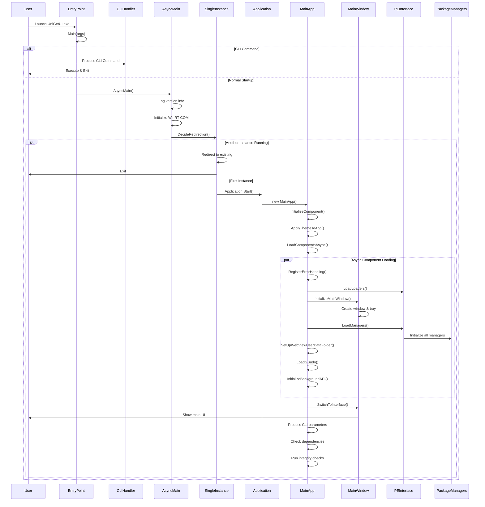

# Application Entry Point

## Main Entry File
**File:** [`src/UniGetUI/EntryPoint.cs`](../../../src/UniGetUI/EntryPoint.cs)

The application's entry point is defined in the `EntryPoint.cs` file within the `UniGetUI` namespace. The project configuration in `UniGetUI.csproj` explicitly specifies this as the startup object:
```xml
<StartupObject>UniGetUI.EntryPoint</StartupObject>
```

## Initialization Sequence

### 1. **Main Method Entry Point**
The `Main` method (marked with `[STAThread]`) is the first code that executes. It performs command-line argument parsing and routing.

### 2. **CLI Argument Processing**
The application checks for various CLI flags in this order:
- `--help`: Display help information and exit
- `--migrate-wingetui-to-unigetui`: Migrate settings from WinGetUI to UniGetUI
- `--uninstall-unigetui` / `--uninstall-wingetui`: Uninstall the application
- `--import-settings`: Import settings from a file
- `--export-settings`: Export settings to a file
- `--enable-setting` / `--disable-setting`: Enable/disable a setting
- `--set-setting-value`: Set a specific setting value
- `--enable-secure-setting` / `--disable-secure-setting`: Manage secure settings
- `--daemon`: Run in daemon mode (background service)

### 3. **Async Main Initialization**
If no special CLI command is detected, the application enters `AsyncMain()`, which:
- Displays the UniGetUI ASCII art logo and version information
- Logs the build number, data directory, and encoding code page
- Initializes WinRT COM wrappers for Windows Runtime interop
- Handles single-instance application logic via `DecideRedirection()`
- Starts the WinUI application if this is the main instance

### 4. **Single Instance Management**
The `DecideRedirection()` method ensures only one instance of UniGetUI runs at a time:
- Registers the app instance with a unique key (`CoreData.MainWindowIdentifier`)
- If another instance exists, redirects activation to it and exits
- If this is the first instance, continues with full initialization

### 5. **MainApp Creation**
When `Application.Start()` is called, it creates a new `MainApp` instance, which:
- Sets up the dispatcher queue and synchronization context
- Initializes the WinUI application framework
- Begins asynchronous component loading

## Bootstrap Process

```csharp
// EntryPoint.cs - Main method
[STAThread]
private static void Main(string[] args)
{
    try
    {
        // Parse CLI arguments
        if (args.Contains(CLIHandler.HELP))
        {
            CLIHandler.Help();
            Environment.Exit(0);
        }
        // ... other CLI handlers ...
        else
        {
            // Set daemon flag if present
            CoreData.WasDaemon = CoreData.IsDaemon = args.Contains(CLIHandler.DAEMON);
            // Start async initialization
            _ = AsyncMain();
        }
    }
    catch (Exception e)
    {
        CrashHandler.ReportFatalException(e);
    }
}

// AsyncMain - Application startup
private static async Task AsyncMain()
{
    // Initialize WinRT COM wrappers
    WinRT.ComWrappersSupport.InitializeComWrappers();
    
    // Handle single-instance logic
    bool isRedirect = await DecideRedirection();
    
    if (!isRedirect)
    {
        // Start the WinUI application
        Application.Start((_) =>
        {
            DispatcherQueueSynchronizationContext context = 
                new(DispatcherQueue.GetForCurrentThread());
            SynchronizationContext.SetSynchronizationContext(context);
            var app = new MainApp();
        });
    }
}
```

## MainApp Initialization Sequence

Once `MainApp` is instantiated (in `App.xaml.cs`), it follows this initialization flow:

### 1. **Constructor Phase**
```csharp
public MainApp()
{
    Instance = this;
    Dispatcher = DispatcherQueue.GetForCurrentThread();
    InitializeComponent();  // Initialize XAML resources
    ApplyThemeToApp();      // Apply light/dark theme
    _ = LoadComponentsAsync();  // Start async loading
}
```

### 2. **Theme Application**
- Reads theme preference from settings (`Settings.K.PreferredTheme`)
- Sets `RequestedTheme` to Light, Dark, or System default
- Initializes `ThemeListener` for system theme changes

### 3. **Component Loading** (`LoadComponentsAsync`)

#### Essential Components (loaded first):
1. **Error Handling Registration**
   - Sets up global exception handlers
   - Configures unhandled exception logging
   - Registers task scheduler exception handler

2. **Package Engine Loaders** (`PEInterface.LoadLoaders`)
   - Initializes `DiscoverablePackagesLoader`
   - Initializes `InstalledPackagesLoader`
   - Initializes `UpgradablePackagesLoader`
   - Initializes `PackageBundlesLoader`

3. **Main Window Creation** (`InitializeMainWindow`)
   - Creates the `MainWindow` instance
   - Sets up window properties and event handlers
   - Configures title bar and system tray icon
   - Starts entry animation

4. **Parallel Component Initialization**
   These run concurrently for faster startup:
   - **Package Managers** (`PEInterface.LoadManagers`): Initializes all package managers (WinGet, Scoop, Chocolatey, Npm, Pip, Cargo, Vcpkg, DotNet, PowerShell, PowerShell7)
   - **WebView2 Setup**: Creates temporary user data folder for WebView2
   - **Icon Database**: Loads icon cache from disk
   - **Notification Service**: Registers app notification handlers
   - **GSudo/Elevator**: Loads elevation tool (GSudo or UniGetUI Elevator)
   - **Background API**: Initializes REST API for inter-process communication

5. **Interface Loading**
   - Calls `MainWindow.SwitchToInterface()` to show the main UI
   - Loads the `MainView` navigation page
   - Processes command-line parameters
   - Checks for missing package manager dependencies
   - Runs integrity checks

6. **Post-Load Activities** (non-blocking):
   - Telemetry initialization
   - Icon and screenshot database loading
   - Automatic update checks

## Dependencies Initialized

### Core System Dependencies
- **WinRT COM Wrappers**: Windows Runtime interoperability layer
- **Dispatcher Queue**: Thread synchronization for UI updates
- **Logger**: Logging system (initialized early, before Main)
- **CoreData**: Application metadata (version, paths, configuration)

### UI Framework
- **WinUI 3**: Microsoft's modern Windows UI framework
- **MainApp**: Application instance and lifecycle manager
- **MainWindow**: Primary window with system tray integration
- **ThemeListener**: System theme change detection

### Package Management Engine
- **PEInterface**: Central interface for package engine
- **Package Managers**: WinGet, Scoop, Chocolatey, Npm, Pip, Cargo, Vcpkg, DotNet, PowerShell, PowerShell7
- **Package Loaders**: For discoverable, installed, and upgradable packages
- **Bundle Loader**: For package bundle import/export

### Supporting Services
- **Settings Engine**: User preferences and configuration management
- **SecureSettings**: Secure credential storage
- **IconDatabase**: Package icon caching
- **BackgroundApiRunner**: REST API for external integrations
- **WebView2**: Embedded browser control (for package details)
- **GSudo/Elevator**: Privilege elevation tool
- **Notification Manager**: Windows notifications
- **CrashHandler**: Unhandled exception reporting
- **AutoUpdater**: Self-update mechanism

## Environment Setup

### Configuration Loading
- **Settings**: Loaded from `%LocalAppData%\UniGetUI\Configuration\` (or `.wingetui` for legacy)
- **Secure Settings**: Stored in Windows Credential Manager
- **Theme Preference**: Applied during `MainApp` constructor (cannot be changed at runtime)

### Environment Variables
- **CODE_PAGE**: Console encoding (set from `CoreData.CODE_PAGE`)
- **HTTP_PROXY**: Proxy configuration (set in `MainWindow.ApplyProxyVariableToProcess()`)
- **WEBVIEW2_USER_DATA_FOLDER**: WebView2 cache location (`%TEMP%\UniGetUI\WebView`)

### Directory Structure
- **Data Directory**: `%LocalAppData%\UniGetUI\` (or portable mode directory)
- **Configuration**: `%LocalAppData%\UniGetUI\Configuration\`
- **Executable Directory**: Location of `UniGetUI.exe`
- **Assets**: `{ExecutableDir}\Assets\` (icons, utilities, etc.)

### Portable Mode
If a file named `ForceUniGetUIPortable` exists in the executable directory, UniGetUI runs in portable mode with settings stored in `{ExecutableDir}\Settings\`.

## Startup Flow Diagram



## Key Design Patterns

### Single Responsibility
- `EntryPoint`: CLI routing and application bootstrap
- `MainApp`: Application lifecycle and component orchestration
- `MainWindow`: UI presentation and user interaction
- `PEInterface`: Package engine coordination

### Asynchronous Initialization
Most components load asynchronously to improve startup performance. The UI becomes interactive while background services continue initializing.

### Dependency Injection via Static Instances
Components access each other through static `Instance` properties (e.g., `MainApp.Instance`, `PEInterface.WinGet`), providing global access without explicit dependency injection.

### Crash Resilience
Multiple layers of exception handling ensure the app remains stable:
1. Top-level `try-catch` in `Main()`
2. `UnhandledException` handler in `MainApp`
3. `UnobservedTaskException` handler for async operations
4. `CrashHandler` for fatal errors

## Daemon Mode

When launched with `--daemon`, UniGetUI:
1. Sets `CoreData.IsDaemon = true`
2. Creates the system tray icon immediately
3. Hides the main window on startup
4. Enables efficiency mode to reduce resource usage
5. Runs in the background waiting for user interaction or scheduled tasks
