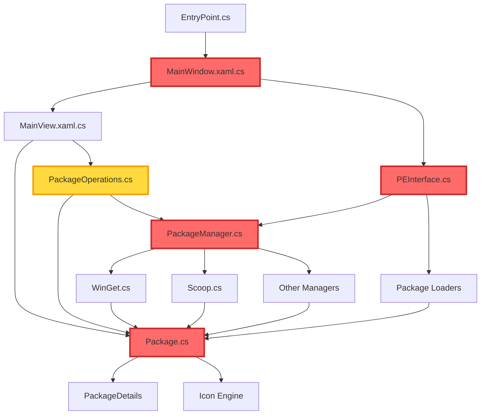

# Critical Files

## Overview

This document identifies the 5 most critical files in the UniGetUI codebase based on the following selection criteria:

1. **Architectural Centrality**: Files that serve as core entry points or central coordination hubs
2. **Dependency Impact**: Files with high import/usage counts throughout the codebase
3. **Functional Scope**: Files that implement essential business logic affecting multiple features
4. **Modification Risk**: Changes to these files have cascading effects on many components
5. **System Integration**: Files that bridge multiple subsystems or serve as primary interfaces

These files form the backbone of UniGetUI's architecture, and understanding them is essential for any significant development work on the project.

## Critical Files List

### 1. src/UniGetUI.PackageEngine.PackageEngine/PEInterface.cs
**Criticality:** ⭐⭐⭐⭐⭐

**Purpose:** This is the central entry point and orchestration hub for the entire Package Engine subsystem. It initializes all package managers (WinGet, Scoop, Chocolatey, Pip, Npm, etc.) and coordinates package loaders.

**Why Critical:**
- Serves as the single point of initialization for all 10+ package managers
- Coordinates the four main package loaders (Discoverable, Installed, Upgradable, Bundles)
- Contains static instances of all package managers that are referenced throughout the application
- Changes to this file affect the entire package management subsystem
- Any failure in initialization here cascades to all package management functionality

**Dependencies:**
- **Depends on:** 
  - All package manager implementations (`WinGet.cs`, `Scoop.cs`, `Chocolatey.cs`, etc.)
  - All package loader classes (`DiscoverablePackagesLoader`, `InstalledPackagesLoader`, `UpgradablePackagesLoader`, `PackageBundlesLoader`)
  - Core logging infrastructure
- **Used by:** 
  - `MainWindow.xaml.cs` - initializes the package engine on startup
  - `MainView.xaml.cs` - accesses package managers and loaders
  - All UI pages displaying packages (Discover, Updates, Installed, Bundles)
  - Package operation handlers throughout the application

**Key Functions/Classes:**
- `PEInterface` - Static class providing the unified interface to the Package Engine
- `LoadManagers()` - Initializes all package managers asynchronously with timeout handling
- `LoadLoaders()` - Instantiates and configures the four package loader singletons
- Static properties for each package manager (`WinGet`, `Scoop`, `Chocolatey`, etc.)
- `Managers` array - Read-only collection of all available package managers

### 2. src/UniGetUI/MainWindow.xaml.cs
**Criticality:** ⭐⭐⭐⭐⭐

**Purpose:** The main application window that serves as the root UI container and primary coordination point for the entire UniGetUI application. It manages application lifecycle, system tray integration, and global UI state.

**Why Critical:**
- Entry point for the WinUI 3 application interface
- Manages the main navigation view and all child pages
- Handles system tray icon and notifications
- Coordinates auto-update functionality
- Manages application-wide settings and theme application
- Processes command-line arguments and deep links
- Controls window geometry, minimize/maximize behavior, and taskbar integration

**Dependencies:**
- **Depends on:**
  - `MainView.xaml.cs` - the primary content navigation control
  - `AutoUpdater.cs` - for application update checks
  - `PEInterface.cs` - to initialize package engine
  - Core settings, logging, and data infrastructure
  - System tray and notification APIs
- **Used by:**
  - `EntryPoint.cs` - creates and displays the main window
  - `AutoUpdater.cs` - updates UI elements for update notifications
  - Various dialog and notification handlers
  - System tray menu handlers

**Key Functions/Classes:**
- `MainWindow` - Main sealed partial class extending WinUI Window
- `LoadTrayMenu()` - Configures system tray icon and context menu
- `ApplyTheme()` - Applies user-selected theme to the window
- `SaveGeometry()` / `LoadGeometry()` - Persists window size and position
- `ShowLoadingDialog()` / `HideLoadingDialog()` - Manages loading overlays
- `ParametersToProcess` - Observable queue for handling deep links and CLI arguments

### 3. src/UniGetUI.PackageEngine.PackageManagerClasses/Manager/PackageManager.cs
**Criticality:** ⭐⭐⭐⭐⭐

**Purpose:** Abstract base class that defines the core contract and common implementation for all package managers. This is the fundamental building block that enables UniGetUI to support multiple package management systems through a unified interface.

**Why Critical:**
- Defines the `IPackageManager` interface implementation that all managers must follow
- Contains initialization logic, status tracking, and capability management
- Implements common functionality shared across all package managers
- Provides the foundation for source management, package operations, and version detection
- Any changes to this class affect all 10+ package manager implementations
- Establishes patterns for extension methods and manager-specific helpers

**Dependencies:**
- **Depends on:**
  - Core settings, logging, and tools infrastructure
  - Manager helper interfaces (`IMultiSourceHelper`, `IPackageDetailsHelper`, `IPackageOperationHelper`)
  - Package classes and manager capability definitions
  - Secure settings for credential management
- **Used by:**
  - All concrete package manager implementations (WinGet, Scoop, Chocolatey, etc.)
  - Package operation classes that need to interact with managers
  - UI components that display manager status and capabilities
  - Package loaders that query managers for packages

**Key Functions/Classes:**
- `PackageManager` - Abstract base class implementing IPackageManager
- `Initialize()` - Primary initialization method checking manager availability and loading version
- `_loadManagerExecutableFile()` - Abstract method for finding manager executable
- `_loadManagerVersion()` - Abstract method for detecting manager version
- `IsEnabled()` - Checks if the manager is enabled in user settings
- `Properties` - Manager metadata (name, icon, description, sources)
- `Capabilities` - Manager feature support flags (admin, architectures, scopes, etc.)
- `Status` - Runtime status (found, version, executable path)

### 4. src/UniGetUI.PackageEngine.PackageManagerClasses/Packages/Package.cs
**Criticality:** ⭐⭐⭐⭐⭐

**Purpose:** Core domain model representing a software package in the UniGetUI system. This class encapsulates all package metadata, state, and behavior, serving as the primary data entity throughout the application.

**Why Critical:**
- Central data model used across all package-related operations
- Implements property change notification for UI binding
- Manages package state (checked, tagged, populated)
- Handles package comparison, hashing, and identity
- Contains serialization logic for import/export functionality
- Provides access to package details, icon management, and version handling
- Every package operation (install, update, uninstall) works with Package instances

**Dependencies:**
- **Depends on:**
  - `IPackageManager` interface for manager association
  - `IManagerSource` for source tracking
  - `PackageDetails` for lazy-loaded detailed information
  - Icon engine for package icon resolution
  - Installation options and overrides system
  - Core tools for version parsing and comparison
- **Used by:**
  - All package loaders (Discoverable, Installed, Upgradable)
  - Package operation classes (Install, Update, Uninstall)
  - All UI pages displaying packages
  - Package list controls and item containers
  - Search, filter, and sort functionality
  - Import/export and bundle management

**Key Functions/Classes:**
- `Package` - Main class implementing IPackage interface
- Constructors for creating regular and upgradable packages
- `Details` property - Lazy-loaded IPackageDetails implementation
- `IsChecked`, `Tag` properties - UI state management with property change notifications
- `GetHash()` / `GetVersionedHash()` - Package identity and comparison
- `AsSerializableAsync()` / `AsSerializable_Incompatible()` - Export/import serialization
- `OverridenOptions` - Per-package installation option customizations
- `IconId` / `GetIconUrl()` - Package icon resolution logic

### 5. src/UniGetUI.PackageEngine.Operations/PackageOperations.cs
**Criticality:** ⭐⭐⭐⭐

**Purpose:** Defines the abstract base class and core implementation for all package operations (install, update, uninstall). This file contains the operation lifecycle management, retry logic, and pre/post operation hooks.

**Why Critical:**
- Foundation for all package manipulation operations in the application
- Implements operation queuing, progress tracking, and status reporting
- Manages admin privilege elevation and interactive installation
- Handles operation success/failure callbacks and retry mechanisms
- Coordinates pre-installation and post-installation operations
- Contains logic for desktop shortcut management and package tagging
- All package state changes flow through operations defined here

**Dependencies:**
- **Depends on:**
  - `AbstractProcessOperation` base class for process management
  - `Package` class for package information
  - `InstallOptions` for operation configuration
  - Core settings for elevation and installation preferences
  - Package loaders for updating package lists after operations
  - Logging infrastructure for operation tracking
- **Used by:**
  - Concrete operation implementations (`InstallPackageOperation`, `UpdatePackageOperation`, `UninstallPackageOperation`)
  - Operation queue and scheduler in MainApp
  - UI operation controls and progress displays
  - Batch operation handlers
  - Operation history tracking

**Key Functions/Classes:**
- `PackageOperation` - Abstract base class for all package operations
- `Initialize()` - Abstract method for operation-specific setup
- `HandleSuccess()` / `HandleFailure()` - Abstract callbacks for operation completion
- `RequiresAdminRights()` - Determines if elevation is needed
- `ApplyRetryAction()` - Implements retry logic with different modes
- Event handlers for operation lifecycle (`Enqueued`, `CancelRequested`, `OperationSucceeded`, `OperationFailed`)
- `_getPreInstallOps()` / `_getPostInstallOps()` - Static factory methods for operation chaining

## File Dependency Graph

**Legend:**
- Red nodes: Top 4 most critical files (5-star criticality)
- Yellow nodes: Highly critical file (4-star criticality)
- Standard nodes: Supporting files and dependencies

## Modification Impact

| File | Impact Level | Affected Components |
|------|--------------|---------------------|
| **PEInterface.cs** | **Critical** | All package managers, all package loaders, main window initialization, all package-related UI pages, package operation scheduling, plugin system integration |
| **MainWindow.xaml.cs** | **Critical** | Application startup, system tray functionality, auto-updater, all navigation and routing, theme application, window state management, all child UI pages and dialogs, deep link handling |
| **PackageManager.cs** | **Critical** | All 10+ package manager implementations, package source management, package discovery and listing, version detection, capability checking, settings integration, all package operations |
| **Package.cs** | **Critical** | All package lists and displays, search and filter functionality, package operations, serialization/import/export, icon display, package comparison and sorting, bundle management, UI data binding |
| **PackageOperations.cs** | **High** | Install/update/uninstall operations, operation queue, progress tracking, retry logic, admin elevation, interactive installations, operation history, desktop shortcut management, pre/post operation hooks |

## Recommendations for Developers

When modifying these critical files, consider the following:

1. **PEInterface.cs Changes:**
   - Test all package managers after changes
   - Verify initialization timeout handling
   - Check loader instantiation logic
   - Run integration tests with all supported package managers

2. **MainWindow.xaml.cs Changes:**
   - Test application startup and shutdown flows
   - Verify system tray integration
   - Check theme switching
   - Test window geometry persistence
   - Validate deep link and CLI argument handling

3. **PackageManager.cs Changes:**
   - Test with multiple concrete manager implementations
   - Verify backward compatibility with existing managers
   - Check capability flag handling
   - Validate source management changes
   - Test both enabled and disabled manager states

4. **Package.cs Changes:**
   - Verify serialization compatibility
   - Test package equality and hashing
   - Check UI binding and property notifications
   - Validate version comparison logic
   - Test with both regular and upgradable packages

5. **PackageOperations.cs Changes:**
   - Test operation lifecycle thoroughly
   - Verify retry mechanisms
   - Check admin elevation logic
   - Test pre/post operation chaining
   - Validate operation cancellation

## Testing Considerations

Before committing changes to any of these critical files:

- [ ] Run the full test suite
- [ ] Test with at least 2-3 different package managers
- [ ] Verify UI functionality in relevant pages
- [ ] Check operation queue behavior
- [ ] Test error handling and edge cases
- [ ] Validate settings persistence
- [ ] Review impact on dependent files
- [ ] Update documentation if interfaces change
