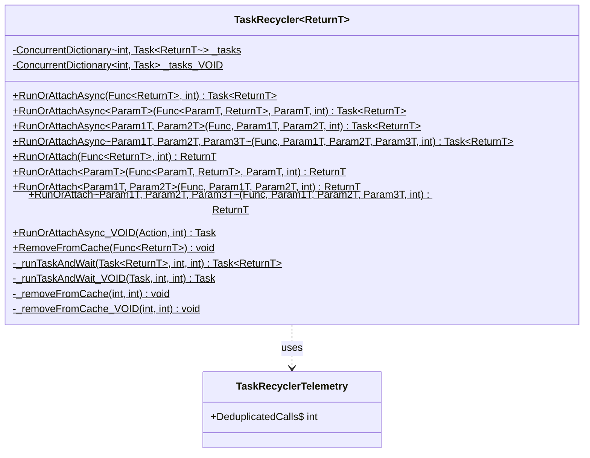

# Class Documentation: TaskRecycler

## Class Overview
- **File:** `src/UniGetUI.Core.Classes/TaskRecycler.cs`
- **Namespace:** `UniGetUI.Core.Classes`
- **Responsibility:** Reduce CPU impact by caching and deduplicating concurrent calls to CPU-intensive methods that return the same result when called multiple times

## Class Diagram


## Properties
| Property | Type | Visibility | Description |
|----------|------|-----------|-------------|
| _tasks | ConcurrentDictionary<int, Task<ReturnT>> | private static | Cache storage for tasks with return values, keyed by method hash |
| _tasks_VOID | ConcurrentDictionary<int, Task> | private static | Cache storage for void tasks (Action delegates), keyed by method hash |

## Methods

### RunOrAttachAsync (0 parameters)
- **Purpose:** Asynchronous entry point for executing or attaching to a cached task with no parameters
- **Parameters:** 
  - `method` (Func<ReturnT>): The method to execute or attach to
  - `cacheTimeSecs` (int, default: 0): Time in seconds to keep the result cached after completion
- **Returns:** `Task<ReturnT>` - The running or cached task
- **Implementation:** 
  1. Computes hash from the method's GetHashCode()
  2. Passes to `_runTaskAndWait` for execution or cache retrieval

### RunOrAttachAsync<ParamT> (1 parameter)
- **Purpose:** Asynchronous entry point for executing or attaching to a cached task with 1 parameter
- **Parameters:** 
  - `method` (Func<ParamT, ReturnT>): The method to execute
  - `arg1` (ParamT): The method parameter
  - `cacheTimeSecs` (int, default: 0): Cache time in seconds
- **Returns:** `Task<ReturnT>` - The running or cached task
- **Implementation:** 
  1. Computes composite hash: method.GetHashCode() + arg1?.GetHashCode()
  2. Wraps method call in a Task
  3. Passes to `_runTaskAndWait`

### RunOrAttachAsync<Param1T, Param2T> (2 parameters)
- **Purpose:** Asynchronous entry point for executing or attaching to a cached task with 2 parameters
- **Parameters:** 
  - `method` (Func<Param1T, Param2T, ReturnT>): The method to execute
  - `arg1` (Param1T), `arg2` (Param2T): The method parameters
  - `cacheTimeSecs` (int, default: 0): Cache time in seconds
- **Returns:** `Task<ReturnT>` - The running or cached task
- **Implementation:** Similar to 1-parameter version, computes composite hash from all arguments

### RunOrAttachAsync<Param1T, Param2T, Param3T> (3 parameters)
- **Purpose:** Asynchronous entry point for executing or attaching to a cached task with 3 parameters
- **Parameters:** 
  - `method` (Func<Param1T, Param2T, Param3T, ReturnT>): The method to execute
  - `arg1` (Param1T), `arg2` (Param2T), `arg3` (Param3T): The method parameters
  - `cacheTimeSecs` (int, default: 0): Cache time in seconds
- **Returns:** `Task<ReturnT>` - The running or cached task
- **Implementation:** Computes composite hash from method and all three arguments

### RunOrAttach (Synchronous versions)
- **Purpose:** Synchronous wrappers around the async methods
- **Parameters:** Same as their async counterparts
- **Returns:** `ReturnT` - The result value (blocks until completion)
- **Implementation:** Calls the async version and uses `.GetAwaiter().GetResult()` to block

### RunOrAttachAsync_VOID
- **Purpose:** Execute or attach to a cached void task (Action delegate)
- **Parameters:**
  - `method` (Action): The void method to execute
  - `cacheTimeSecs` (int, default: 0): Cache time in seconds
- **Returns:** `Task` - The running or cached task (no return value)
- **Implementation:** Similar to typed versions but uses `_tasks_VOID` dictionary

### RemoveFromCache
- **Purpose:** Instantly removes a function call from the cache
- **Parameters:**
  - `method` (Func<ReturnT>): The method to remove from cache
- **Returns:** void
- **Implementation:** 
  1. Computes method hash
  2. Calls `_removeFromCache` with zero delay

### _runTaskAndWait (Private)
- **Purpose:** Core logic for running or attaching to cached tasks
- **Parameters:**
  - `task` (Task<ReturnT>): The task to run or cache
  - `hash` (int): The computed hash key
  - `cacheTimeSecsSecs` (int): Cache duration
- **Returns:** `Task<ReturnT>` - The completed task result
- **Implementation:**
  1. Attempts to get existing task from cache using `TryGetValue`
  2. If not found, attempts to add new task using `TryAdd`
  3. If race condition detected (TryAdd fails), recursively retries
  4. If new task added successfully, starts the task execution
  5. Awaits task completion
  6. Schedules cache removal after specified time
  7. Returns result

### _runTaskAndWait_VOID (Private)
- **Purpose:** Core logic for running or attaching to cached void tasks
- **Parameters:** Same as `_runTaskAndWait` but uses `Task` instead of `Task<ReturnT>`
- **Returns:** `Task` - Completed task (no return value)
- **Implementation:** Similar to `_runTaskAndWait` but for void methods

### _removeFromCache (Private)
- **Purpose:** Removes a task from cache after specified delay
- **Parameters:**
  - `hash` (int): The cache key
  - `cacheTimeSecsSecs` (int): Delay before removal
- **Returns:** void (async)
- **Implementation:**
  1. If cacheTimeSecsSecs > 0, delays for that duration
  2. Removes entry from `_tasks` dictionary

### _removeFromCache_VOID (Private)
- **Purpose:** Removes a void task from cache after specified delay
- **Parameters:** Same as `_removeFromCache`
- **Returns:** void (async)
- **Implementation:** Same as `_removeFromCache` but operates on `_tasks_VOID`

## Relationships
- **Inherits From:** None (static class)
- **Implements:** None
- **Uses:** 
  - `System.Collections.Concurrent.ConcurrentDictionary<TKey, TValue>` - Thread-safe cache storage
  - `System.Threading.Tasks.Task<T>` - Async task execution
- **Used By:** 
  - `UniGetUI.PackageEngine.Managers.Cargo.Cargo` - Caching installed package queries
  - `UniGetUI.PackageEngine.Managers.Generic.NuGet.BaseNuGet` - Caching installed packages retrieval
  - `UniGetUI.PackageEngine.Operations.PackageOperations` - Caching package icon URL retrieval
  - Various package managers throughout the codebase

## Design Patterns

### Flyweight Pattern
The TaskRecycler implements a variation of the Flyweight pattern by sharing task execution results across multiple callers. Instead of creating new tasks for identical method calls, it reuses already-running or cached tasks, reducing memory and CPU overhead.

### Singleton Pattern (Per Generic Type)
Each instantiation of `TaskRecycler<ReturnT>` acts as a singleton cache for that specific return type. The static fields ensure only one cache exists per type parameter.

### Memoization Pattern
The class implements memoization by caching method results based on the method and its arguments. The hash-based key generation ensures that identical calls (same method + same arguments) return cached results.

### Race Condition Handling
The implementation uses a sophisticated race condition detection mechanism:
- Uses `TryGetValue` to check for existing tasks
- Uses `TryAdd` to atomically add new tasks
- If `TryAdd` fails (another thread added a task between checks), recursively retries to attach to the newly added task

## Usage Example

### Basic Usage - No Parameters
```csharp
// Define a CPU-intensive method
private List<Package> GetInstalledPackages()
{
    // Expensive operation
    Thread.Sleep(5000);
    return FetchPackagesFromSystem();
}

// Call it multiple times - only executes once
var task1 = TaskRecycler<List<Package>>.RunOrAttachAsync(GetInstalledPackages);
var task2 = TaskRecycler<List<Package>>.RunOrAttachAsync(GetInstalledPackages);

// Both tasks share the same execution
var result1 = await task1; // Waits 5 seconds
var result2 = await task2; // Returns immediately with same result
// result1 == result2 (same instance!)
```

### Usage with Parameters
```csharp
// Method with parameter
private PackageDetails GetPackageDetails(string packageId)
{
    Thread.Sleep(2000);
    return FetchDetailsFromAPI(packageId);
}

// Different arguments create different cache entries
var task1 = TaskRecycler<PackageDetails>.RunOrAttachAsync(GetPackageDetails, "package-a");
var task2 = TaskRecycler<PackageDetails>.RunOrAttachAsync(GetPackageDetails, "package-a");
var task3 = TaskRecycler<PackageDetails>.RunOrAttachAsync(GetPackageDetails, "package-b");

// task1 and task2 share execution (same argument)
// task3 runs independently (different argument)
```

### Usage with Cache Time
```csharp
// Cache result for 15 seconds after completion
var installedPackages = TaskRecycler<List<Package>>.RunOrAttach(
    GetInstalledPackages, 
    cacheTimeSecs: 15
);

// Subsequent calls within 15 seconds return the cached result
// without re-executing the method
```

### Synchronous Usage
```csharp
// Blocks until result is available
var packages = TaskRecycler<List<Package>>.RunOrAttach(GetInstalledPackages);
```

### Real-World Example from Codebase
```csharp
// From BaseNuGet.cs
protected override Task<IEnumerable<IPackage>> GetAvailableUpdates_UnSafe()
{
    var installedPackages = TaskRecycler<IReadOnlyList<IPackage>>.RunOrAttach(GetInstalledPackages);
    // Multiple calls to GetAvailableUpdates_UnSafe will share the same
    // GetInstalledPackages execution, reducing API calls
}
```

### Manual Cache Clearing
```csharp
// Clear cache immediately, even if cached time hasn't expired
TaskRecycler<List<Package>>.RemoveFromCache(GetInstalledPackages);

// Next call will execute the method again
```

## Important Warnings

### Object Instance Sharing
⚠️ **WARNING:** When using TaskRecycler with methods that return instances of classes, the return instance WILL BE THE SAME when the call attaches to an existing call. This means:

```csharp
var result1 = await TaskRecycler<MyClass>.RunOrAttachAsync(CreateObject);
var result2 = await TaskRecycler<MyClass>.RunOrAttachAsync(CreateObject);

// result1 and result2 reference THE SAME object instance
// Modifications to result1 will affect result2!
result1.Property = "changed";
Console.WriteLine(result2.Property); // Outputs: "changed"
```

### Thread Safety Considerations
- The class uses `ConcurrentDictionary` for thread-safe cache operations
- Multiple threads can safely call `RunOrAttachAsync` concurrently
- The recursive retry mechanism handles race conditions elegantly

## Performance Benefits
- **Reduces redundant computation**: CPU-intensive methods are only executed once for concurrent calls
- **Minimizes API calls**: External API queries are deduplicated automatically
- **Configurable caching**: Optional cache time extends benefits beyond concurrent calls
- **Zero overhead for unique calls**: No performance penalty when calls don't match cached entries
