# External API Integrations

## Integration Overview

UniGetUI integrates with multiple external APIs to provide comprehensive package management functionality. The application communicates with:

1. **Package Registry APIs** - To fetch package information, metadata, and download URLs from various package managers (Crates.io, PyPI, NuGet, Chocolatey, Microsoft Store)
2. **GitHub Raw Content API** - To download language translation files and icon databases
3. **Internal UniGetUI Services** - For telemetry, updates, and announcements
4. **Error Reporting** - For crash reports and error tracking

All HTTP communications use a standardized `HttpClient` with custom user agent identification and follow best practices for error handling and rate limiting.

---

## API Details

### API 1: Crates.io API

**Purpose:** Fetch package information and metadata for Rust/Cargo packages

**Authentication:**
- **Method:** None (Public API)
- **Implementation:** `src/UniGetUI.PackageEngine.Managers.Cargo/CratesIOClient.cs`

**Endpoints Used:**
| Endpoint | Method | Purpose | Implementation File |
|----------|--------|---------|-------------------|
| `/api/v1/crates/{packageId}` | GET | Fetch package manifest | `CratesIOClient.cs` |
| `/api/v1/crates/{packageId}/{version}` | GET | Fetch specific version details | `CratesIOClient.cs` |

**Configuration:**
```csharp
public const string ApiUrl = "https://crates.io/api/v1";

// HttpClient setup
HttpClient client = new(CoreTools.GenericHttpClientParameters);
client.DefaultRequestHeaders.UserAgent.ParseAdd(CoreData.UserAgentString);
```

**Rate Limits:**
- **Requests per minute:** Not explicitly handled in code (relies on Crates.io default limits)
- **Handling strategy:** No specific rate limiting implementation; relies on synchronous calls

**Error Handling:**
```csharp
private static T Fetch<T>(Uri url)
{
    HttpClient client = new(CoreTools.GenericHttpClientParameters);
    client.DefaultRequestHeaders.UserAgent.ParseAdd(CoreData.UserAgentString);

    var manifestStr = client.GetStringAsync(url).GetAwaiter().GetResult();

    var manifest = JsonSerializer.Deserialize<T>(manifestStr, options: SerializationHelpers.DefaultOptions)
                   ?? throw new NullResponseException($"Null response for request to {url}");
    return manifest;
}
```

**Dependencies:**
- **Library:** System.Net.Http.HttpClient
- **Version:** Built-in .NET
- **Serialization:** System.Text.Json

---

### API 2: PyPI API

**Purpose:** Fetch package information and metadata for Python packages

**Authentication:**
- **Method:** None (Public API)
- **Implementation:** `src/UniGetUI.PackageEngine.Managers.Pip/Helpers/PipPkgDetailsHelper.cs`

**Endpoints Used:**
| Endpoint | Method | Purpose | Implementation File |
|----------|--------|---------|-------------------|
| `/pypi/{packageId}/json` | GET | Fetch package details and metadata | `PipPkgDetailsHelper.cs` |

**Configuration:**
```csharp
HttpClient client = new(CoreTools.GenericHttpClientParameters);
client.DefaultRequestHeaders.UserAgent.ParseAdd(CoreData.UserAgentString);
string url = $"https://pypi.org/pypi/{details.Package.Id}/json";
```

**Rate Limits:**
- **Requests per minute:** Not explicitly handled (relies on PyPI's CDN and rate limits)
- **Handling strategy:** Synchronous requests only when package details are requested

**Error Handling:**
```csharp
protected override void GetDetails_UnSafe(IPackageDetails details)
{
    // Wrapped in try-catch by base class
    INativeTaskLogger logger = Manager.TaskLogger.CreateNew(LoggableTaskType.LoadPackageDetails);
    
    string JsonString;
    HttpClient client = new(CoreTools.GenericHttpClientParameters);
    client.DefaultRequestHeaders.UserAgent.ParseAdd(CoreData.UserAgentString);
    JsonString = client.GetStringAsync($"https://pypi.org/pypi/{details.Package.Id}/json")
        .GetAwaiter().GetResult();
    
    // Parse JSON and extract package information
    JsonObject? contents = JsonNode.Parse(JsonString) as JsonObject;
    // ...
    
    logger.Close(0);
}
```

**Dependencies:**
- **Library:** System.Net.Http.HttpClient
- **Version:** Built-in .NET
- **Serialization:** System.Text.Json.Nodes

---

### API 3: NuGet API (v2 OData)

**Purpose:** Search and retrieve package information for NuGet and PowerShell Gallery packages

**Authentication:**
- **Method:** None (Public API)
- **Implementation:** `src/UniGetUI.PackageEngine.Managers.Generic.NuGet/BaseNuGet.cs`, `BaseNuGetDetailsHelper.cs`

**Endpoints Used:**
| Endpoint | Method | Purpose | Implementation File |
|----------|--------|---------|-------------------|
| `/Search()` | GET | Search for packages with filters | `BaseNuGet.cs` |
| `/Packages(Id='{id}',Version='{version}')` | GET | Get specific package version | `BaseNuGetDetailsHelper.cs` |
| `/FindPackagesById()` | GET | Find all versions of a package | `BaseNuGetDetailsHelper.cs` |

**Configuration:**
```csharp
// Default NuGet source
new ManagerSource(this, "nuget.org", new Uri("https://www.nuget.org/api/v2"));

// Search URL construction
Uri SearchUrl = new($"{source.Url}/Search()" +
    $"?$filter=IsLatestVersion" +
    $"&$orderby=Id&searchTerm='{HttpUtility.UrlEncode(query)}'" +
    $"&targetFramework=''" +
    $"&includePrerelease={(canPrerelease ? "true" : "false")}" +
    $"&$skip=0" +
    $"&$top=50" +
    $"&semVerLevel=2.0.0");

using HttpClient client = new(CoreTools.GenericHttpClientParameters);
client.DefaultRequestHeaders.UserAgent.ParseAdd(CoreData.UserAgentString);
```

**Rate Limits:**
- **Requests per minute:** Not explicitly limited in code
- **Handling strategy:** Pagination support with `$skip` and `$top` parameters; follows "next" links for complete results

**Error Handling:**
```csharp
HttpResponseMessage response = client.GetAsync(SearchUrl).GetAwaiter().GetResult();

if (!response.IsSuccessStatusCode)
{
    logger.Error($"Failed to fetch api at Url={SearchUrl} with status code {response.StatusCode}");
    SearchUrl = null;
    continue;
}
```

**Dependencies:**
- **Library:** System.Net.Http.HttpClient
- **Version:** Built-in .NET
- **Parsing:** Regular expressions for XML/OData response parsing

---

### API 4: Chocolatey Community API

**Purpose:** Fetch package information from Chocolatey package repository

**Authentication:**
- **Method:** None (Public API)
- **Implementation:** Uses NuGet v2 OData protocol (see API 3)

**Endpoints Used:**
| Endpoint | Method | Purpose | Implementation File |
|----------|--------|---------|-------------------|
| `/api/v2/Search()` | GET | Search Chocolatey packages | `BaseNuGet.cs` (inherited) |
| `/api/v2/Packages(Id='{id}',Version='{version}')` | GET | Get package details | `BaseNuGetDetailsHelper.cs` |

**Configuration:**
```csharp
// Default Chocolatey source
new ManagerSource(this, "community", new Uri("https://community.chocolatey.org/api/v2/"));

// Alternative legacy URL also supported
"https://chocolatey.org/api/v2/"
```

**Rate Limits:**
- **Requests per minute:** Not explicitly handled
- **Handling strategy:** Same as NuGet API (inherits from BaseNuGet)

**Error Handling:**
Same error handling as NuGet API (inherits from BaseNuGet class)

**Dependencies:**
- **Library:** System.Net.Http.HttpClient
- **Version:** Built-in .NET
- **Base Implementation:** Inherits from BaseNuGet class

---

### API 5: Microsoft Store API

**Purpose:** Fetch package icons and metadata for Microsoft Store packages accessed via WinGet

**Authentication:**
- **Method:** None (Public API)
- **Implementation:** `src/UniGetUI.PackageEngine.Managers.WinGet/ClientHelpers/WinGetIconsHelper.cs`

**Endpoints Used:**
| Endpoint | Method | Purpose | Implementation File |
|----------|--------|---------|-------------------|
| `/v8.0/sdk/products` | POST | Get product information including icons | `WinGetIconsHelper.cs` |

**Configuration:**
```csharp
string CountryCode = CultureInfo.CurrentCulture.Name.Split("-")[^1];
string Locale = CultureInfo.CurrentCulture.Name;
string url = $"https://storeedgefd.dsx.mp.microsoft.com/v8.0/sdk/products?market={CountryCode}&locale={Locale}&deviceFamily=Windows.Desktop";

#pragma warning disable SYSLIB0014
var httpRequest = (HttpWebRequest)WebRequest.Create(url);
#pragma warning restore SYSLIB0014

httpRequest.Method = "POST";
httpRequest.ContentType = "application/json";

string data = "{\"productIds\": \"" + package.Id.ToLower() + "\"}";
```

**Rate Limits:**
- **Requests per minute:** Not explicitly handled
- **Handling strategy:** Caches responses in `__msstore_package_manifests` dictionary to avoid repeated requests

**Error Handling:**
```csharp
var httpResponse = httpRequest.GetResponse() as HttpWebResponse;
if (httpResponse is null)
{
    Logger.Warn($"Null MS Store response for uri={url} and data={data}");
    return null;
}

if (result != "" && httpResponse.StatusCode == HttpStatusCode.OK)
    __msstore_package_manifests[package.Id] = result;
```

**Dependencies:**
- **Library:** System.Net.WebRequest (legacy API)
- **Version:** Built-in .NET
- **Parsing:** Regular expressions for JSON response parsing

---

### API 6: GitHub Raw Content API

**Purpose:** Download language translation files, icon databases, and installation scripts

**Authentication:**
- **Method:** None (Public repository content)
- **Implementation:** Multiple files across the codebase

**Endpoints Used:**
| Endpoint | Method | Purpose | Implementation File |
|----------|--------|---------|-------------------|
| `/marticliment/UniGetUI/main/src/UniGetUI.Core.LanguageEngine/Assets/Languages/lang_{code}.json` | GET | Download updated translation files | `LanguageEngine.cs` |
| `/marticliment/UniGetUI/main/WebBasedData/screenshot-database-v2.json` | GET | Download icon and screenshot database | `IconDatabase.cs` |
| `/cargo-bins/cargo-binstall/main/install-from-binstall-release.ps1` | GET | Download cargo-binstall installer | `Cargo.cs` |

**Configuration:**
```csharp
// Language files
Uri NewFile = new("https://raw.githubusercontent.com/marticliment/UniGetUI/main/src/UniGetUI.Core.LanguageEngine/Assets/Languages/lang_" + LangKey + ".json");

HttpClient client = new();
client.DefaultRequestHeaders.UserAgent.ParseAdd(CoreData.UserAgentString);
string fileContents = await client.GetStringAsync(NewFile);

// Icon database
Uri DownloadUrl = new("https://github.com/marticliment/UniGetUI/raw/refs/heads/main/WebBasedData/screenshot-database-v2.json");

using (HttpClient client = new(CoreTools.GenericHttpClientParameters))
{
    client.DefaultRequestHeaders.UserAgent.ParseAdd(CoreData.UserAgentString);
    string fileContents = await client.GetStringAsync(DownloadUrl);
    await File.WriteAllTextAsync(IconsAndScreenshotsFile, fileContents);
}
```

**Rate Limits:**
- **Requests per minute:** Subject to GitHub API rate limits (60 requests per hour for unauthenticated requests)
- **Handling strategy:** Files are cached locally and only updated periodically

**Error Handling:**
```csharp
// Language files
try
{
    Uri NewFile = new("https://raw.githubusercontent.com/...");
    HttpClient client = new();
    client.DefaultRequestHeaders.UserAgent.ParseAdd(CoreData.UserAgentString);
    string fileContents = await client.GetStringAsync(NewFile);
    File.WriteAllText(localPath, fileContents);
    Logger.ImportantInfo("Lang files were updated successfully from GitHub");
}
catch (Exception e)
{
    Logger.Warn("Could not download updated translations from GitHub");
    Logger.Warn(e);
}

// Icon database
try
{
    // Download and save
    Logger.ImportantInfo("Downloaded new icons and screenshots successfully!");
}
catch (Exception e)
{
    Logger.Warn("Failed to download icons and screenshots");
    Logger.Warn(e);
}
```

**Dependencies:**
- **Library:** System.Net.Http.HttpClient
- **Version:** Built-in .NET
- **Serialization:** System.Text.Json (for JSON files)

---

### API 7: UniGetUI Telemetry API

**Purpose:** Send anonymous usage statistics and telemetry data to improve the application

**Authentication:**
- **Method:** Client ID token (randomly generated 64-character string)
- **Implementation:** `src/UniGetUI.Interface.Telemetry/TelemetryHandler.cs`

**Endpoints Used:**
| Endpoint | Method | Purpose | Implementation File |
|----------|--------|---------|-------------------|
| `/activity` | POST | Report application activity and settings | `TelemetryHandler.cs` |
| `/package/install` | POST | Report package installation | `TelemetryHandler.cs` |
| `/package/update` | POST | Report package update | `TelemetryHandler.cs` |
| `/package/download` | POST | Report package download | `TelemetryHandler.cs` |
| `/package/uninstall` | POST | Report package uninstallation | `TelemetryHandler.cs` |
| `/package/details` | POST | Report package details view | `TelemetryHandler.cs` |
| `/package/share` | POST | Report package sharing | `TelemetryHandler.cs` |
| `/bundles/import` | POST | Report bundle import | `TelemetryHandler.cs` |
| `/bundles/export` | POST | Report bundle export | `TelemetryHandler.cs` |

**Configuration:**
```csharp
#if DEBUG
    private const string HOST = "http://localhost:3000";
#else
    private const string HOST = "https://marticliment.com/unigetui/statistics";
#endif

// Request setup
var request = new HttpRequestMessage(HttpMethod.Post, $"{HOST}/activity");

request.Headers.Add("clientId", ID);
request.Headers.Add("clientVersion", CoreData.VersionName);
request.Headers.Add("activeManagers", ManagerMagicValue.ToString());
request.Headers.Add("activeSettings", SettingsMagicValue.ToString());
request.Headers.Add("language", LanguageEngine.SelectedLocale);

HttpClient _httpClient = new(CoreTools.GenericHttpClientParameters);
_httpClient.DefaultRequestHeaders.UserAgent.ParseAdd(CoreData.UserAgentString);
HttpResponseMessage response = await _httpClient.SendAsync(request);
```

**Rate Limits:**
- **Requests per minute:** Not explicitly limited
- **Handling strategy:** Asynchronous fire-and-forget calls; waits for internet connection before sending

**Error Handling:**
```csharp
try
{
    if (Settings.Get(Settings.K.DisableTelemetry)) return;
    await CoreTools.WaitForInternetConnection();
    
    // ... prepare and send request ...
    
    if (response.IsSuccessStatusCode)
    {
        Logger.Debug("[Telemetry] Call to /activity succeeded");
    }
    else
    {
        Logger.Warn($"[Telemetry] Call to /activity failed with error code {response.StatusCode}");
    }
}
catch (Exception ex)
{
    Logger.Error("[Telemetry] Hard crash when calling /activity");
    Logger.Error(ex);
}
```

**Privacy:**
- User can disable telemetry via `Settings.K.DisableTelemetry`
- Only anonymous, aggregated data is sent
- Client ID is randomly generated and stored locally

**Dependencies:**
- **Library:** System.Net.Http.HttpClient
- **Version:** Built-in .NET

---

### API 8: UniGetUI Update API

**Purpose:** Check for application updates and download new versions

**Authentication:**
- **Method:** None (Public API)
- **Implementation:** `src/UniGetUI/AutoUpdater.cs`

**Endpoints Used:**
| Endpoint | Method | Purpose | Implementation File |
|----------|--------|---------|-------------------|
| `/versions/unigetui/stable.ver` | GET | Check stable version | `AutoUpdater.cs` |
| `/versions/unigetui/beta.ver` | GET | Check beta version | `AutoUpdater.cs` |
| GitHub Releases | GET | Download installer | `AutoUpdater.cs` |

**Configuration:**
```csharp
private const string STABLE_ENDPOINT = "https://www.marticliment.com/versions/unigetui/stable.ver";
private const string BETA_ENDPOINT = "https://www.marticliment.com/versions/unigetui/beta.ver";
private const string STABLE_INSTALLER_URL = "https://github.com/marticliment/UniGetUI/releases/latest/download/UniGetUI.Installer.exe";
private const string BETA_INSTALLER_URL = "https://github.com/marticliment/UniGetUI/releases/download/$TAG/UniGetUI.Installer.exe";

// Check for updates
string UpdatesEndpoint = Settings.Get(Settings.K.EnableUniGetUIBeta) ? BETA_ENDPOINT : STABLE_ENDPOINT;
string InstallerDownloadUrl = Settings.Get(Settings.K.EnableUniGetUIBeta) ? BETA_INSTALLER_URL : STABLE_INSTALLER_URL;
```

**Rate Limits:**
- **Requests per minute:** Not applicable
- **Handling strategy:** Checks every 60 minutes on success, 10 minutes on failure

**Error Handling:**
```csharp
try
{
    // Check and download updates
    await Task.Delay(TimeSpan.FromMinutes(updateSucceeded ? 60 : 10));
}
catch (Exception ex)
{
    Logger.Error("Update check failed");
    Logger.Error(ex);
}
```

**Dependencies:**
- **Library:** System.Net.Http.HttpClient
- **Version:** Built-in .NET
- **Installer Verification:** SHA256 hash validation

---

### API 9: UniGetUI Announcements API

**Purpose:** Fetch and display announcements to users

**Authentication:**
- **Method:** None (Public API)
- **Implementation:** `src/UniGetUI/Controls/Announcer.xaml.cs`

**Endpoints Used:**
| Endpoint | Method | Purpose | Implementation File |
|----------|--------|---------|-------------------|
| Custom URL | GET | Fetch announcement content | `Announcer.xaml.cs` |

**Configuration:**
```csharp
private static readonly HttpClient NetClient = new(CoreTools.GenericHttpClientParameters);

public Announcer()
{
    NetClient.DefaultRequestHeaders.UserAgent.ParseAdd(CoreData.UserAgentString);
    // ...
}

HttpResponseMessage response = await NetClient.GetAsync(announcement_url);
if (response.IsSuccessStatusCode)
{
    string[] response_body = (await response.Content.ReadAsStringAsync()).Split("////");
    string title = response_body[0].Trim();
    string body = response_body[1].Trim();
    string linkId = response_body[2].Trim();
    string linkName = response_body[3].Trim();
    Uri imageUrl = new(response_body[4].Trim());
}
```

**Rate Limits:**
- **Requests per minute:** Not explicitly limited
- **Handling strategy:** Loaded on-demand when announcement widget is viewed

**Error Handling:**
```csharp
try
{
    HttpResponseMessage response = await NetClient.GetAsync(announcement_url);
    if (response.IsSuccessStatusCode)
    {
        // Parse and display announcement
    }
    else
    {
        SetText(CoreTools.Translate("Could not load announcements - HTTP status code is $CODE")
            .Replace("$CODE", response.StatusCode.ToString()));
        SetImage(new Uri("ms-appx:///Assets/Images/warn.png"));
        if (!retry)
        {
            _ = LoadAnnouncements(true); // Retry with http:// if https:// fails
        }
    }
}
catch (Exception ex)
{
    Logger.Warn("Could not load announcements");
    Logger.Warn(ex);
    SetText(CoreTools.Translate("Could not load announcements - ") + ex.ToString());
    SetImage(new Uri("ms-appx:///Assets/Images/warn.png"));
}
```

**Dependencies:**
- **Library:** System.Net.Http.HttpClient
- **Version:** Built-in .NET

---

### API 10: Error Reporting API

**Purpose:** Submit crash reports and error information for debugging

**Authentication:**
- **Method:** None (Public endpoint)
- **Implementation:** `src/UniGetUI/CrashHandler.cs`

**Endpoints Used:**
| Endpoint | Method | Purpose | Implementation File |
|----------|--------|---------|-------------------|
| `/error-report/` | GET | Submit error reports via query parameters | `CrashHandler.cs` |

**Configuration:**
```csharp
string ErrorUrl = $"https://www.marticliment.com/error-report/" +
    $"?appName={Uri.EscapeDataString(CoreData.VersionName)}" +
    $"&errorBody={Uri.EscapeDataString(errorBody)}" +
    $"&context={Uri.EscapeDataString(context)}";
```

**Rate Limits:**
- **Requests per minute:** Not explicitly limited
- **Handling strategy:** Only triggered on application crashes or critical errors

**Error Handling:**
Errors during error reporting are likely logged but not explicitly handled (fail silently to avoid recursive error loops)

**Dependencies:**
- **Library:** System.Uri (for URL encoding)
- **Version:** Built-in .NET

---

## Common Infrastructure

### User Agent String
All API calls include a consistent user agent for identification:

```csharp
public const string UserAgentString = $"UniGetUI/{VersionName} (https://marticliment.com/unigetui/; contact@marticliment.com)";
```

### HTTP Client Configuration
Standard HTTP client parameters are used across all integrations:

```csharp
// From CoreTools.GenericHttpClientParameters
HttpClient client = new(CoreTools.GenericHttpClientParameters);
client.DefaultRequestHeaders.UserAgent.ParseAdd(CoreData.UserAgentString);
```

### Connection Handling
Many operations wait for internet connectivity before attempting API calls:

```csharp
await CoreTools.WaitForInternetConnection();
```

---

## API Integration Diagram

```mermaid
graph TB
    App[UniGetUI Application]
    
    subgraph "Package Registry APIs"
        CratesIO[Crates.io API]
        PyPI[PyPI API]
        NuGet[NuGet API]
        Choco[Chocolatey API]
        MSStore[Microsoft Store API]
    end
    
    subgraph "GitHub Services"
        GHRaw[GitHub Raw Content]
        GHReleases[GitHub Releases]
    end
    
    subgraph "Internal Services"
        Telemetry[Telemetry API]
        Updates[Update API]
        Announcements[Announcements API]
        ErrorReport[Error Reporting]
    end
    
    App -->|Package Search & Details| CratesIO
    App -->|Package Search & Details| PyPI
    App -->|Package Search & Details| NuGet
    App -->|Package Search & Details| Choco
    App -->|Icons & Metadata| MSStore
    
    App -->|Translation Files| GHRaw
    App -->|Icon Database| GHRaw
    App -->|Install Scripts| GHRaw
    App -->|Download Installers| GHReleases
    
    App -->|Usage Statistics| Telemetry
    App -->|Version Check| Updates
    App -->|User Messages| Announcements
    App -->|Crash Reports| ErrorReport
    
    style App fill:#4CAF50,stroke:#333,stroke-width:3px,color:#fff
    style CratesIO fill:#FFA000,stroke:#333,stroke-width:2px
    style PyPI fill:#3776AB,stroke:#333,stroke-width:2px,color:#fff
    style NuGet fill:#004880,stroke:#333,stroke-width:2px,color:#fff
    style Choco fill:#80B5E3,stroke:#333,stroke-width:2px
    style MSStore fill:#0078D4,stroke:#333,stroke-width:2px,color:#fff
    style GHRaw fill:#6e5494,stroke:#333,stroke-width:2px,color:#fff
    style GHReleases fill:#6e5494,stroke:#333,stroke-width:2px,color:#fff
    style Telemetry fill:#FF6F00,stroke:#333,stroke-width:2px,color:#fff
    style Updates fill:#FF6F00,stroke:#333,stroke-width:2px,color:#fff
    style Announcements fill:#FF6F00,stroke:#333,stroke-width:2px,color:#fff
    style ErrorReport fill:#FF6F00,stroke:#333,stroke-width:2px,color:#fff
```



---

## Security Considerations

1. **No Hardcoded Credentials**: All public APIs require no authentication
2. **User Agent Identification**: All requests include proper user agent headers
3. **SSL/TLS**: All production endpoints use HTTPS
4. **Privacy**: Telemetry can be disabled by users
5. **Installer Verification**: Downloaded installers are verified using SHA256 hashes
6. **Error Handling**: All API calls include proper error handling and logging
7. **Rate Limiting**: Application relies on external service rate limits; implements caching where appropriate

---

## Configuration Options

Users can configure certain API integrations through settings:

- `Settings.K.DisableTelemetry` - Disable telemetry reporting
- `Settings.K.DisableLangAutoUpdater` - Disable automatic language file updates
- `Settings.K.DisableAutoUpdateWingetUI` - Disable automatic update checks
- `Settings.K.EnableUniGetUIBeta` - Use beta update channel
- `Settings.K.IconDataBaseURL` - Override icon database URL

---

## Future Considerations

1. **Rate Limiting**: Consider implementing application-level rate limiting for package registry APIs
2. **Caching**: Expand caching strategies to reduce API calls
3. **Async/Await**: Some APIs still use `.GetAwaiter().GetResult()` - consider full async implementation
4. **API Versioning**: Monitor for API version updates and deprecations
5. **Authentication**: Some package sources may require authentication in the future
6. **Retry Logic**: Implement exponential backoff for failed API calls
