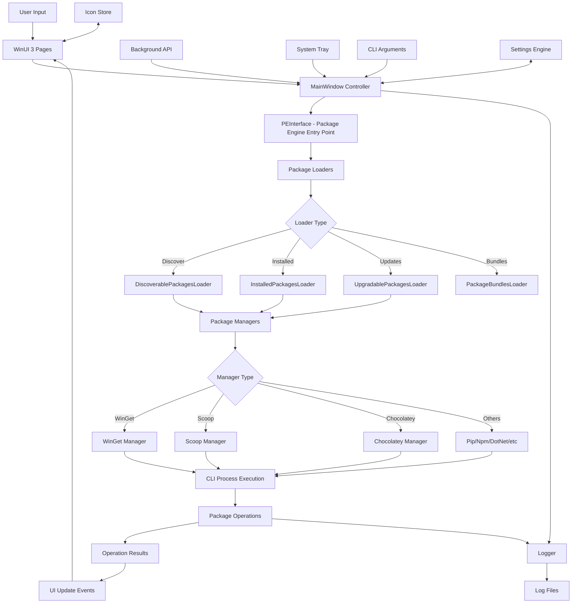
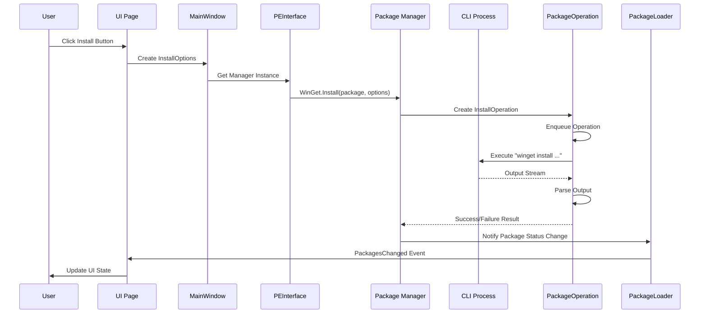
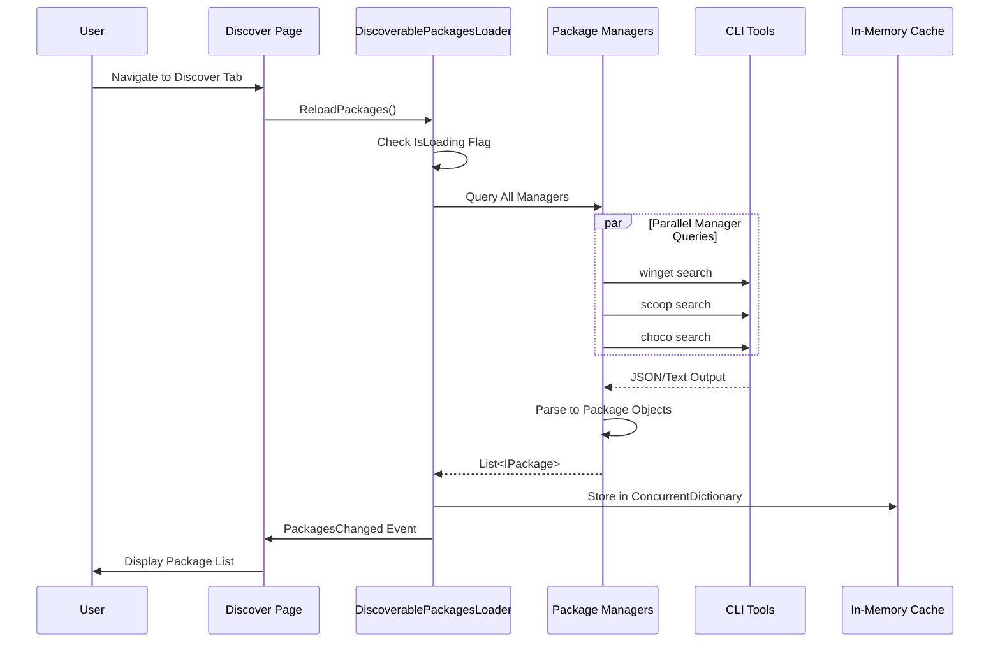
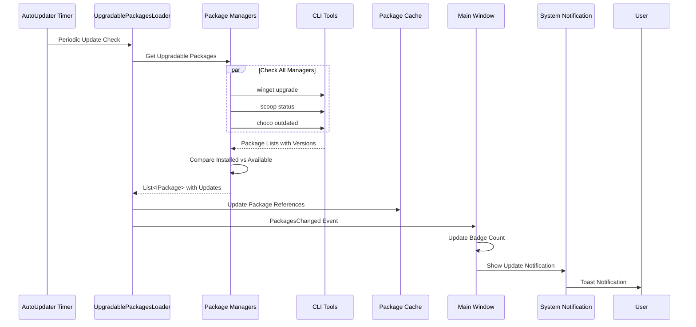
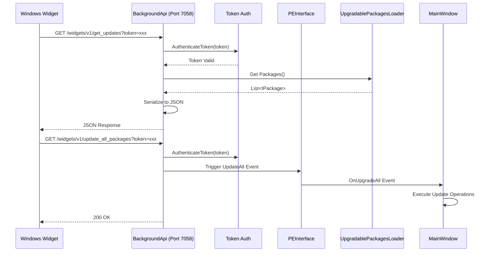
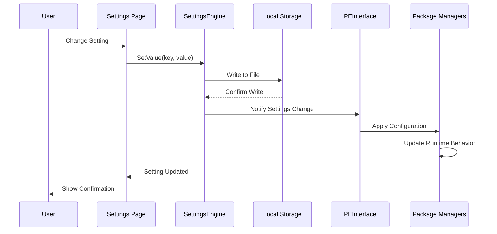
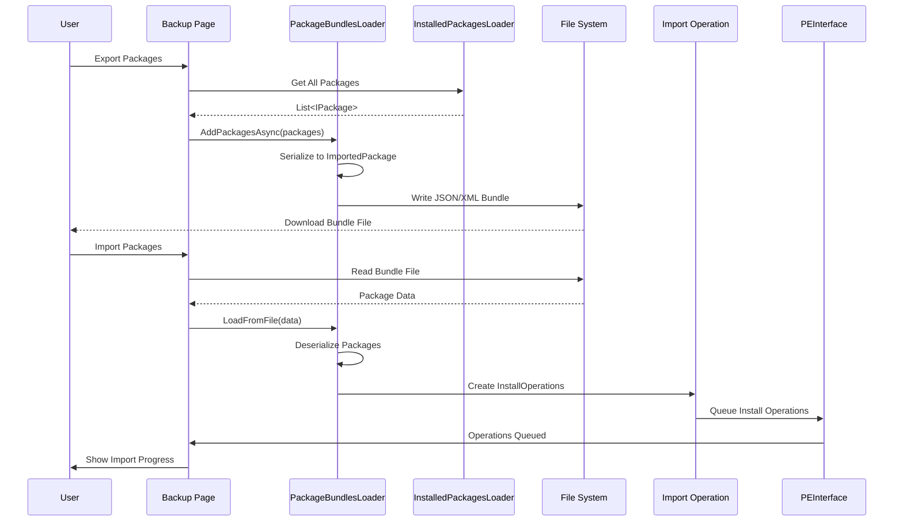

# Data Flow

## Overview

UniGetUI is a Windows desktop application that serves as a unified graphical interface for multiple package managers (WinGet, Scoop, Chocolatey, Pip, Npm, .NET Tool, PowerShell Gallery, Cargo, and Vcpkg). The application follows a layered architecture where data flows from user interactions through the UI layer, into the Package Engine layer, and finally to the underlying CLI package managers.

The primary data flow involves:
1. **User Input** → UI Pages (WinUI 3/XAML)
2. **UI Pages** → Package Engine Interface (PEInterface)
3. **Package Engine** → Package Managers (WinGet, Scoop, etc.)
4. **Package Managers** → CLI Tools (via process execution)
5. **CLI Output** → Package Operations
6. **Package Operations** → Package Loaders
7. **Package Loaders** → UI (via event notifications)

Data is primarily stored in-memory using concurrent collections and observable collections, with persistent settings stored locally. The application also exposes a local REST API for external integrations like Windows Widgets.

## Data Flow Diagram



## Data Lifecycle

### 1. Data Entry Points

**Primary User Interface Inputs:**
- **MainWindow.xaml.cs**: Main application window handling user interactions
  - Navigation between pages (Discover, Installed, Updates, Settings)
  - System tray interactions
  - Window state management
  
- **UI Pages** (in `src/UniGetUI/Pages/`):
  - Package discovery and search requests
  - Package installation/update/uninstall commands
  - Settings configuration changes
  - Import/export bundle operations

**External Integration Inputs:**
- **Background API** (`BackgroundApi.cs`): RESTful API running on `http://localhost:7058`
  - Widget integration requests (`/widgets/v1/*` and `/widgets/v2/*` endpoints)
  - Package sharing links (`/v2/show-package`)
  - External application integrations
  
- **CLI Arguments** (`CLIHandler.cs`): Command-line parameter processing
  - Silent operations
  - Direct package operations
  - Daemon mode activation

**Automated Inputs:**
- **AutoUpdater.cs**: Periodic update checks for packages and the application itself
- **Package Loaders**: Automated background refresh of package lists

### 2. Data Transformations

**User Request to Package Operation:**
1. **UI Input Capture**: User actions captured in XAML pages
2. **Command Translation**: UI commands translated to `InstallOptions` and operation parameters
3. **Package Object Creation**: `IPackage` instances created with metadata
4. **Operation Queue**: Operations added to `AbstractOperation` queue with dependencies

**CLI Output to Package Data:**
1. **Process Execution**: CLI commands executed via `AbstractProcessOperation`
2. **Output Parsing**: Manager-specific helpers parse CLI output
   - WinGet: JSON output parsing (`WinGet.cs`)
   - Scoop: JSON manifest parsing
   - Chocolatey: XML/text output parsing
3. **Package Metadata Extraction**: 
   - Package ID, name, version
   - Source, publisher information
   - Installation status, update availability
4. **Object Hydration**: `Package` objects populated with parsed data

**Settings Transformation:**
- **Settings Engine**: Reads/writes settings to persistent storage
- **Configuration Mapping**: Maps UI settings to package manager CLI arguments
- **Installation Options**: Converts user preferences to `InstallOptions` objects
  - Admin rights requirements
  - Interactive installation mode
  - Hash check settings
  - Installation scope (user/system)

**Icon and Resource Transformations:**
- **Icon Engine**: Fetches and caches package icons
- **Image Processing**: Converts icon formats for UI rendering
- **Resource Localization**: Language-specific strings loaded from `LanguageEngine`

### 3. Data Storage

**In-Memory Storage:**
- **ConcurrentDictionary&lt;long, IPackage&gt;**: Primary package collection in `AbstractPackageLoader`
  - Thread-safe concurrent access
  - Key: Package hash (ID + Manager + Source)
  - Value: `IPackage` instances
  
- **ObservableQueue&lt;string&gt;**: Command-line parameters queue in `MainWindow`
- **Observable Collections**: UI-bound collections for real-time updates

**Persistent Storage:**
- **Settings Storage** (via `SettingsEngine`):
  - File location: Local application data directory
  - Format: Key-value pairs
  - Content: User preferences, API tokens, cached configurations
  
- **Icon Cache** (`IconStore`):
  - File location: Local cache directory
  - Format: Image files (PNG/ICO)
  - Content: Downloaded package icons
  
- **Log Files** (`Logger`):
  - File location: Application data directory
  - Format: Text logs with timestamps
  - Content: Operation history, errors, debug information

**No Traditional Database:**
- UniGetUI does not use SQL databases or document stores
- All package data is ephemeral and fetched from package managers on demand
- State is maintained in-memory with periodic refreshes

### 4. Data Output

**UI Rendering:**
- **Package Lists**: Rendered in WinUI 3 DataGrids and ListViews
- **Status Updates**: Progress bars, notifications, and status messages
- **Package Details**: Detail panels with metadata, version history, and actions
- **Visual Feedback**: Icons, badges, and state indicators

**API Responses:**
- **Background API JSON Responses**:
  ```json
  {
    "version": "3.x.x",
    "updates": [...],
    "status": "success"
  }
  ```
- **CORS-enabled** for cross-origin widget requests
- **Token-based authentication** for secure external access

**External Notifications:**
- **System Notifications**: Windows toast notifications for updates and operations
- **System Tray Updates**: Icon badge and context menu updates
- **Widget Updates**: Data pushed to Windows Widgets panel

**Process Outputs:**
- **CLI Command Execution**: Standard output/error captured from package managers
- **Operation Results**: Success/failure status with detailed messages
- **Log Entries**: Structured logging to files for debugging

## Critical Data Paths

### Path 1: Package Installation Flow



**Key Components:**
1. **InstallOptions**: Configuration object with admin rights, interactive mode, hash check settings
2. **PackageOperation**: Abstract operation handling pre/post operations and error retry logic
3. **CLI Process**: Spawned process with captured stdout/stderr
4. **Event System**: Observer pattern for UI updates without direct coupling

### Path 2: Package Discovery and Loading



**Key Features:**
- **Parallel Execution**: Multiple package managers queried simultaneously
- **Lazy Loading**: Packages loaded on-demand when page is accessed
- **Deduplication**: Same package from multiple sources handled by hash-based dictionary
- **Event-Driven Updates**: UI automatically refreshes when package data changes

### Path 3: Update Check and Notification



**Key Behaviors:**
- **Background Polling**: Periodic checks without blocking UI
- **Version Comparison**: Semantic versioning comparison for update detection
- **User Preferences**: Respects auto-update settings and ignored packages
- **Notification Throttling**: Prevents notification spam

### Path 4: Background API Integration



**Security Features:**
- **Token Authentication**: Random 64-character token generated per session
- **Local-Only Access**: API bound to `localhost:7058` only
- **CORS Enabled**: Allows widget cross-origin requests
- **Session-Based**: Token regenerated on application restart

### Path 5: Settings Persistence



**Configuration Types:**
- **Boolean Flags**: Auto-updates, admin elevation, interactive installs
- **String Values**: Proxy settings, language preferences, API tokens
- **Lists**: Ignored packages, preferred sources, custom CLI arguments
- **Dictionaries**: Per-package override options

### Path 6: Package Import/Export (Bundles)



**Bundle Features:**
- **Serialization Format**: JSON-based package metadata
- **Version Preservation**: Saves specific versions and installation options
- **Cross-Machine Support**: Bundles portable across machines
- **Validation**: Invalid packages marked during import for user review

## Data Flow Characteristics

### Concurrency Model
- **Thread-Safe Collections**: `ConcurrentDictionary` for package storage
- **Async/Await Pattern**: Heavy use of async operations for I/O
- **Parallel Manager Loading**: Multiple package managers initialized concurrently
- **UI Thread Marshaling**: Observable collections ensure UI updates on correct thread

### Error Handling
- **Operation Retry Logic**: Failed operations can retry with modified settings
- **Graceful Degradation**: Missing package managers don't block the application
- **Detailed Logging**: All operations logged with context for debugging
- **User Notifications**: Errors surfaced through UI with actionable messages

### Performance Optimizations
- **Lazy Loading**: Package details loaded on-demand
- **Icon Caching**: Package icons cached locally to reduce network requests
- **Debounced Updates**: UI updates batched to prevent excessive redraws
- **Background Loading**: Package lists refreshed in background without blocking UI

### Data Validation
- **Token Authentication**: API requests validated with session tokens
- **Package Hash Verification**: Optional integrity checking for installations
- **Version Validation**: Semantic version parsing and comparison
- **Input Sanitization**: User inputs sanitized before CLI execution
