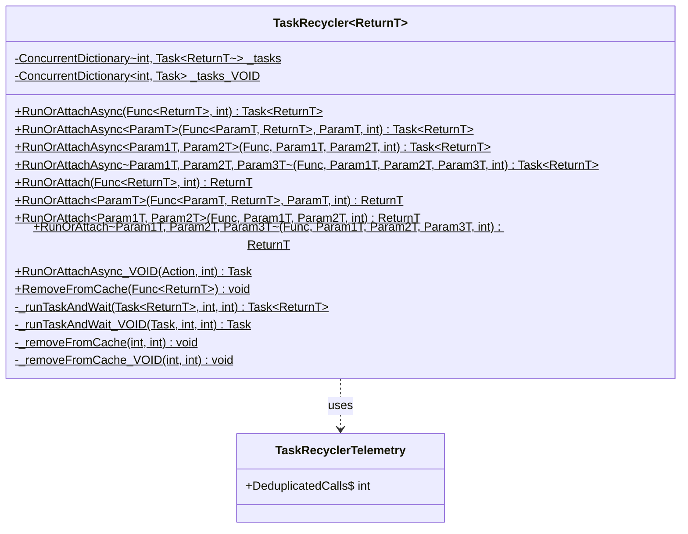

# Class Documentation: TaskRecycler

## Class Overview
- **File:** `src/UniGetUI.Core.Classes/TaskRecycler.cs`
- **Namespace:** `UniGetUI.Core.Classes`
- **Responsibility:** Reduce CPU impact by caching and deduplicating concurrent calls to CPU-intensive methods that return the same result when called multiple times

## Class Diagram


## Properties
| Property | Type | Visibility | Description |
|----------|------|-----------|-------------|
| _tasks | ConcurrentDictionary<int, Task<ReturnT>> | private static | Cache storage for tasks with return values, keyed by method hash |
| _tasks_VOID | ConcurrentDictionary<int, Task> | private static | Cache storage for void tasks (Action delegates), keyed by method hash |

## Methods

### RunOrAttachAsync (0 parameters)
- **Purpose:** Asynchronous entry point for executing or attaching to a cached task with no parameters
- **Parameters:** 
  - `method` (Func<ReturnT>): The method to execute or attach to
  - `cacheTimeSecs` (int, default: 0): Time in seconds to keep the result cached after completion
- **Returns:** `Task<ReturnT>` - The running or cached task
- **Implementation:** 
  1. Computes hash from the method's GetHashCode()
  2. Passes to `_runTaskAndWait` for execution or cache retrieval

### RunOrAttachAsync<ParamT> (1 parameter)
- **Purpose:** Asynchronous entry point for executing or attaching to a cached task with 1 parameter
- **Parameters:** 
  - `method` (Func<ParamT, ReturnT>): The method to execute
  - `arg1` (ParamT): The method parameter
  - `cacheTimeSecs` (int, default: 0): Cache time in seconds
- **Returns:** `Task<ReturnT>` - The running or cached task
- **Implementation:** 
  1. Computes composite hash: method.GetHashCode() + arg1?.GetHashCode()
  2. Wraps method call in a Task
  3. Passes to `_runTaskAndWait`

### RunOrAttachAsync<Param1T, Param2T> (2 parameters)
- **Purpose:** Asynchronous entry point for executing or attaching to a cached task with 2 parameters
- **Parameters:** 
  - `method` (Func<Param1T, Param2T, ReturnT>): The method to execute
  - `arg1` (Param1T), `arg2` (Param2T): The method parameters
  - `cacheTimeSecs` (int, default: 0): Cache time in seconds
- **Returns:** `Task<ReturnT>` - The running or cached task
- **Implementation:** Similar to 1-parameter version, computes composite hash from all arguments

### RunOrAttachAsync<Param1T, Param2T, Param3T> (3 parameters)
- **Purpose:** Asynchronous entry point for executing or attaching to a cached task with 3 parameters
- **Parameters:** 
  - `method` (Func<Param1T, Param2T, Param3T, ReturnT>): The method to execute
  - `arg1` (Param1T), `arg2` (Param2T), `arg3` (Param3T): The method parameters
  - `cacheTimeSecs` (int, default: 0): Cache time in seconds
- **Returns:** `Task<ReturnT>` - The running or cached task
- **Implementation:** Computes composite hash from method and all three arguments

### RunOrAttach (Synchronous versions)
- **Purpose:** Synchronous wrappers around the async methods
- **Parameters:** Same as their async counterparts
- **Returns:** `ReturnT` - The result value (blocks until completion)
- **Implementation:** Calls the async version and uses `.GetAwaiter().GetResult()` to block

### RunOrAttachAsync_VOID
- **Purpose:** Execute or attach to a cached void task (Action delegate)
- **Parameters:**
  - `method` (Action): The void method to execute
  - `cacheTimeSecs` (int, default: 0): Cache time in seconds
- **Returns:** `Task` - The running or cached task (no return value)
- **Implementation:** Similar to typed versions but uses `_tasks_VOID` dictionary

### RemoveFromCache
- **Purpose:** Instantly removes a function call from the cache
- **Parameters:**
  - `method` (Func<ReturnT>): The method to remove from cache
- **Returns:** void
- **Implementation:** 
  1. Computes method hash
  2. Calls `_removeFromCache` with zero delay

### _runTaskAndWait (Private)
- **Purpose:** Core logic for running or attaching to cached tasks
- **Parameters:**
  - `task` (Task<ReturnT>): The task to run or cache
  - `hash` (int): The computed hash key
  - `cacheTimeSecsSecs` (int): Cache duration
- **Returns:** `Task<ReturnT>` - The completed task result
- **Implementation:**
  1. Attempts to get existing task from cache using `TryGetValue`
  2. If not found, attempts to add new task using `TryAdd`
  3. If race condition detected (TryAdd fails), recursively retries
  4. If new task added successfully, starts the task execution
  5. Awaits task completion
  6. Schedules cache removal after specified time
  7. Returns result

### _runTaskAndWait_VOID (Private)
- **Purpose:** Core logic for running or attaching to cached void tasks
- **Parameters:** Same as `_runTaskAndWait` but uses `Task` instead of `Task<ReturnT>`
- **Returns:** `Task` - Completed task (no return value)
- **Implementation:** Similar to `_runTaskAndWait` but for void methods

### _removeFromCache (Private)
- **Purpose:** Removes a task from cache after specified delay
- **Parameters:**
  - `hash` (int): The cache key
  - `cacheTimeSecsSecs` (int): Delay before removal
- **Returns:** void (async)
- **Implementation:**
  1. If cacheTimeSecsSecs > 0, delays for that duration
  2. Removes entry from `_tasks` dictionary

### _removeFromCache_VOID (Private)
- **Purpose:** Removes a void task from cache after specified delay
- **Parameters:** Same as `_removeFromCache`
- **Returns:** void (async)
- **Implementation:** Same as `_removeFromCache` but operates on `_tasks_VOID`

## Relationships
- **Inherits From:** None (static class)
- **Implements:** None
- **Uses:** 
  - `System.Collections.Concurrent.ConcurrentDictionary<TKey, TValue>` - Thread-safe cache storage
  - `System.Threading.Tasks.Task<T>` - Async task execution
- **Used By:** 
  - `UniGetUI.PackageEngine.Managers.Cargo.Cargo` - Caching installed package queries
  - `UniGetUI.PackageEngine.Managers.Generic.NuGet.BaseNuGet` - Caching installed packages retrieval
  - `UniGetUI.PackageEngine.Operations.PackageOperations` - Caching package icon URL retrieval
  - Various package managers throughout the codebase

## Design Patterns

### Flyweight Pattern
The TaskRecycler implements a variation of the Flyweight pattern by sharing task execution results across multiple callers. Instead of creating new tasks for identical method calls, it reuses already-running or cached tasks, reducing memory and CPU overhead.

### Singleton Pattern (Per Generic Type)
Each instantiation of `TaskRecycler<ReturnT>` acts as a singleton cache for that specific return type. The static fields ensure only one cache exists per type parameter.

### Memoization Pattern
The class implements memoization by caching method results based on the method and its arguments. The hash-based key generation ensures that identical calls (same method + same arguments) return cached results.

### Race Condition Handling
The implementation uses a sophisticated race condition detection mechanism:
- Uses `TryGetValue` to check for existing tasks
- Uses `TryAdd` to atomically add new tasks
- If `TryAdd` fails (another thread added a task between checks), recursively retries to attach to the newly added task

## Usage Example

### Basic Usage - No Parameters
```csharp
// Define a CPU-intensive method
private List<Package> GetInstalledPackages()
{
    // Expensive operation
    Thread.Sleep(5000);
    return FetchPackagesFromSystem();
}

// Call it multiple times - only executes once
var task1 = TaskRecycler<List<Package>>.RunOrAttachAsync(GetInstalledPackages);
var task2 = TaskRecycler<List<Package>>.RunOrAttachAsync(GetInstalledPackages);

// Both tasks share the same execution
var result1 = await task1; // Waits 5 seconds
var result2 = await task2; // Returns immediately with same result
// result1 == result2 (same instance!)
```

### Usage with Parameters
```csharp
// Method with parameter
private PackageDetails GetPackageDetails(string packageId)
{
    Thread.Sleep(2000);
    return FetchDetailsFromAPI(packageId);
}

// Different arguments create different cache entries
var task1 = TaskRecycler<PackageDetails>.RunOrAttachAsync(GetPackageDetails, "package-a");
var task2 = TaskRecycler<PackageDetails>.RunOrAttachAsync(GetPackageDetails, "package-a");
var task3 = TaskRecycler<PackageDetails>.RunOrAttachAsync(GetPackageDetails, "package-b");

// task1 and task2 share execution (same argument)
// task3 runs independently (different argument)
```

### Usage with Cache Time
```csharp
// Cache result for 15 seconds after completion
var installedPackages = TaskRecycler<List<Package>>.RunOrAttach(
    GetInstalledPackages, 
    cacheTimeSecs: 15
);

// Subsequent calls within 15 seconds return the cached result
// without re-executing the method
```

### Synchronous Usage
```csharp
// Blocks until result is available
var packages = TaskRecycler<List<Package>>.RunOrAttach(GetInstalledPackages);
```

### Real-World Example from Codebase
```csharp
// From BaseNuGet.cs
protected override Task<IEnumerable<IPackage>> GetAvailableUpdates_UnSafe()
{
    var installedPackages = TaskRecycler<IReadOnlyList<IPackage>>.RunOrAttach(GetInstalledPackages);
    // Multiple calls to GetAvailableUpdates_UnSafe will share the same
    // GetInstalledPackages execution, reducing API calls
}
```

### Manual Cache Clearing
```csharp
// Clear cache immediately, even if cached time hasn't expired
TaskRecycler<List<Package>>.RemoveFromCache(GetInstalledPackages);

// Next call will execute the method again
```

## Important Warnings

### Object Instance Sharing
⚠️ **WARNING:** When using TaskRecycler with methods that return instances of classes, the return instance WILL BE THE SAME when the call attaches to an existing call. This means:

```csharp
var result1 = await TaskRecycler<MyClass>.RunOrAttachAsync(CreateObject);
var result2 = await TaskRecycler<MyClass>.RunOrAttachAsync(CreateObject);

// result1 and result2 reference THE SAME object instance
// Modifications to result1 will affect result2!
result1.Property = "changed";
Console.WriteLine(result2.Property); // Outputs: "changed"
```

### Thread Safety Considerations
- The class uses `ConcurrentDictionary` for thread-safe cache operations
- Multiple threads can safely call `RunOrAttachAsync` concurrently
- The recursive retry mechanism handles race conditions elegantly

## Performance Benefits
- **Reduces redundant computation**: CPU-intensive methods are only executed once for concurrent calls
- **Minimizes API calls**: External API queries are deduplicated automatically
- **Configurable caching**: Optional cache time extends benefits beyond concurrent calls
- **Zero overhead for unique calls**: No performance penalty when calls don't match cached entries
# Core Functions: TaskRecycler

## Module Overview
- **File:** `src/UniGetUI.Core.Classes/TaskRecycler.cs`
- **Purpose:** A static utility class that reduces CPU impact by caching and reusing results from concurrent task executions. It prevents redundant execution of CPU-intensive methods that are expected to return the same result when called simultaneously.

## Key Concepts

**Task Deduplication:** When multiple callers invoke the same method concurrently, TaskRecycler ensures only one execution occurs. Subsequent calls "attach" to the already-running task and receive the same result.

**Cache Management:** After task completion, results can optionally be cached for a specified duration, allowing future calls within that timeframe to receive cached results immediately.

**Thread Safety:** Uses `ConcurrentDictionary` to safely handle concurrent access from multiple threads.

**Hash-Based Identification:** Methods are identified by computing a hash from the method delegate and its parameters, enabling efficient lookup and caching.

## Function Documentation

### RunOrAttachAsync(method, cacheTimeSecs)

**Purpose:** Asynchronously executes a parameterless method or attaches to an existing execution if the same method is already running.

**Parameters:**
| Parameter | Type | Description |
|-----------|------|-------------|
| method | `Func<ReturnT>` | The parameterless function to execute |
| cacheTimeSecs | `int` | (Optional) Time in seconds to cache the result after completion. Default is 0 (no caching) |

**Returns:** `Task<ReturnT>` - A task that completes with the method's return value

**Implementation Steps:**
1. **Hash Computation:** Computes hash from the method delegate using `method.GetHashCode()`
2. **Cache Lookup:** Checks if a task with this hash already exists in `_tasks` dictionary
3. **Attachment:** If found, returns the existing task (caller waits for same result)
4. **Task Creation:** If not found, attempts to add new task to cache using `TryAdd`
5. **Race Condition Handling:** If `TryAdd` fails (another thread added it first), recursively retries
6. **Execution:** If successfully added, starts the task execution
7. **Awaiting:** Waits for task completion and retrieves result
8. **Cache Cleanup:** Schedules removal from cache after `cacheTimeSecs` expires

**Code Example:**
```csharp
// Method to cache
private List<Package> GetInstalledPackages()
{
    // Expensive operation - queries system for installed packages
    return QuerySystemPackages();
}

// Usage - concurrent calls return same result
var task1 = TaskRecycler<List<Package>>.RunOrAttachAsync(GetInstalledPackages);
var task2 = TaskRecycler<List<Package>>.RunOrAttachAsync(GetInstalledPackages);

List<Package> result1 = await task1; // Executes method
List<Package> result2 = await task2; // Attaches to task1, receives same result

// With caching - result cached for 5 seconds
var task3 = TaskRecycler<List<Package>>.RunOrAttachAsync(GetInstalledPackages, 5);
await Task.Delay(2000);
var task4 = TaskRecycler<List<Package>>.RunOrAttachAsync(GetInstalledPackages, 5);
// task4 receives cached result instantly without execution
```

**Complexity:**
- **Time:** O(1) for cache lookup/insertion (dictionary operations)
- **Space:** O(n) where n is the number of distinct cached method calls

**Edge Cases:**
- **Null Parameters:** Handles null method arguments gracefully in hash computation
- **Race Conditions:** Automatically detects and resolves when multiple threads try to add the same task simultaneously by recursively retrying
- **Same Instance Requirement:** WARNING - When caching methods that return class instances, the SAME instance is returned to all callers. This can cause issues if callers modify the returned object.

**Potential Issues:**
- **Object Mutation:** If the returned object is a reference type and one caller modifies it, all callers sharing the cached result will see the modifications
- **Hash Collisions:** Theoretically possible (though rare) that different methods could produce the same hash, causing incorrect cache hits
- **Memory Leaks:** If cacheTimeSecs is set too high or cache is not properly cleared, memory usage can grow

---

### RunOrAttachAsync&lt;ParamT&gt;(method, arg1, cacheTimeSecs)

**Purpose:** Asynchronously executes a single-parameter method or attaches to an existing execution with matching parameters.

**Parameters:**
| Parameter | Type | Description |
|-----------|------|-------------|
| method | `Func<ParamT, ReturnT>` | The function to execute with one parameter |
| arg1 | `ParamT` | The argument to pass to the method |
| cacheTimeSecs | `int` | (Optional) Time in seconds to cache the result. Default is 0 |

**Returns:** `Task<ReturnT>` - A task that completes with the method's return value

**Implementation Steps:**
1. **Hash Computation:** Combines method hash with argument hash: `method.GetHashCode() + (arg1?.GetHashCode() ?? 0)`
2. **Cache Lookup:** Checks if a task with this combined hash exists
3. **Task Wrapping:** Creates a lambda that captures the argument: `() => method(arg1)`
4. **Follows Same Pattern:** Delegates to `_runTaskAndWait` for execution/attachment logic

**Code Example:**
```csharp
// Method with parameter
private PackageDetails GetPackageDetails(string packageId)
{
    // Expensive API call
    return QueryPackageRegistry(packageId);
}

// Usage - calls with same parameter are cached
var task1 = TaskRecycler<PackageDetails>.RunOrAttachAsync(GetPackageDetails, "package-123");
var task2 = TaskRecycler<PackageDetails>.RunOrAttachAsync(GetPackageDetails, "package-123");
var task3 = TaskRecycler<PackageDetails>.RunOrAttachAsync(GetPackageDetails, "package-456");

var details1 = await task1; // Executes for "package-123"
var details2 = await task2; // Attaches to task1
var details3 = await task3; // Separate execution for "package-456"

// details1 and details2 are identical
// details3 is different
```

**Complexity:**
- **Time:** O(1) for cache operations
- **Space:** O(n) where n is the number of distinct (method, arguments) combinations cached

**Edge Cases:**
- **Null Arguments:** Safely handles null arguments by using `arg1?.GetHashCode() ?? 0`
- **Different Instances, Same Values:** Objects with equal hash codes are treated as the same, which is correct behavior
- **Parameter Mutation:** If the parameter is mutable and modified between calls, hash remains the same but behavior may differ

**Potential Issues:**
- **Hash Computation:** Relies on parameter's `GetHashCode()` implementation; poor implementations can cause collisions
- **Value Equality:** Parameters are compared by hash, not by deep value equality

---

### RunOrAttachAsync&lt;Param1T, Param2T&gt;(method, arg1, arg2, cacheTimeSecs)

**Purpose:** Asynchronously executes a two-parameter method or attaches to an existing execution with matching parameters.

**Parameters:**
| Parameter | Type | Description |
|-----------|------|-------------|
| method | `Func<Param1T, Param2T, ReturnT>` | The function to execute with two parameters |
| arg1 | `Param1T` | The first argument |
| arg2 | `Param2T` | The second argument |
| cacheTimeSecs | `int` | (Optional) Cache duration in seconds. Default is 0 |

**Returns:** `Task<ReturnT>` - A task that completes with the method's return value

**Implementation Steps:**
1. **Hash Computation:** Combines all hashes: `method.GetHashCode() + (arg1?.GetHashCode() ?? 0) + (arg2?.GetHashCode() ?? 0)`
2. **Task Creation:** Wraps method call with both arguments: `() => method(arg1, arg2)`
3. **Delegates to Core Logic:** Uses `_runTaskAndWait` for execution/caching

**Code Example:**
```csharp
// Method with two parameters
private SearchResults SearchPackages(string query, string source)
{
    return PerformSearch(query, source);
}

// Usage
var task1 = TaskRecycler<SearchResults>.RunOrAttachAsync(
    SearchPackages, "browser", "winget");
var task2 = TaskRecycler<SearchResults>.RunOrAttachAsync(
    SearchPackages, "browser", "winget");
var task3 = TaskRecycler<SearchResults>.RunOrAttachAsync(
    SearchPackages, "browser", "chocolatey");

var results1 = await task1; // Executes query
var results2 = await task2; // Attaches to task1
var results3 = await task3; // Different parameters, separate execution
```

**Complexity:**
- **Time:** O(1) for cache operations
- **Space:** O(n) where n is distinct (method, arg1, arg2) combinations

**Edge Cases:**
- **Multiple Null Arguments:** Handles any combination of null arguments safely
- **Order Matters:** (arg1=A, arg2=B) is different from (arg1=B, arg2=A)

**Potential Issues:**
- **Hash Collisions:** More parameters increase collision probability (though still rare)
- **Simple Addition:** Hash combination uses simple addition; better mixing algorithms exist but add complexity

---

### RunOrAttachAsync&lt;Param1T, Param2T, Param3T&gt;(method, arg1, arg2, arg3, cacheTimeSecs)

**Purpose:** Asynchronously executes a three-parameter method or attaches to an existing execution with matching parameters.

**Parameters:**
| Parameter | Type | Description |
|-----------|------|-------------|
| method | `Func<Param1T, Param2T, Param3T, ReturnT>` | The function with three parameters |
| arg1 | `Param1T` | The first argument |
| arg2 | `Param2T` | The second argument |
| arg3 | `Param3T` | The third argument |
| cacheTimeSecs | `int` | (Optional) Cache duration in seconds. Default is 0 |

**Returns:** `Task<ReturnT>` - A task that completes with the method's return value

**Implementation Steps:**
1. **Hash Computation:** Combines all four hashes (method + 3 arguments)
2. **Task Wrapping:** Creates lambda with all three arguments captured
3. **Standard Flow:** Follows same execution pattern as other overloads

**Code Example:**
```csharp
// Method with three parameters
private InstallResult InstallPackage(string packageId, string version, string architecture)
{
    return PerformInstallation(packageId, version, architecture);
}

// Usage
var task1 = TaskRecycler<InstallResult>.RunOrAttachAsync(
    InstallPackage, "7zip", "23.01", "x64");
var task2 = TaskRecycler<InstallResult>.RunOrAttachAsync(
    InstallPackage, "7zip", "23.01", "x64");
    
var result1 = await task1; // Executes installation
var result2 = await task2; // Receives same result
```

**Complexity:**
- **Time:** O(1) for cache operations
- **Space:** O(n) where n is distinct (method, arg1, arg2, arg3) combinations

**Edge Cases:**
- **All Null Arguments:** Safely handles all parameters being null
- **Parameter Order:** Order is significant in hash computation

**Potential Issues:**
- **Increased Collision Risk:** More parameters mean more hash values to combine
- **No Variadic Support:** Limited to 3 parameters; methods with 4+ parameters not supported

---

### RunOrAttach(method, cacheTimeSecs)

**Purpose:** Synchronously executes a parameterless method or attaches to an existing execution, blocking until completion.

**Parameters:**
| Parameter | Type | Description |
|-----------|------|-------------|
| method | `Func<ReturnT>` | The parameterless function to execute |
| cacheTimeSecs | `int` | (Optional) Cache duration in seconds. Default is 0 |

**Returns:** `ReturnT` - The method's return value

**Implementation Steps:**
1. **Async Delegation:** Calls `RunOrAttachAsync(method, cacheTimeSecs)`
2. **Synchronous Blocking:** Uses `GetAwaiter().GetResult()` to block until completion
3. **Returns Result:** Unwraps and returns the result

**Code Example:**
```csharp
// Synchronous usage
private int CalculateExpensiveValue()
{
    // CPU-intensive calculation
    return PerformCalculation();
}

// Blocks until result is available
int result = TaskRecycler<int>.RunOrAttach(CalculateExpensiveValue);
Console.WriteLine($"Result: {result}");
```

**Complexity:**
- **Time:** O(1) for cache operations + O(T) where T is method execution time
- **Space:** O(n) where n is number of cached calls

**Edge Cases:**
- **Deadlock Risk:** If called from UI thread or other contexts sensitive to blocking, can cause deadlocks
- **Exception Propagation:** Exceptions from async execution are properly propagated

**Potential Issues:**
- **Thread Blocking:** Blocks calling thread, which can cause performance issues in UI or ASP.NET contexts
- **Prefer Async:** In modern C# applications, async versions should be preferred

---

### RunOrAttach&lt;ParamT&gt;(method, arg1, cacheTimeSecs)

**Purpose:** Synchronously executes a single-parameter method, blocking until completion.

**Parameters:**
| Parameter | Type | Description |
|-----------|------|-------------|
| method | `Func<ParamT, ReturnT>` | Function with one parameter |
| arg1 | `ParamT` | The argument to pass |
| cacheTimeSecs | `int` | (Optional) Cache duration. Default is 0 |

**Returns:** `ReturnT` - The method's return value

**Implementation Steps:**
1. **Delegates to Async:** Calls `RunOrAttachAsync(method, arg1, cacheTimeSecs)`
2. **Blocks for Result:** Uses `GetAwaiter().GetResult()`

**Code Example:**
```csharp
// Synchronous call with parameter
string details = TaskRecycler<string>.RunOrAttach(GetPackageInfo, "package-id");
```

**Complexity:**
- **Time:** O(1) + O(T)
- **Space:** O(n)

**Edge Cases:**
- Same as parameterless `RunOrAttach`

**Potential Issues:**
- Same blocking concerns as parameterless version

---

### RunOrAttach&lt;Param1T, Param2T&gt;(method, arg1, arg2, cacheTimeSecs)

**Purpose:** Synchronously executes a two-parameter method, blocking until completion.

**Parameters:**
| Parameter | Type | Description |
|-----------|------|-------------|
| method | `Func<Param1T, Param2T, ReturnT>` | Function with two parameters |
| arg1 | `Param1T` | First argument |
| arg2 | `Param2T` | Second argument |
| cacheTimeSecs | `int` | (Optional) Cache duration. Default is 0 |

**Returns:** `ReturnT` - The method's return value

**Implementation Steps:**
1. **Delegates to Async:** Calls corresponding async overload
2. **Blocks:** Uses `GetAwaiter().GetResult()`

**Complexity:**
- **Time:** O(1) + O(T)
- **Space:** O(n)

---

### RunOrAttach&lt;Param1T, Param2T, Param3T&gt;(method, arg1, arg2, arg3, cacheTimeSecs)

**Purpose:** Synchronously executes a three-parameter method, blocking until completion.

**Parameters:**
| Parameter | Type | Description |
|-----------|------|-------------|
| method | `Func<Param1T, Param2T, Param3T, ReturnT>` | Function with three parameters |
| arg1 | `Param1T` | First argument |
| arg2 | `Param2T` | Second argument |
| arg3 | `Param3T` | Third argument |
| cacheTimeSecs | `int` | (Optional) Cache duration. Default is 0 |

**Returns:** `ReturnT` - The method's return value

**Implementation Steps:**
1. **Delegates to Async:** Calls corresponding async overload
2. **Blocks:** Uses `GetAwaiter().GetResult()`

**Complexity:**
- **Time:** O(1) + O(T)
- **Space:** O(n)

---

### RunOrAttachAsync_VOID(method, cacheTimeSecs)

**Purpose:** Asynchronously executes a parameterless void method (Action) or attaches to existing execution.

**Parameters:**
| Parameter | Type | Description |
|-----------|------|-------------|
| method | `Action` | The parameterless action to execute |
| cacheTimeSecs | `int` | (Optional) Cache duration. Default is 0 |

**Returns:** `Task` - A task representing the async operation (no return value)

**Implementation Steps:**
1. **Hash from Action:** Computes hash from action delegate
2. **Separate Cache:** Uses `_tasks_VOID` dictionary (separate from return-value tasks)
3. **Task Creation:** Creates `Task` (not `Task<T>`)
4. **Standard Logic:** Follows same attachment/execution pattern

**Code Example:**
```csharp
// Void method
private void UpdateStatusBar()
{
    // Update UI operation
    Thread.Sleep(1000);
    StatusBar.Text = "Updated";
}

// Multiple concurrent calls execute once
var task1 = TaskRecycler<object>.RunOrAttachAsync_VOID(UpdateStatusBar);
var task2 = TaskRecycler<object>.RunOrAttachAsync_VOID(UpdateStatusBar);

await task1; // Executes
await task2; // Attaches to task1
```

**Complexity:**
- **Time:** O(1)
- **Space:** O(n)

**Edge Cases:**
- **No Return Value:** Cannot share results, only deduplicates execution
- **Side Effects:** All callers see the same side effects since method executes once

**Potential Issues:**
- **Side Effect Assumptions:** Callers must understand only one execution occurs

---

### RemoveFromCache(method)

**Purpose:** Immediately removes a method call from the cache, preventing future calls from attaching to it.

**Parameters:**
| Parameter | Type | Description |
|-----------|------|-------------|
| method | `Func<ReturnT>` | The method to remove from cache |

**Returns:** `void`

**Implementation Steps:**
1. **Hash Computation:** Computes hash from method delegate
2. **Immediate Removal:** Calls `_removeFromCache(hash, 0)` with 0 delay
3. **Dictionary Cleanup:** Removes entry from `_tasks` dictionary
4. **No Effect on Running Tasks:** If task is currently running, it completes normally; only prevents new attachments

**Code Example:**
```csharp
// Remove from cache immediately
TaskRecycler<int>.RemoveFromCache(GetExpensiveData);

// Next call will create new task instead of attaching
var newTask = TaskRecycler<int>.RunOrAttachAsync(GetExpensiveData);
```

**Complexity:**
- **Time:** O(1) for dictionary removal
- **Space:** O(1)

**Edge Cases:**
- **Method Not Cached:** If method isn't in cache, operation does nothing (no error)
- **Currently Running:** Removal doesn't cancel running tasks, just prevents future attachments
- **Concurrent Calls:** Safe to call concurrently with task execution

**Potential Issues:**
- **Manual Management Required:** Caller must track which methods to clear
- **No Wildcard:** Cannot clear all caches at once; must call per method

---

### _runTaskAndWait(task, hash, cacheTimeSecsSecs)

**Purpose:** Core internal method that handles task execution and attachment logic.

**Parameters:**
| Parameter | Type | Description |
|-----------|------|-------------|
| task | `Task<ReturnT>` | The task to execute |
| hash | `int` | Hash identifying the method call |
| cacheTimeSecsSecs | `int` | Cache duration after completion |

**Returns:** `Task<ReturnT>` - The completed task with result

**Implementation Steps:**
1. **Cache Lookup:** Attempts to get cached task with `TryGetValue(hash, out _task)`
2. **If Found:** Uses cached task instead of new one
3. **If Not Found:** Attempts to add new task with `TryAdd(hash, task)`
4. **Race Condition Detection:** If `TryAdd` fails, another thread added it concurrently
5. **Recursive Retry:** Recursively calls itself to retry cache lookup
6. **Start Execution:** If successfully added to cache, starts the task
7. **Await Result:** Waits for task completion and retrieves result
8. **Schedule Cleanup:** Calls `_removeFromCache` to schedule removal after cache expires
9. **Return Result:** Returns the task result

**Code Example:**
```csharp
// Internal - not called directly by users
// Conceptual flow:
Task<int> task = new Task<int>(() => ExpensiveMethod());
int hash = ExpensiveMethod.GetHashCode();
int result = await _runTaskAndWait(task, hash, 5);
```

**Complexity:**
- **Time:** O(1) for cache operations; O(T) for task execution
- **Space:** O(1) per call

**Edge Cases:**
- **Race Condition:** Multiple threads trying to add same hash simultaneously
- **Recursive Handling:** Recursion depth limited by how many times `TryAdd` fails (typically 1-2 times max)
- **ConfigureAwait(false):** Doesn't capture synchronization context, improving performance

**Potential Issues:**
- **Stack Overflow Risk:** Theoretically, infinite recursion if `TryAdd` always fails (practically impossible)
- **Fire-and-Forget Cleanup:** `_removeFromCache` is async void, exceptions are swallowed

---

### _runTaskAndWait_VOID(task, hash, cacheTimeSecsSecs)

**Purpose:** Internal method handling void task (Action) execution and attachment.

**Parameters:**
| Parameter | Type | Description |
|-----------|------|-------------|
| task | `Task` | The void task to execute |
| hash | `int` | Hash identifying the action |
| cacheTimeSecsSecs | `int` | Cache duration |

**Returns:** `Task` - The completed void task

**Implementation Steps:**
1. **Same Logic:** Identical to `_runTaskAndWait` but for `Task` instead of `Task<T>`
2. **Separate Cache:** Uses `_tasks_VOID` dictionary
3. **No Return Value:** Doesn't return result, just ensures completion

**Complexity:**
- **Time:** O(1) + O(T)
- **Space:** O(1)

---

### _removeFromCache(hash, cacheTimeSecsSecs)

**Purpose:** Internal method that removes a task from cache after optional delay.

**Parameters:**
| Parameter | Type | Description |
|-----------|------|-------------|
| hash | `int` | Hash of the cached task |
| cacheTimeSecsSecs | `int` | Delay before removal (0 = immediate) |

**Returns:** `void` (async void)

**Implementation Steps:**
1. **Delay Check:** If `cacheTimeSecsSecs > 0`, waits with `Task.Delay(cacheTimeSecsSecs * 1000)`
2. **Removal:** Calls `_tasks.Remove(hash, out _)` to remove from dictionary
3. **Fire-and-Forget:** Method is async void, executes in background

**Code Example:**
```csharp
// Internal - scheduled automatically after task completion
_removeFromCache(hash, 5); // Removes after 5 seconds
```

**Complexity:**
- **Time:** O(1) for removal
- **Space:** O(1)

**Edge Cases:**
- **Already Removed:** If hash already removed, `Remove` returns false but no error
- **Zero Delay:** Immediate removal without delay

**Potential Issues:**
- **Async Void:** Exceptions in async void methods can crash the process
- **No Cancellation:** Once scheduled, cannot be cancelled
- **Fire-and-Forget:** No way to await or track completion

---

### _removeFromCache_VOID(hash, cacheTimeSecsSecs)

**Purpose:** Internal method for removing void tasks from cache.

**Parameters:**
| Parameter | Type | Description |
|-----------|------|-------------|
| hash | `int` | Hash of the cached void task |
| cacheTimeSecsSecs | `int` | Delay before removal |

**Returns:** `void` (async void)

**Implementation Steps:**
1. **Identical Logic:** Same as `_removeFromCache` but operates on `_tasks_VOID`

**Complexity:**
- **Time:** O(1)
- **Space:** O(1)

---

## Architecture Patterns

### Generic Type Parameter
The class is generic on the return type (`TaskRecycler<ReturnT>`), requiring users to specify the return type when calling methods. This allows type-safe operation while supporting any return type.

### Concurrent Dictionary Storage
Uses `ConcurrentDictionary<int, Task<ReturnT>>` for thread-safe cache storage without explicit locking, providing better performance under concurrent access.

### Overload Pattern
Provides multiple overloads for different parameter counts (0-3 parameters), enabling intuitive usage while maintaining type safety.

### Async/Sync Duality
Offers both async (`RunOrAttachAsync`) and sync (`RunOrAttach`) versions, with sync versions simply blocking on async versions.

### Fire-and-Forget Cleanup
Cache removal is scheduled as async void, allowing immediate return to caller while cleanup happens in background.

## Performance Characteristics

**Best Use Cases:**
- CPU-intensive operations (system queries, complex calculations)
- I/O-bound operations with deterministic results (database queries, API calls)
- Operations frequently called concurrently (UI refresh triggers, periodic updates)

**Scenarios to Avoid:**
- Methods with side effects that must execute multiple times
- Methods returning mutable objects that callers will modify
- Real-time operations requiring latest data each call
- Methods with different results on each call

**Memory Considerations:**
- Each cached call consumes memory until cache expires
- Long cache times with many unique calls can increase memory pressure
- Return values are kept in memory for cache duration

## Usage Guidelines

**When to Use TaskRecycler:**
1. Method is CPU-intensive or slow (I/O-bound)
2. Method returns same result when called with same parameters within short timeframe
3. Method is likely to be called concurrently from multiple locations
4. Result is immutable or callers won't modify it

**When NOT to Use TaskRecycler:**
1. Method has side effects that must execute each time
2. Method returns mutable objects that callers will modify
3. Method must return fresh/latest data on every call
4. Method is already fast (< 10ms)

**Best Practices:**
1. Keep cache times short (0-10 seconds) unless you're certain longer is safe
2. Use for idempotent operations
3. Document when methods are wrapped in TaskRecycler
4. Consider return value mutability
5. Test with concurrent scenarios

## Example: Complete Usage Pattern

```csharp
public class PackageManager
{
    // Expensive operation - queries all installed packages
    private List<Package> QueryInstalledPackages()
    {
        // Simulates expensive system query
        Thread.Sleep(2000);
        return SystemPackageQuery.GetAll();
    }
    
    // Public method uses TaskRecycler to optimize concurrent calls
    public async Task<List<Package>> GetInstalledPackagesAsync()
    {
        // Multiple concurrent calls will attach to same execution
        // Result cached for 10 seconds to avoid repeated system queries
        return await TaskRecycler<List<Package>>.RunOrAttachAsync(
            QueryInstalledPackages,
            cacheTimeSecs: 10
        );
    }
    
    // Force refresh by clearing cache
    public void RefreshPackageCache()
    {
        TaskRecycler<List<Package>>.RemoveFromCache(QueryInstalledPackages);
    }
}

// Usage
var manager = new PackageManager();

// Concurrent calls from UI
var task1 = manager.GetInstalledPackagesAsync(); // Executes query
var task2 = manager.GetInstalledPackagesAsync(); // Attaches to task1
var task3 = manager.GetInstalledPackagesAsync(); // Attaches to task1

var packages1 = await task1; // All three receive same result
var packages2 = await task2; // from single execution
var packages3 = await task3;

// Within 10 seconds, new calls get cached result
await Task.Delay(5000);
var task4 = manager.GetInstalledPackagesAsync(); // Returns cached result instantly

// After 10 seconds, cache expires
await Task.Delay(6000);
var task5 = manager.GetInstalledPackagesAsync(); // Executes new query

// Or force refresh
manager.RefreshPackageCache();
var task6 = manager.GetInstalledPackagesAsync(); // Executes new query
```

## Testing Insights

From the test suite (`TaskRecyclerTests.cs`), key behaviors verified:

1. **Concurrent Execution Deduplication:** Multiple simultaneous calls return identical results
2. **Cache Expiration:** After cache time expires, new calls execute fresh
3. **Instance vs Static:** Same method from different instances is NOT cached together
4. **Parameter Sensitivity:** Different parameter values create separate cache entries
5. **Manual Cache Clearing:** `RemoveFromCache` works immediately regardless of cache time
6. **Race Condition Safety:** Concurrent additions are handled correctly without data corruption

## Telemetry

The `TaskRecyclerTelemetry` class provides a simple counter:
- **DeduplicatedCalls:** Tracks number of calls that attached to existing tasks (not currently incremented in code)

This could be enhanced to provide metrics on:
- Cache hit rate
- Average task execution time
- Number of active cached tasks
- Memory usage

## Limitations

1. **Parameter Count:** Maximum 3 parameters supported
2. **Hash Collisions:** Relies on `GetHashCode()` quality
3. **No Generic Method Support:** Cannot cache generic methods
4. **No Async Method Parameters:** Cannot directly pass `async` methods
5. **No Cancellation:** No support for `CancellationToken`
6. **Fire-and-Forget Cleanup:** No way to await cache cleanup completion
7. **No Cache Size Limits:** No maximum cache size enforcement
8. **No LRU or Other Eviction:** Only time-based eviction supported

## Future Enhancements

Potential improvements:
1. Add `CancellationToken` support
2. Implement variadic parameter support (params arrays)
3. Add cache size limits with LRU eviction
4. Provide cache statistics/metrics
5. Better hash collision detection
6. Support for cancellable cleanup
7. Configurable hash function
8. Cache warmup capability
