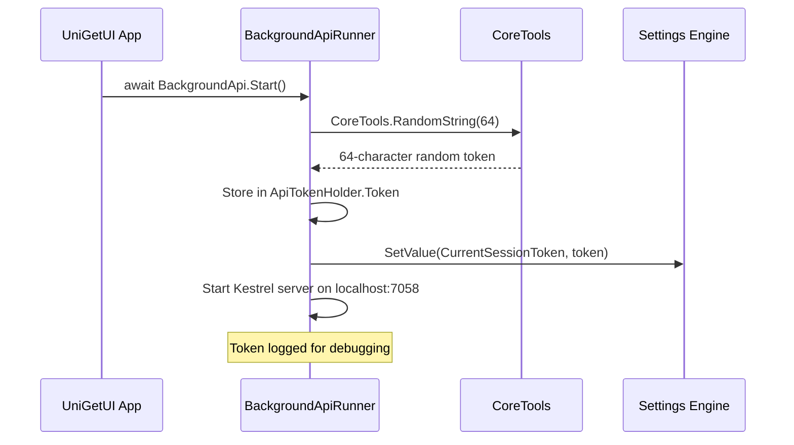
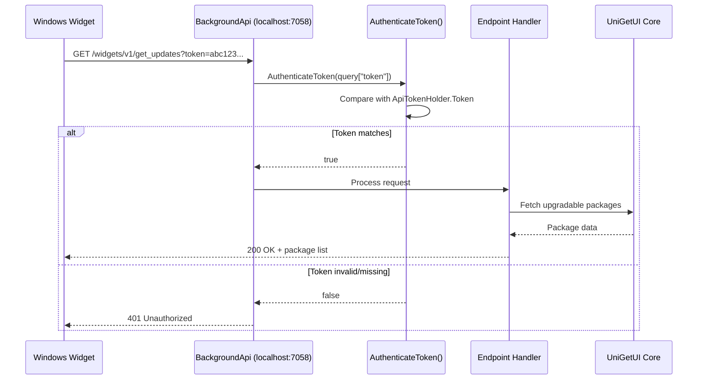

# Authentication & Authorization

## Overview
- **Strategy:** Token-based authentication using randomly-generated session tokens
- **Implementation:** `src/UniGetUI.Interface.BackgroundApi/BackgroundApi.cs`
- **Scope:** Local-only API for widgets and external integrations
- **Security Model:** Single session token per application instance

## Architecture Context

UniGetUI is a **desktop Windows application** that provides a GUI for package managers. It does **not** have traditional user authentication (no login/signup). Instead, it implements a **lightweight token-based authentication system** for its local HTTP API to:

1. Enable communication between the main application and Windows widgets
2. Provide a secure interface for external integrations (Dev Home, third-party widgets)
3. Prevent unauthorized access to the local API endpoints running on `http://localhost:7058`

## Authentication Flow

### Token Generation on Startup



### Authentication Steps

#### Step 1: Application startup generates token
- **File:** `src/UniGetUI.Interface.BackgroundApi/BackgroundApi.cs:Start()`
- **Location:** Lines 46-49
- **Process:** 
  - Generates a new 64-character random alphanumeric token
  - Stores in static `ApiTokenHolder.Token` for in-memory access
  - Persists to settings file via `Settings.SetValue(Settings.K.CurrentSessionToken, token)`

#### Step 2: Token generation
- **File:** `src/UniGetUI.Core.Tools/Tools.cs:RandomString()`
- **Location:** Lines 202-209
- **Method:** 
  - Uses `System.Random` class
  - Character pool: `abcdefghijklmnopqrstuvwxyz0123456789`
  - Length: 64 characters
  - **Note:** Uses non-cryptographic random for convenience (low-risk local-only scenario)

#### Step 3: API server startup
- **File:** `src/UniGetUI.Interface.BackgroundApi/BackgroundApi.cs:Start()`
- **Location:** Lines 51-92
- **Configuration:**
  - Server: ASP.NET Core Kestrel
  - URL: `http://localhost:7058`
  - CORS: Allows all origins (for local widget access)
  - No HTTPS (local-only traffic)

#### Step 4: Token storage
- **File:** `src/UniGetUI.Core.Settings/SettingsEngine_Names.cs`
- **Setting Key:** `CurrentSessionToken`
- **Format:** Plain text file in user configuration directory
- **Lifecycle:** Valid only for current application session
- **Exclusions:** Token is excluded from settings export/import (see `SettingsEngine_ImportExport.cs`)

## Authorized Request Flow



## Authorization Levels

UniGetUI does **not** implement role-based access control. All endpoints protected by the same session token have equivalent access.

| Endpoint Category | Protection | Purpose | Implementation |
|-------------------|------------|---------|----------------|
| Public | None | Health check, share links | `/v2/show-package`, `/is-running` |
| Widget API v1 | Token required | Widget integration | `/widgets/v1/*` endpoints |
| Widget API v2 | Token required | Enhanced widget features | `/widgets/v2/*` endpoints |

### Token Validation

- **File:** `src/UniGetUI.Interface.BackgroundApi/BackgroundApi.cs:AuthenticateToken()`
- **Location:** Lines 40-43
- **Logic:** Simple string equality check: `token == ApiTokenHolder.Token`
- **Applied to:** All `/widgets/*` endpoints

### Protected Endpoints Examples

All protected endpoints follow this pattern:

```csharp
private async Task WIDGETS_V1_GetUpdates(HttpContext context)
{
    if (!AuthenticateToken(context.Request.Query["token"]))
    {
        context.Response.StatusCode = 401;
        return;
    }
    // ... handle request
}
```

**Protected endpoints:**
- `/widgets/v1/get_wingetui_version` - Returns build number
- `/widgets/v1/get_updates` - Returns list of available updates
- `/widgets/v1/open_wingetui` - Triggers main window to open
- `/widgets/v1/view_on_wingetui` - Opens updates page
- `/widgets/v1/update_package` - Triggers package update
- `/widgets/v1/update_all_packages` - Triggers update all
- `/widgets/v1/update_all_packages_for_source` - Updates packages by source
- `/widgets/v2/get_icon_for_package` - Returns package icon

## Security Measures

### Token Security
- **Generation:** 64-character alphanumeric string (36^64 possible combinations)
- **Storage:** Stored in-memory (`ApiTokenHolder.Token`) and in user settings file
- **Transmission:** Sent via query parameter (acceptable for localhost-only traffic)
- **Lifetime:** Single session - new token generated on each application start
- **Scope:** Local machine only (`localhost:7058`)

### CORS Configuration
```csharp
app.UseCors(policy => policy
    .AllowAnyOrigin()
    .AllowAnyMethod()
    .AllowAnyHeader()
);
```
- **Rationale:** Permissive for local widgets running in different contexts
- **Risk mitigation:** Token authentication prevents unauthorized access despite open CORS

### Rate Limiting
**Not implemented** - Not necessary for local-only API with token authentication

### CSRF Protection
**Not applicable** - Local API with token authentication; no session cookies used

### Additional Security Notes
1. **No TLS/HTTPS:** API uses HTTP because:
   - Local-only communication (localhost)
   - No sensitive data transmission beyond the token
   - Avoids certificate management complexity
   
2. **Token exclusion from exports:** The `CurrentSessionToken` is explicitly excluded from settings exports to prevent token reuse across machines (see `SettingsEngine_ImportExport.cs`, lines checking for `CurrentSessionToken`)

3. **No password hashing:** Not applicable - no user passwords in the system

4. **Logging:** Token is logged at INFO level on generation for debugging (visible in application logs)

## Token Lifecycle

### Token Generation
1. Application starts
2. `BackgroundApi.Start()` called from `App.xaml.cs` during initialization
3. New random token generated via `CoreTools.RandomString(64)`
4. Token stored in memory and persisted to settings

### Token Usage
1. External clients (widgets) read token from settings or receive it from the application
2. Clients include token as query parameter: `?token=<token_value>`
3. Each API request validates token against stored value
4. Invalid token returns HTTP 401 Unauthorized

### Token Expiration
- **Session-based:** Token is valid only while application is running
- **No explicit expiration time:** Token remains valid until application closes
- **Regenerated on restart:** Each new application session gets a fresh token
- **No refresh mechanism:** Not needed due to local-only, single-session nature

### Token Cleanup
- **On application shutdown:** Token removed from memory (process terminates)
- **Settings file:** Old token remains in settings file but is invalid once app restarts
- **No revocation API:** Token cannot be manually revoked; only regenerated on app restart

## Token Distribution

### How Widgets Get the Token

Widgets and external integrations can obtain the token through:

1. **Reading Settings File:** 
   - Path: User configuration directory (platform-specific)
   - File: `CurrentSessionToken`
   - Contains: Plain text token value

2. **Application Communication:**
   - The main application can pass the token to widgets through OS-level mechanisms
   - Widgets can read from the same settings location the app writes to

### Example Token Retrieval (Conceptual)
```csharp
// In widget code:
string token = Settings.GetValue(Settings.K.CurrentSessionToken);
string apiUrl = $"http://localhost:7058/widgets/v1/get_updates?token={token}";
```

## Logout Process

**Not applicable** - UniGetUI is a desktop application without user accounts or login sessions. The "session" refers to the application runtime, not a user session.

### Application Shutdown
When the application closes:
1. HTTP server stops via `BackgroundApi.Stop()`
2. Token becomes invalid (server no longer running)
3. In-memory token cleared (process exits)
4. Settings file retains old token (overwritten on next startup)

## API Discovery

### Health Check Endpoint
- **Endpoint:** `/is-running`
- **Authentication:** None required
- **Purpose:** Allows external clients to check if UniGetUI is running
- **Response:** `{"status": "success"}`

### Package Sharing Endpoint
- **Endpoint:** `/v2/show-package?pid=<package_id>&psource=<source>`
- **Authentication:** None required
- **Purpose:** Allows deep linking to packages (e.g., from web browser)
- **Behavior:** Triggers main application to open and display specified package

## Integration Examples

### Widget API Call Example
```bash
# Get list of available updates
curl "http://localhost:7058/widgets/v1/get_updates?token=abc123xyz..."

# Update a specific package
curl "http://localhost:7058/widgets/v1/update_package?token=abc123xyz...&id=Microsoft.PowerToys"

# Update all packages
curl "http://localhost:7058/widgets/v1/update_all_packages?token=abc123xyz..."
```

### Response Format Examples

**Get Updates Response:**
```
PackageName1|PackageId1|1.0.0|1.1.0|SourceName|ManagerName|IconUrl&&PackageName2|...
```
- Format: Pipe-separated values, packages separated by `&&`
- Fields: Name, ID, Current Version, New Version, Source, Manager, Icon URL

**Success Response:**
```json
{"status": "success"}
```

**Unauthorized Response:**
- HTTP Status: 401
- Body: Empty

## Comparison with Traditional Auth Systems

| Aspect | Traditional Web App | UniGetUI |
|--------|-------------------|----------|
| User Accounts | Yes (login/signup) | No |
| Password Storage | Hashed (bcrypt, etc.) | N/A |
| Session Management | Server-side sessions/JWT | Single token per app instance |
| Authentication Method | Credentials → Token | Auto-generated token |
| Token Expiry | Time-based (e.g., 1 hour) | Process-based (until app closes) |
| Refresh Tokens | Yes | No |
| Multi-user Support | Yes | Single user (Windows user context) |
| Authorization Roles | Admin, User, Guest, etc. | None (token = full access) |
| HTTPS Requirement | Required | Not used (localhost only) |

## Security Considerations

### Threat Model

**In Scope:**
- Unauthorized access to local API from malicious local applications
- Token theft from settings file by other local processes

**Out of Scope:**
- Network attacks (API not exposed to network)
- Multi-user authentication (single Windows user context)
- User impersonation (no user accounts)

### Mitigations

1. **Token Randomness:** 64-character alphanumeric provides sufficient entropy against brute force
2. **Localhost Binding:** Server only listens on `127.0.0.1`, not accessible from network
3. **Session-based Tokens:** Token changes each session, limiting exposure window
4. **Settings Exclusion:** Token not exported with settings, preventing cross-machine reuse

### Known Limitations

1. **Query Parameter Transmission:** Token sent in URL query string
   - Acceptable for localhost but visible in process lists
   - Alternative (headers) would require more complex widget integration

2. **Non-Cryptographic Random:** `System.Random` used instead of `RandomNumberGenerator`
   - Acceptable for local-only scenario with short-lived tokens
   - Sufficient entropy for practical purposes

3. **Plain Text Storage:** Token stored unencrypted in settings file
   - Protected by OS file permissions (user's home directory)
   - Acceptable given local-only usage and session-based lifecycle

4. **No Token Rotation:** Token remains same throughout application session
   - Not needed given session-based model and local scope

## Related Files

- `src/UniGetUI.Interface.BackgroundApi/BackgroundApi.cs` - Main API implementation
- `src/UniGetUI.Core.Tools/Tools.cs` - Token generation utility
- `src/UniGetUI.Core.Settings/SettingsEngine_Names.cs` - Settings key definition
- `src/UniGetUI.Core.Settings/SettingsEngine_ImportExport.cs` - Token exclusion from exports
- `src/UniGetUI/App.xaml.cs` - API initialization on app startup

## Further Reading

- [ASP.NET Core Kestrel Documentation](https://docs.microsoft.com/en-us/aspnet/core/fundamentals/servers/kestrel)
- [Windows Widgets Development](https://learn.microsoft.com/en-us/windows/apps/design/widgets/)
- UniGetUI command-line arguments: `cli-arguments.md` in repository root
