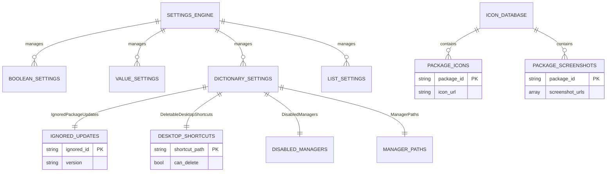

# Database Schema

## Database Overview
- **Type:** File-based JSON storage with in-memory caching
- **Version:** Custom implementation (no versioning system)
- **Connection:** File system I/O through `UniGetUI.Core.SettingsEngine` and `UniGetUI.Core.IconEngine`
- **Primary Location:** 
  - Settings: `%LOCALAPPDATA%\UniGetUI\Configuration\` (or `~/.wingetui/` for legacy)
  - Icon Cache: `%LOCALAPPDATA%\UniGetUI\CachedMetadata\`

## Architecture

UniGetUI uses a **file-based persistence system** rather than a traditional relational database. The application stores data in three primary formats:

1. **Boolean Settings** - Empty files (presence = true, absence = false)
2. **Value Settings** - Text files containing string values
3. **Structured Data** - JSON files for dictionaries and lists

All data access is managed through the `Settings` class in `UniGetUI.Core.SettingsEngine`, which provides:
- In-memory caching using `ConcurrentDictionary`
- Thread-safe read/write operations
- Automatic serialization/deserialization

## Entity Relationship Diagram



## Data Stores

### Settings Engine (Core Configuration)

**Purpose:** Central configuration management for all application settings

**Location:** `src/UniGetUI.Core.Settings/SettingsEngine.cs`

**Storage Format:**
- Boolean settings: Empty files in configuration directory
- Value settings: Plain text files
- Dictionaries: JSON files with `.json` extension
- Lists: JSON files with `.json` extension

**Key Operations:**
- `Get(K key)` - Read boolean setting
- `Set(K key, bool value)` - Write boolean setting
- `GetValue(K key)` - Read string value
- `SetValue(K key, string value)` - Write string value
- `GetDictionary<KeyT, ValueT>(K key)` - Read dictionary
- `SetDictionary<KeyT, ValueT>(K key, Dictionary<KeyT, ValueT> value)` - Write dictionary

**In-Memory Cache:**
```csharp
private static readonly ConcurrentDictionary<K, bool> booleanSettings
private static readonly ConcurrentDictionary<K, string> valueSettings
private static readonly ConcurrentDictionary<K, Dictionary<object, object?>> _dictionarySettings
private static readonly ConcurrentDictionary<string, List<object>> listSettings
```

### Ignored Updates Database

**Purpose:** Track packages whose updates should be ignored (either all versions or specific versions)

**Implementation:** `src/UniGetUI.PackageEngine.PackageManagerClasses/Packages/Classes/IgnoredUpdatesDatabase.cs`

**Schema:**
```json
{
  "managerName\\packageId": "version_or_wildcard_or_date"
}
```

**Storage:** `IgnoredPackageUpdates.json` in configuration directory

**Key Format:** `{manager.Name.ToLower()}\\{package.Id}`

**Value Options:**
- `"*"` - All versions ignored permanently
- `"1.2.3"` - Specific version ignored
- `"<2025-12-31"` - Ignored until date (temporary)

**Example Data:**
```json
{
  "winget\\Microsoft.PowerToys": "*",
  "chocolatey\\firefox": "115.0.1",
  "scoop\\git": "<2025-01-15"
}
```

**Common Operations:**
| Method | Description | File Location |
|--------|-------------|---------------|
| `Add(string ignoredId, string version)` | Add/update ignored package | IgnoredUpdatesDatabase.cs:86 |
| `Remove(string ignoredId)` | Remove package from ignored list | IgnoredUpdatesDatabase.cs:96 |
| `HasUpdatesIgnored(string ignoredId, string version)` | Check if package version is ignored | IgnoredUpdatesDatabase.cs:122 |
| `GetIgnoredVersion(string ignoredId)` | Get the ignored version for a package | IgnoredUpdatesDatabase.cs:152 |
| `GetDatabase()` | Retrieve entire dictionary | IgnoredUpdatesDatabase.cs:71 |

### Desktop Shortcuts Database

**Purpose:** Track user preferences for desktop shortcuts created by package installations

**Implementation:** `src/UniGetUI.PackageEngine.PackageManagerClasses/Packages/Classes/DesktopShortcutsDatabase.cs`

**Schema:**
```json
{
  "C:\\Users\\Username\\Desktop\\AppName.lnk": true,
  "C:\\Users\\Public\\Desktop\\AnotherApp.lnk": false
}
```

**Storage:** `DeletableDesktopShortcuts.json` in configuration directory

**Key Format:** Full file path to `.lnk` file

**Value Meaning:**
- `true` - User allows deletion (Status.Delete)
- `false` - User wants to maintain (Status.Maintain)
- Not present - Unknown status, user needs to be asked

**Status Enum:**
```csharp
enum Status {
    Maintain,  // Explicitly keep
    Unknown,   // Not yet decided
    Delete     // Allow deletion
}
```

**Common Operations:**
| Method | Description | File Location |
|--------|-------------|---------------|
| `AddToDatabase(string path, Status status)` | Set shortcut deletion status | DesktopShortcutsDatabase.cs:32 |
| `GetStatus(string path)` | Get current status of shortcut | DesktopShortcutsDatabase.cs:88 |
| `DeleteFromDisk(string path)` | Delete shortcut file | DesktopShortcutsDatabase.cs:65 |
| `GetShortcutsOnDisk()` | List all `.lnk` files on desktop | DesktopShortcutsDatabase.cs:104 |
| `HandleNewShortcuts(List<string> previous)` | Process shortcuts created during operation | DesktopShortcutsDatabase.cs:154 |

**In-Memory State:**
```csharp
private static readonly List<string> UnknownShortcuts = []
```
Tracks shortcuts awaiting user decision.

### Icon Database

**Purpose:** Provide package icons and screenshots from a centrally maintained database

**Implementation:** `src/UniGetUI.Core.IconStore/IconDatabase.cs`

**Data Source:** Downloaded from GitHub repository (JSON format)
- URL: `https://github.com/marticliment/UniGetUI/raw/refs/heads/main/WebBasedData/screenshot-database-v2.json`
- Local Cache: `%LOCALAPPDATA%\UniGetUI\CachedMetadata\Icon Database.json`

**Schema Structure:**
```csharp
struct IconScreenshotDatabase_v2 {
    PackageCount package_count;
    Dictionary<string, PackageIconAndScreenshots> icons_and_screenshots;
}

struct PackageCount {
    int total;
    int done;
    int packages_with_icon;
    int packages_with_screenshot;
    int total_screenshots;
}

struct PackageIconAndScreenshots {
    string icon;           // URL to icon image
    List<string> images;   // URLs to screenshot images
}
```

**Example JSON:**
```json
{
  "package_count": {
    "total": 15000,
    "done": 12000,
    "packages_with_icon": 10000,
    "packages_with_screenshot": 5000,
    "total_screenshots": 25000
  },
  "icons_and_screenshots": {
    "winget\\Microsoft.VisualStudioCode": {
      "icon": "https://example.com/vscode-icon.png",
      "images": [
        "https://example.com/vscode-screenshot1.png",
        "https://example.com/vscode-screenshot2.png"
      ]
    },
    "__test_entry_DO_NOT_EDIT_PLEASE": {
      "icon": "https://this.is.a.test/url/used_for/automated_unit_testing.png",
      "images": [
        "https://image_number.com/1.png",
        "https://image_number.com/2.png",
        "https://image_number.com/3.png"
      ]
    }
  }
}
```

**Common Operations:**
| Method | Description | File Location |
|--------|-------------|---------------|
| `LoadIconAndScreenshotsDatabaseAsync()` | Download and load database from GitHub | IconDatabase.cs:38 |
| `LoadFromCacheAsync()` | Load database from local cache | IconDatabase.cs:78 |
| `GetIconUrlForId(string id)` | Get icon URL for package ID | IconDatabase.cs:106 |
| `GetScreenshotsUrlForId(string id)` | Get screenshot URLs for package ID | IconDatabase.cs:116 |
| `GetIconCount()` | Get metadata about icon database | IconDatabase.cs:121 |

**Caching Strategy:**
- Downloads fresh data on application startup
- Falls back to cached file if download fails
- Singleton pattern ensures single instance
- In-memory dictionary for fast lookups

## Relationships

- **Settings Engine → All Databases:** One-to-Many - Settings Engine manages all configuration data stores
- **Ignored Updates → Packages:** Many-to-One - Multiple ignored update entries per manager
- **Desktop Shortcuts → Packages:** Many-to-Many - Shortcuts can be created by multiple packages, packages can create multiple shortcuts
- **Icon Database → Packages:** One-to-One - Each package ID maps to one icon and screenshot set

## Common Queries

### Query 1: Check if Package Updates Are Ignored
```csharp
// Check if a specific package version is ignored
string ignoredId = $"{package.Manager.Properties.Name.ToLower()}\\{package.Id}";
bool isIgnored = IgnoredUpdatesDatabase.HasUpdatesIgnored(ignoredId, package.NewVersion);

// Check if all versions are ignored
bool allVersionsIgnored = IgnoredUpdatesDatabase.HasUpdatesIgnored(ignoredId, "*");
```
- **Implementation:** `IgnoredUpdatesDatabase.cs:HasUpdatesIgnored()`
- **Performance:** O(1) dictionary lookup with in-memory cache
- **Use Case:** Called during package update checks to filter out ignored packages

### Query 2: Add Package to Ignored Updates
```csharp
// Ignore all versions permanently
string ignoredId = IgnoredUpdatesDatabase.GetIgnoredIdForPackage(package);
IgnoredUpdatesDatabase.Add(ignoredId, "*");

// Ignore specific version
IgnoredUpdatesDatabase.Add(ignoredId, "2.5.1");

// Ignore temporarily (until date)
PauseTime pauseTime = new() { Months = 1 };
string dateStr = "<" + pauseTime.GetDateFromNow();
IgnoredUpdatesDatabase.Add(ignoredId, dateStr);
```
- **Implementation:** `IgnoredUpdatesDatabase.cs:Add()`
- **Performance:** O(1) dictionary insert + file I/O
- **Use Case:** User action to ignore package updates

### Query 3: Get Icon and Screenshots for Package
```csharp
// Get icon URL
string? iconUrl = IconDatabase.Instance.GetIconUrlForId(packageId);

// Get all screenshot URLs
string[] screenshots = IconDatabase.Instance.GetScreenshotsUrlForId(packageId);
```
- **Implementation:** `IconDatabase.cs:GetIconUrlForId()`, `GetScreenshotsUrlForId()`
- **Performance:** O(1) dictionary lookup
- **Use Case:** Displaying package details in UI

### Query 4: Handle Desktop Shortcuts After Installation
```csharp
// Before installation - capture existing shortcuts
List<string> previousShortcuts = DesktopShortcutsDatabase.GetShortcutsOnDisk();

// After installation - detect and handle new shortcuts
DesktopShortcutsDatabase.HandleNewShortcuts(previousShortcuts);

// Get shortcuts needing user decision
List<string> unknownShortcuts = DesktopShortcutsDatabase.GetUnknownShortcuts();
```
- **Implementation:** `DesktopShortcutsDatabase.cs:HandleNewShortcuts()`
- **Performance:** O(n) file system scan + O(m) dictionary lookups
- **Use Case:** Post-installation cleanup and user prompting

### Query 5: Get All Configuration Settings
```csharp
// Read boolean setting
bool autoUpdate = Settings.Get(Settings.K.AutomaticallyUpdatePackages);

// Read string setting
string proxyUrl = Settings.GetValue(Settings.K.ProxyURL);

// Read dictionary setting
var ignoredUpdates = Settings.GetDictionary<string, string>(Settings.K.IgnoredPackageUpdates);

// Read list setting
var operationHistory = Settings.GetList<string>("OperationHistory");
```
- **Implementation:** `SettingsEngine.cs`, `SettingsEngine_Dictionaries.cs`, `SettingsEngine_Lists.cs`
- **Performance:** O(1) with in-memory cache, O(n) on first access (file read + JSON deserialization)
- **Use Case:** Application configuration and state management

### Query 6: Check Desktop Shortcut Deletion Status
```csharp
// Get status for specific shortcut
var status = DesktopShortcutsDatabase.GetStatus(shortcutPath);

switch (status) {
    case Status.Delete:
        // User approved deletion
        DesktopShortcutsDatabase.DeleteFromDisk(shortcutPath);
        break;
    case Status.Maintain:
        // User wants to keep it
        break;
    case Status.Unknown:
        // Need to ask user
        break;
}
```
- **Implementation:** `DesktopShortcutsDatabase.cs:GetStatus()`
- **Performance:** O(1) dictionary lookup
- **Use Case:** Determining whether to delete shortcuts after package operations

## Data Migration

### Configuration Directory Migration
The application automatically migrates configuration files from legacy locations:
- **Old Path:** `~/.wingetui/` or `%LOCALAPPDATA%\UniGetUI\` (root)
- **New Path:** `%LOCALAPPDATA%\UniGetUI\Configuration\`

**Migration Logic:** `CoreData.cs:UniGetUIUserConfigurationDirectory`
- Detects old configuration files (no extension or `.json`)
- Moves them to new configuration subdirectory
- Preserves data integrity with error handling

### Portable Mode
When `ForceUniGetUIPortable` file exists in executable directory:
- All data stored in `.\Settings\` relative to executable
- Enables USB drive installations
- Automatic fallback to user directory if path is not writable

## Performance Optimizations

### In-Memory Caching
All settings are cached in `ConcurrentDictionary` collections:
- Boolean settings cached on first read
- Value settings cached on first read
- Dictionary settings cached on first read
- Eliminates repeated file I/O operations

**Cache Invalidation:** Automatic on write operations

### Concurrent Access
- Uses `ConcurrentDictionary<K, V>` for thread-safe operations
- No explicit locking required for reads
- Atomic write operations through dictionary APIs

### Icon Database Optimization
- Single download on startup (cached for session)
- Singleton pattern prevents duplicate downloads
- Local file cache for offline access
- Fast in-memory dictionary lookups

### File I/O Optimization
- Dictionary/List changes write entire structure (atomic)
- Empty dictionaries/lists result in file deletion (no empty JSON files)
- JSON serialization uses consistent options for predictable formatting

### Lazy Loading
- Settings loaded on-demand, not at startup
- Icon database loaded asynchronously
- Configuration directory created only when needed

## Error Handling

### File Access Errors
- Logged via `UniGetUI.Core.Logging.Logger`
- Non-critical errors don't block application startup
- Failed downloads fall back to cached data
- Write failures preserve existing cached state

### Portable Mode Fallback
If portable directory is not writable:
- Automatically switches to user-local storage
- Logs warning about failed portable mode
- Continues operation without data loss

### JSON Deserialization Errors
- Invalid JSON results in empty collection (not crash)
- Type mismatches logged as errors
- Returns default values on parse failures

## Storage Locations Summary

| Data Type | Filename Pattern | Directory |
|-----------|------------------|-----------|
| Boolean Settings | `{SettingName}` (empty file) | Configuration |
| Value Settings | `{SettingName}` (text file) | Configuration |
| Dictionary Settings | `{SettingName}.json` | Configuration |
| List Settings | `{SettingName}.json` | Configuration |
| Icon Database | `Icon Database.json` | CachedMetadata |
| Installation Options | `{PackageId}.json` | InstallationOptions |
| Cached Icons | Various | CachedMedia |
| Language Files | Various | CachedLanguageFiles |

**Base Directory Resolution:**
1. Check for portable mode flag
2. Use `%LOCALAPPDATA%\UniGetUI\` (preferred)
3. Fall back to `~/.wingetui/` (legacy)

## Key Classes Reference

| Class | Purpose | Location |
|-------|---------|----------|
| `Settings` | Core settings management | UniGetUI.Core.Settings/SettingsEngine.cs |
| `IgnoredUpdatesDatabase` | Ignored package updates | UniGetUI.PackageEngine.PackageManagerClasses/.../IgnoredUpdatesDatabase.cs |
| `DesktopShortcutsDatabase` | Desktop shortcut management | UniGetUI.PackageEngine.PackageManagerClasses/.../DesktopShortcutsDatabase.cs |
| `IconDatabase` | Icon and screenshot data | UniGetUI.Core.IconStore/IconDatabase.cs |
| `CoreData` | Path and directory constants | UniGetUI.Core.Data/CoreData.cs |

## Testing

**Unit Tests:**
- Icon Database: `src/UniGetUI.Core.IconEngine.Tests/IconDatabaseTests.cs`
- Settings Engine: `src/UniGetUI.Core.Settings.Tests/SettingsTest.cs`

**Test Coverage:**
- Icon database loading and caching
- Icon and screenshot retrieval
- Settings persistence and retrieval
- Dictionary operations

**Test Patterns:**
- Mock data includes test entries like `__test_entry_DO_NOT_EDIT_PLEASE`
- Tests verify both positive and negative cases (existing/non-existing data)
- Async operations tested with `async Task` pattern
