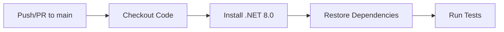

# Build & Deployment

## Build Process

### Build Tool
- **Tool:** .NET SDK 8.0
- **Config Files:** 
  - `src/UniGetUI.sln` - Main solution file
  - `src/UniGetUI/UniGetUI.csproj` - Main application project file
  - `UniGetUI.iss` - Inno Setup installer configuration

### Build Command
```bash
# For testing/development
dotnet publish src/UniGetUI/UniGetUI.csproj /noLogo /property:Configuration=Release /property:Platform=x64 -v m

# For full release build (with installer)
build_release.cmd
```

### Build Steps

The build process is orchestrated by the `build_release.cmd` script:

1. **Step 1: Update version resources**
   - Script: `scripts/apply_versions.py`
   - Updates version strings in source files
   - Increments build number in `scripts/BuildNumber`

2. **Step 2: Kill running instances**
   - Terminates any running instances of `wingetui.exe` and `unigetui.exe`
   - Prevents file locking issues during build

3. **Step 3: Run tests**
   - Command: `dotnet test src/UniGetUI.sln -v q --nologo`
   - Runs all unit tests in the solution
   - Build fails if any tests fail

4. **Step 4: Clean previous build**
   - Command: `dotnet clean src/UniGetUI.sln -v m -nologo`
   - Removes previous build artifacts

5. **Step 5: Publish application**
   - Command: `dotnet publish src/UniGetUI/UniGetUI.csproj /noLogo /property:Configuration=Release /property:Platform=x64 -v m`
   - Target Framework: `net8.0-windows10.0.26100.0`
   - Runtime: `win-x64`
   - Output: `src/UniGetUI/bin/x64/Release/net8.0-windows10.0.26100.0/win-x64/publish`
   - Build features:
     - PublishTrimmed: `true` (reduces binary size)
     - TrimMode: `partial`
     - BuiltInComInteropSupport: `true`

6. **Step 6: Copy build output**
   - Source: `src\UniGetUI\bin\x64\Release\net8.0-windows10.0.26100.0\win-x64\publish`
   - Destination: `unigetui_bin/`
   - Removes old `unigetui_bin` directory and creates new one

7. **Step 7: Code signing (optional)**
   - Prompts user for signing confirmation
   - Signs `UniGetUI.exe` and all `.dll` files
   - Uses `%signcommand%` environment variable

8. **Step 8: Create WingetUI.exe copy**
   - Creates copy of `UniGetUI.exe` as `WingetUI.exe`
   - Maintains backward compatibility

9. **Step 9: Generate integrity tree**
   - Script: `scripts/generate_integrity_tree.py`
   - Generates MD5 checksums for all files
   - Output: `unigetui_bin/IntegrityTree.json`
   - Used for file integrity verification

10. **Step 10: Create ZIP archive**
    - Creates `output/` directory
    - Compresses `unigetui_bin/` to `output/UniGetUI.x64.zip`
    - Uses 7zip for compression

11. **Step 11: Create installer**
    - Tool: Inno Setup 6
    - Config: `UniGetUI.iss`
    - Output: `UniGetUI.Installer.exe` and `WingetUI.Installer.exe`
    - Features:
      - Multi-language support (20+ languages)
      - Custom install options (portable vs regular)
      - Optional chocolatey installation
      - VC++ 2015-2022 and Edge WebView2 dependency installation
      - Registry integration for deep links (`unigetui://`)
      - File type association (`.ubundle`)

12. **Step 12: Calculate checksums**
    - Generates SHA256 hashes for installer and ZIP
    - Displays checksums in console

### Build Output
```
output/
├── UniGetUI.Installer.exe          # Main installer
├── WingetUI.Installer.exe          # Legacy named installer
└── UniGetUI.x64.zip                # Portable ZIP archive

unigetui_bin/
├── UniGetUI.exe                    # Main executable
├── WingetUI.exe                    # Legacy copy
├── IntegrityTree.json              # File integrity checksums
├── *.dll                           # Dependencies
└── (various runtime files)
```

### Test Publishing
Two scripts are available for quick testing:

**test_publish.cmd** (with signing):
```cmd
dotnet publish src/UniGetUI/UniGetUI.csproj /property:Configuration=Release /property:Platform=x64
# Signs the executable
# Generates integrity tree
# Launches the application
```

**test_publish_nosign.cmd** (without signing):
```cmd
# Same as above but skips code signing step
```

### Custom Build Targets

The `UniGetUI.csproj` includes custom MSBuild targets:

- **GenerateBuildInfo** (BeforeBuild): Generates secrets file via PowerShell script
- **PostBuildGenerateIntegrityTree** (PostBuildEvent): Auto-generates integrity tree for debug builds

## Deployment

### Production Environment
- **Platforms:** 
  - Microsoft Store
  - GitHub Releases
  - WinGet Package Repository
  - Scoop (extras bucket)
  - Chocolatey Package Repository
- **Official Website:** https://www.marticliment.com/unigetui/
- **GitHub Repository:** https://github.com/marticliment/UniGetUI

### Deployment Process

#### Manual Deployment

Manual release process requires:

1. **Build:**
   ```cmd
   build_release.cmd
   ```

2. **Upload artifacts:**
   - Create GitHub release
   - Upload `output/UniGetUI.Installer.exe`
   - Upload `output/WingetUI.Installer.exe`
   - Upload `output/UniGetUI.x64.zip`
   - Include SHA256 checksums in release notes

3. **Version tagging:**
   - Tag format: `v{major}.{minor}.{patch}` (e.g., `v3.3.6`)
   - Supports pre-release tags (e.g., `v3.3.6-beta.1`)

#### CI/CD Pipeline

The project uses **GitHub Actions** for CI/CD:

##### Test Workflow
- **Config:** `.github/workflows/dotnet-test.yml`
- **Triggers:**
  - Push to `main` branch (when C# files, project files, or solution files change)
  - Pull requests to `main` branch
  - Manual workflow dispatch

**Pipeline Stages:**


**Workflow Steps:**
1. **Checkout:** Clone repository
2. **Setup .NET:** Install .NET 8.0 SDK
3. **Restore:** `dotnet restore` in `src/` directory
4. **Test:** `dotnet test --no-restore --verbosity q --nologo`

##### WinGet Stable Release Workflow
- **Config:** `.github/workflows/winget-stable.yml`
- **Triggers:**
  - GitHub release published (stable releases only)
  - Manual workflow dispatch

**Workflow:**
1. **Trigger:** New release created on GitHub
2. **Submit:** Automatically submits to WinGet repository
3. **Package ID:** `MartiCliment.UniGetUI`
4. **Installer:** Uses regex pattern `UniGetUI\.Installer\.exe$`
5. **Authentication:** Uses `WINGET_TOKEN` secret

##### WinGet Pre-release Workflow
- **Config:** `.github/workflows/winget-prerelease.yml`
- **Triggers:**
  - GitHub pre-release published
  - Manual workflow dispatch

**Workflow:**
1. **Trigger:** Pre-release created on GitHub
2. **Submit:** Automatically submits to WinGet pre-release channel
3. **Package ID:** `MartiCliment.UniGetUI.Pre-Release`
4. **Condition:** Only runs if `github.event.release.prerelease == true`

##### CodeQL Security Scanning
- **Config:** `.github/workflows/codeql.yml`
- **Triggers:**
  - Weekly schedule (Monday at 00:00)
  - Manual workflow dispatch

**Workflow:**
1. **Languages:** C# and Python
2. **Build Mode:** None (interpreted languages)
3. **Output:** Security vulnerability reports

##### Translation Test Workflow
- **Config:** `.github/workflows/translations-test.yml`
- **Purpose:** Validates translation files

##### Icon Update Workflow
- **Config:** `.github/workflows/update-icons.yaml`
- **Purpose:** Automatically updates application icons

##### Tolgee Update Workflow
- **Config:** `.github/workflows/update-tolgee.yml`
- **Purpose:** Syncs translations with Tolgee platform

### Environment Configurations

#### Development/Testing
- **Branch:** Any feature branch or `main`
- **Build:** Manual via `test_publish.cmd` or `test_publish_nosign.cmd`
- **Testing:** Local machine testing
- **Signing:** Optional (can be skipped)

#### Stable Production
- **Branch:** `main` (releases)
- **Trigger:** GitHub Release (not marked as pre-release)
- **Distribution:**
  - GitHub Releases
  - WinGet (`MartiCliment.UniGetUI`)
  - Microsoft Store (separate submission)
  - Scoop (extras/unigetui)
  - Chocolatey (wingetui)
- **Auto-deploy:** Yes (WinGet only, others require manual submission)
- **Signing:** Required

#### Pre-release/Beta
- **Branch:** `main` (pre-releases)
- **Trigger:** GitHub Pre-release
- **Distribution:**
  - GitHub Releases
  - WinGet Pre-release (`MartiCliment.UniGetUI.Pre-Release`)
- **Auto-deploy:** Yes (WinGet only)
- **Signing:** Required

### Deployment Checklist
- [ ] All tests passing (`dotnet test src/UniGetUI.sln`)
- [ ] Version numbers updated in:
  - [ ] `src/UniGetUI.Core.Data/CoreData.cs` (VersionName, BuildNumber)
  - [ ] `UniGetUI.iss` (MyAppVersion)
  - [ ] `scripts/BuildNumber` (incremented)
- [ ] Code signed (for production releases)
- [ ] Installer tested on clean Windows installation
- [ ] Integrity tree generated (`IntegrityTree.json`)
- [ ] Release notes prepared
- [ ] SHA256 checksums calculated and documented
- [ ] GitHub release created with proper tag
- [ ] Pre-release flag set correctly (if applicable)

### Version Management

Version information is managed through:

1. **scripts/apply_versions.py**
   - Interactive script for updating versions
   - Prompts for version name (e.g., "3.3.6")
   - Auto-increments build number
   - Updates `src/UniGetUI.Core.Data/CoreData.cs`
   - Updates `UniGetUI.iss`

2. **Version Storage Locations:**
   - `src/UniGetUI.Core.Data/CoreData.cs`: VersionName and BuildNumber constants
   - `UniGetUI.iss`: MyAppVersion definition
   - `scripts/BuildNumber`: Build counter file

### Rollback Procedure

If a release has critical issues:

1. **Immediate rollback:**
   ```bash
   # Create hotfix from previous stable tag
   git checkout v{previous.version}
   git checkout -b hotfix/{issue}
   # Fix the issue
   # Create new patch release
   ```

2. **WinGet rollback:**
   - Submit new package version with fix
   - Previous version remains available
   - Users can downgrade manually: `winget install --version {version} MartiCliment.UniGetUI`

3. **GitHub Release:**
   - Mark problematic release as pre-release
   - Add warning in release notes
   - Create new fixed release

4. **Microsoft Store:**
   - Submit new version to Microsoft Store
   - Previous version stops being distributed automatically

### Monitoring & Logging

- **CodeQL:** Weekly automated security scans
- **Test Status:** Visible via GitHub Actions badge in README
- **Build Status:** GitHub Actions workflow status
- **Issue Tracking:** GitHub Issues
- **Security Reports:** Via [WhiteHub disclosure program](https://whitehub.net/programs/unigetui/)
- **Telemetry:** Built-in telemetry via `UniGetUI.Interface.Telemetry` project

### Distribution Channels Summary

| Channel | Package ID | Auto-Deploy | Update Mechanism |
|---------|-----------|-------------|------------------|
| **WinGet (Stable)** | MartiCliment.UniGetUI | ✅ Yes | GitHub Actions |
| **WinGet (Pre-release)** | MartiCliment.UniGetUI.Pre-Release | ✅ Yes | GitHub Actions |
| **Microsoft Store** | N/A | ❌ Manual | Store submission |
| **Scoop** | extras/unigetui | ❌ Manual | Scoop PR |
| **Chocolatey** | wingetui | ❌ Manual | Chocolatey PR |
| **GitHub Releases** | N/A | ❌ Manual | GitHub UI |

### Dependencies

Runtime dependencies installed via Inno Setup:

- **VC++ 2015-2022 Redistributable:** Required for native interop
- **Edge WebView2 Runtime:** Required for web views
- **.NET 8.0 Runtime:** Bundled with application (self-contained publish)

Both can be skipped with command-line flags:
- `/NoVCRedist` - Skip VC++ installation
- `/NoEdgeWebView` - Skip WebView2 installation

### Special Installation Options

The installer supports several custom options:

1. **Portable Installation:**
   - Creates `ForceUniGetUIPortable` marker file
   - Doesn't modify registry
   - No auto-start on Windows startup
   - No file type associations

2. **Regular Installation:**
   - Start menu icon (optional)
   - Desktop icon (optional)
   - Auto-start on Windows login
   - Deep link registration (`unigetui://`)
   - File type association (`.ubundle`)
   - Optional Chocolatey installation to `%USERPROFILE%\UniGetUI\Chocolatey`

3. **Silent Installation:**
   ```cmd
   UniGetUI.Installer.exe /silent
   ```

4. **Custom Parameters:**
   - `/NoDeployInstaller` - Don't copy installer to app directory
   - `/NoWinGet` - Skip WinGet installation check
   - `/NoChocolatey` - Don't install Chocolatey
   - `/NoAutoStart` - Don't launch after installation
   - `/NoRunOnStartup` - Disable auto-start on login
   - `/EnableSystemChocolatey` - Use system Chocolatey instead of bundled

### Build Artifacts Retention

- **Local builds:** Stored in `output/` and `unigetui_bin/` directories
- **GitHub Actions:** Artifacts retained per repository settings
- **GitHub Releases:** Permanent storage
- **Package managers:** Retain all versions per their policies
