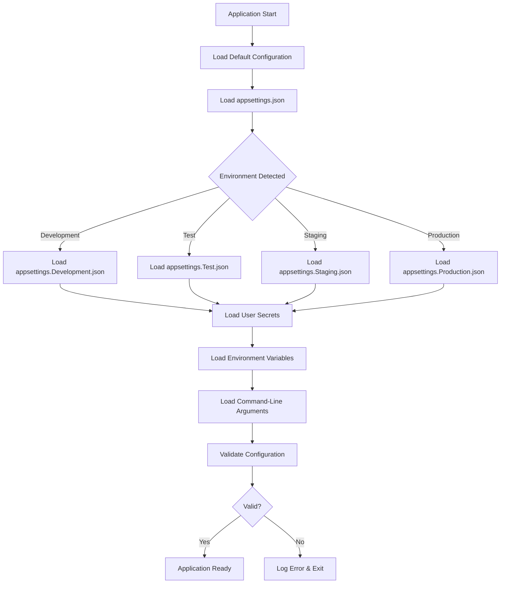

# Configuration Management

## Overview

This document defines configuration management patterns for UniGetUI and applications built with the CodingKit Framework. It provides guidelines for structured, maintainable, and secure configuration management across different environments.

## Table of Contents

- [Configuration Architecture](#configuration-architecture)
- [Configuration File Structure](#configuration-file-structure)
- [Configuration Sources](#configuration-sources)
- [Configuration Validation](#configuration-validation)
- [Dynamic Configuration Updates](#dynamic-configuration-updates)
- [Configuration Versioning](#configuration-versioning)
- [Best Practices](#best-practices)

## Configuration Architecture

### Layered Configuration Model

The CodingKit Framework follows a hierarchical configuration model with multiple layers of precedence:

```
1. Default Configuration (Lowest Priority)
   ↓
2. appsettings.json (Base Configuration)
   ↓
3. appsettings.{Environment}.json (Environment-Specific)
   ↓
4. User Secrets (Development Only)
   ↓
5. Environment Variables
   ↓
6. Command-Line Arguments (Highest Priority)
```

### Configuration Flow



## Configuration File Structure

### Base Configuration: appsettings.json

```json
{
  "AppSettings": {
    "ApplicationName": "UniGetUI",
    "Version": "3.3.6",
    "DataDirectory": "%LocalAppData%\\UniGetUI",
    "EnableTelemetry": true,
    "Culture": "en-US"
  },
  "Logging": {
    "LogLevel": {
      "Default": "Information",
      "Microsoft": "Warning",
      "System": "Warning"
    },
    "File": {
      "Path": "%LocalAppData%\\UniGetUI\\Logs",
      "RetentionDays": 30,
      "MaxFileSizeMB": 10
    }
  },
  "Features": {
    "EnableAutoUpdates": true,
    "EnableBackgroundOperations": true,
    "EnablePackageBackup": true,
    "EnableStatistics": true,
    "ExperimentalFeatures": false
  },
  "PackageManagers": {
    "WinGet": {
      "Enabled": true,
      "Priority": 1,
      "CacheDurationMinutes": 30
    },
    "Chocolatey": {
      "Enabled": true,
      "Priority": 2,
      "CacheDurationMinutes": 30
    },
    "Scoop": {
      "Enabled": true,
      "Priority": 3,
      "CacheDurationMinutes": 30
    }
  },
  "Security": {
    "AllowCLIArguments": false,
    "AllowImportingCLIArguments": false,
    "AllowPrePostOpCommand": false,
    "RequireElevation": false,
    "VerifyPackageSignatures": true
  },
  "Performance": {
    "MaxConcurrentOperations": 3,
    "NetworkTimeoutSeconds": 30,
    "CacheEnabled": true,
    "MaxCacheSizeMB": 500
  },
  "UI": {
    "Theme": "System",
    "Language": "en-US",
    "ShowNotifications": true,
    "MinimizeToTray": false,
    "StartMinimized": false
  }
}
```

### Environment Variables Configuration

Environment-specific settings should be overridable via environment variables using a hierarchical naming convention:

```bash
# Format: {Section}__{SubSection}__{Property}
# Double underscore (__) separates hierarchy levels

# Example: Override logging level
LOGGING__LOGLEVEL__DEFAULT=Debug

# Example: Override application name
APPSETTINGS__APPLICATIONNAME=UniGetUI-Dev

# Example: Override package manager settings
PACKAGEMANAGERS__WINGET__ENABLED=true

# Example: Override security settings
SECURITY__ALLOWCLIARGUMENTS=true
```

### Command-Line Arguments

Command-line arguments provide the highest priority configuration override:

```bash
# Format: --{Section}:{SubSection}:{Property}=Value
# Colon (:) separates hierarchy levels

# Example: Override logging level
UniGetUI.exe --Logging:LogLevel:Default=Debug

# Example: Override data directory
UniGetUI.exe --AppSettings:DataDirectory=C:\CustomPath

# Example: Disable telemetry
UniGetUI.exe --AppSettings:EnableTelemetry=false
```

## Configuration Sources

### 1. Application Settings Files

**Location**: `{AppRoot}/` or `{AppRoot}/config/`

**Files**:
- `appsettings.json` - Base configuration (committed to repository)
- `appsettings.Development.json` - Development overrides (committed)
- `appsettings.Test.json` - Test environment overrides (committed)
- `appsettings.Staging.json` - Staging environment overrides (committed)
- `appsettings.Production.json` - Production overrides (committed, no secrets)

**Best Practices**:
- Store only non-sensitive configuration
- Use environment variables for sensitive data
- Commit environment-specific files to source control
- Use JSON schema validation

### 2. User Secrets (Development Only)

**Location**: 
- Windows: `%APPDATA%\Microsoft\UserSecrets\{UserSecretsId}\secrets.json`
- Linux/macOS: `~/.microsoft/usersecrets/{UserSecretsId}/secrets.json`

**Purpose**: Store sensitive data during development without committing to source control

**Configuration**:
```xml
<!-- Add to .csproj file -->
<PropertyGroup>
  <UserSecretsId>UniGetUI-12345678-1234-1234-1234-123456789012</UserSecretsId>
</PropertyGroup>
```

**Usage**:
```bash
# Set a user secret
dotnet user-secrets set "ApiKeys:GitHub" "ghp_yourtoken"

# List all secrets
dotnet user-secrets list

# Remove a secret
dotnet user-secrets remove "ApiKeys:GitHub"

# Clear all secrets
dotnet user-secrets clear
```

**Example secrets.json**:
```json
{
  "ApiKeys": {
    "GitHub": "ghp_developmenttoken",
    "Telemetry": "dev-telemetry-key"
  },
  "ConnectionStrings": {
    "Database": "Server=localhost;Database=UniGetUI_Dev;Trusted_Connection=true;"
  }
}
```

### 3. Environment Variables

**Location**: System/User/Process environment variables

**Best Practices**:
- Use for sensitive data in production
- Follow naming convention: `{SECTION}__{PROPERTY}`
- Use uppercase for environment variable names
- Document required environment variables

### 4. External Configuration Providers

**Azure App Configuration**:
```csharp
builder.Configuration.AddAzureAppConfiguration(options =>
{
    options.Connect(Environment.GetEnvironmentVariable("AZURE_APPCONFIG_CONNECTION"))
           .UseFeatureFlags();
});
```

**AWS Systems Manager Parameter Store**:
```csharp
builder.Configuration.AddSystemsManager("/myapp/");
```

**HashiCorp Vault**:
```csharp
builder.Configuration.AddVault(options =>
{
    options.Address = "https://vault.company.com";
    options.Path = "secret/myapp";
});
```

### 5. Secure Settings Storage

For security-sensitive settings that require system-level protection:

**Location**: `%ProgramFiles%\UniGetUI\SecureSettings\{Username}\`

**Implementation**:
```csharp
// Check secure setting
bool isAllowed = SecureSettings.Get(SecureSettings.K.AllowCLIArguments);

// Set secure setting (requires elevation)
await SecureSettings.TrySet(SecureSettings.K.AllowCLIArguments, true);
```

**Use Cases**:
- Security policy enforcement
- System-wide restrictions
- Multi-user security settings
- Protected configuration options

## Configuration Validation

### Startup Validation

Validate configuration at application startup to fail fast:

```csharp
public class AppSettingsValidator : IConfigurationValidator
{
    public ValidationResult Validate(IConfiguration configuration)
    {
        var errors = new List<string>();

        // Validate required settings
        if (string.IsNullOrEmpty(configuration["AppSettings:ApplicationName"]))
        {
            errors.Add("AppSettings:ApplicationName is required");
        }

        // Validate value ranges
        var maxOps = configuration.GetValue<int>("Performance:MaxConcurrentOperations");
        if (maxOps < 1 || maxOps > 10)
        {
            errors.Add("Performance:MaxConcurrentOperations must be between 1 and 10");
        }

        // Validate directory paths
        var dataDir = configuration["AppSettings:DataDirectory"];
        if (!Directory.Exists(Environment.ExpandEnvironmentVariables(dataDir)))
        {
            try
            {
                Directory.CreateDirectory(Environment.ExpandEnvironmentVariables(dataDir));
            }
            catch
            {
                errors.Add($"Cannot create data directory: {dataDir}");
            }
        }

        return errors.Any() 
            ? ValidationResult.Failure(errors) 
            : ValidationResult.Success();
    }
}
```

### Data Annotations Validation

Use data annotations for strongly-typed configuration:

```csharp
public class AppSettings
{
    [Required]
    [StringLength(100, MinimumLength = 1)]
    public string ApplicationName { get; set; }

    [Required]
    [RegularExpression(@"^\d+\.\d+\.\d+$")]
    public string Version { get; set; }

    [Required]
    [DirectoryPath]
    public string DataDirectory { get; set; }

    [Range(1, 10)]
    public int MaxConcurrentOperations { get; set; } = 3;
}

// Register and validate
services.AddOptions<AppSettings>()
    .Bind(configuration.GetSection("AppSettings"))
    .ValidateDataAnnotations()
    .ValidateOnStart();
```

### JSON Schema Validation

Use JSON schema for configuration file validation:

**appsettings.schema.json**:
```json
{
  "$schema": "http://json-schema.org/draft-07/schema#",
  "type": "object",
  "required": ["AppSettings", "Logging"],
  "properties": {
    "AppSettings": {
      "type": "object",
      "required": ["ApplicationName", "Version"],
      "properties": {
        "ApplicationName": {
          "type": "string",
          "minLength": 1,
          "maxLength": 100
        },
        "Version": {
          "type": "string",
          "pattern": "^\\d+\\.\\d+\\.\\d+$"
        },
        "DataDirectory": {
          "type": "string"
        }
      }
    },
    "Logging": {
      "type": "object",
      "properties": {
        "LogLevel": {
          "type": "object",
          "properties": {
            "Default": {
              "type": "string",
              "enum": ["Trace", "Debug", "Information", "Warning", "Error", "Critical"]
            }
          }
        }
      }
    }
  }
}
```

## Dynamic Configuration Updates

### Reload Configuration Changes

Enable runtime configuration reloading:

```csharp
// Program.cs or Startup
builder.Configuration.AddJsonFile("appsettings.json", 
    optional: false, 
    reloadOnChange: true);

builder.Configuration.AddJsonFile($"appsettings.{env}.json", 
    optional: true, 
    reloadOnChange: true);
```

### Change Token Monitoring

Monitor configuration changes:

```csharp
public class ConfigurationMonitor : IDisposable
{
    private readonly IConfiguration _configuration;
    private readonly IDisposable _changeToken;

    public ConfigurationMonitor(IConfiguration configuration)
    {
        _configuration = configuration;
        _changeToken = ChangeToken.OnChange(
            () => configuration.GetReloadToken(),
            OnConfigurationChanged);
    }

    private void OnConfigurationChanged()
    {
        Logger.Information("Configuration changed, reloading settings");
        
        // Refresh cached configuration
        RefreshSettings();
        
        // Notify components
        ConfigurationChanged?.Invoke(this, EventArgs.Empty);
    }

    public event EventHandler ConfigurationChanged;

    public void Dispose()
    {
        _changeToken?.Dispose();
    }
}
```

### Hot Reload Support

Implement configuration hot reload:

```csharp
public class FeatureManager
{
    private readonly IOptionsMonitor<FeaturesSettings> _options;

    public FeatureManager(IOptionsMonitor<FeaturesSettings> options)
    {
        _options = options;
        
        // Subscribe to changes
        _options.OnChange(settings =>
        {
            Logger.Information("Feature flags updated");
            UpdateFeatureStates(settings);
        });
    }

    public bool IsEnabled(string featureName)
    {
        // Always get current value
        return _options.CurrentValue.IsEnabled(featureName);
    }
}
```

## Configuration Versioning

### Version Tracking

Track configuration versions for auditing and rollback:

```json
{
  "$schema": "https://json.schemastore.org/appsettings.json",
  "ConfigurationVersion": "3.3.6",
  "ConfigurationUpdated": "2024-11-05T15:30:00Z",
  "ConfigurationHash": "sha256:abc123...",
  
  "AppSettings": {
    // ... configuration
  }
}
```

### Migration Support

Handle configuration migrations:

```csharp
public class ConfigurationMigrator
{
    public void Migrate(IConfiguration configuration)
    {
        var version = Version.Parse(configuration["ConfigurationVersion"] ?? "1.0.0");
        
        if (version < new Version("3.0.0"))
        {
            MigrateTo_3_0_0(configuration);
        }
        
        if (version < new Version("3.3.0"))
        {
            MigrateTo_3_3_0(configuration);
        }
    }

    private void MigrateTo_3_0_0(IConfiguration configuration)
    {
        // Migrate deprecated settings
        // Rename keys
        // Convert data formats
    }
}
```

### Configuration Backup

Backup configuration before changes:

```csharp
public class ConfigurationBackup
{
    private readonly string _backupDirectory;

    public void BackupConfiguration(string configFile)
    {
        var timestamp = DateTime.UtcNow.ToString("yyyyMMddHHmmss");
        var backupFile = Path.Combine(_backupDirectory, 
            $"appsettings.{timestamp}.backup.json");
        
        File.Copy(configFile, backupFile);
        
        // Keep only last 10 backups
        CleanOldBackups();
    }

    public void RestoreConfiguration(string backupFile)
    {
        var configFile = "appsettings.json";
        
        // Backup current before restore
        BackupConfiguration(configFile);
        
        // Restore from backup
        File.Copy(backupFile, configFile, overwrite: true);
    }
}
```

## Best Practices

### 1. Security

✅ **DO**:
- Store secrets in secure locations (User Secrets, Environment Variables, Azure Key Vault)
- Use encryption for sensitive configuration
- Implement least privilege access
- Validate all configuration inputs
- Audit configuration changes

❌ **DON'T**:
- Commit secrets to source control
- Store passwords in plain text
- Use default credentials
- Expose sensitive configuration in logs

### 2. Structure

✅ **DO**:
- Use hierarchical structure with logical grouping
- Follow consistent naming conventions
- Use strongly-typed configuration classes
- Document all configuration options
- Provide default values

❌ **DON'T**:
- Use flat configuration structure
- Mix concerns in configuration sections
- Use magic strings for keys
- Leave configuration undocumented

### 3. Validation

✅ **DO**:
- Validate configuration at startup
- Use JSON schema for file validation
- Implement custom validation rules
- Fail fast on invalid configuration
- Log validation errors clearly

❌ **DON'T**:
- Skip configuration validation
- Silently ignore invalid values
- Use default values for critical settings without warning

### 4. Environments

✅ **DO**:
- Use separate configuration files per environment
- Override sensitive settings via environment variables
- Test configuration in all environments
- Document environment-specific requirements
- Use feature flags for environment-specific behavior

❌ **DON'T**:
- Use same configuration for all environments
- Hard-code environment-specific values
- Deploy with development configuration

### 5. Maintenance

✅ **DO**:
- Version your configuration
- Document configuration changes
- Backup configuration before updates
- Implement configuration migration
- Monitor configuration changes

❌ **DON'T**:
- Make breaking configuration changes without migration
- Delete old configuration without backup
- Ignore configuration drift

## See Also

- [Environment Strategy](environment-strategy.md)
- [Feature Flags Guide](feature-flags-guide.md)
- [Security Best Practices](../codebase-analysis/07-best-practices/patterns-standards.md)
- [Configuration Examples](../../examples/configuration/)
