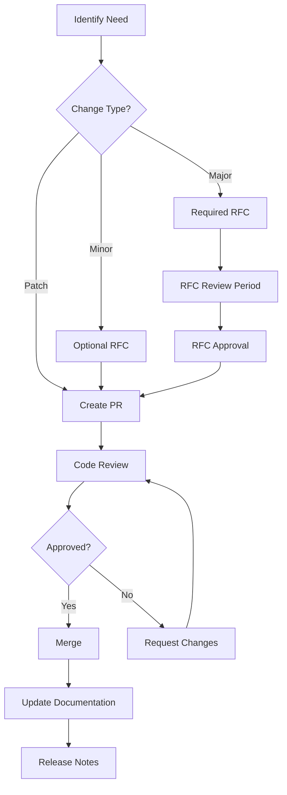

# CodingKit Maintenance Process

## Overview

This document defines the processes for maintaining, updating, and evolving the CodingKit framework for Windows Applications. It establishes workflows, review schedules, and governance procedures to ensure the framework remains robust, secure, and aligned with project goals.

## Table of Contents

- [Maintenance Workflow](#maintenance-workflow)
- [Review and Approval Process](#review-and-approval-process)
- [Versioning Strategy](#versioning-strategy)
- [Deprecation Policy](#deprecation-policy)
- [Regular Review Schedule](#regular-review-schedule)
- [Feedback Collection](#feedback-collection)
- [Breaking Change Management](#breaking-change-management)
- [Emergency Procedures](#emergency-procedures)

## Maintenance Workflow

### Types of Changes

CodingKit changes are categorized into the following types:

#### 1. Patch Changes
- **Definition:** Bug fixes, documentation updates, minor improvements
- **Examples:** Typo fixes, clarification updates, small bug fixes
- **Process:** Standard PR review by one maintainer
- **Timeline:** 1-3 business days for review

#### 2. Minor Changes
- **Definition:** New features, non-breaking enhancements, significant refactoring
- **Examples:** New coding patterns, new helper classes, new best practices
- **Process:** PR review by two maintainers, RFC recommended but not required
- **Timeline:** 3-7 business days for review

#### 3. Major Changes
- **Definition:** Breaking changes, architectural modifications, new paradigms
- **Examples:** Major API changes, new architectural patterns, removal of deprecated features
- **Process:** RFC required, review by all maintainers, community feedback period
- **Timeline:** 14-30 days minimum (includes feedback period)

### Standard Workflow



### Change Proposal Process

1. **Identification:** Identify the need for a change (bug, feature request, improvement)
2. **Assessment:** Determine the type of change (patch, minor, major)
3. **Documentation:** Document the proposed change
   - For patches: Include in PR description
   - For minor changes: Create detailed PR description or optional RFC
   - For major changes: Create RFC using the RFC template
4. **Discussion:** Open discussion period appropriate to change type
5. **Implementation:** Implement the approved changes
6. **Review:** Conduct code review according to change type
7. **Documentation Update:** Update relevant documentation
8. **Release:** Include in next appropriate release

## Review and Approval Process

### Review Roles

#### Maintainers
- **Responsibilities:**
  - Review and approve changes to CodingKit
  - Ensure consistency with existing standards
  - Validate technical correctness
  - Approve RFCs for major changes
- **Authority:** Can approve/reject PRs and RFCs

#### Contributors
- **Responsibilities:**
  - Propose changes via PRs or RFCs
  - Respond to review feedback
  - Update documentation
- **Authority:** Can submit proposals but cannot approve

#### Community Members
- **Responsibilities:**
  - Provide feedback on proposed changes
  - Report issues and suggest improvements
  - Participate in RFC discussions
- **Authority:** Can comment but cannot approve

### Approval Requirements

| Change Type | Maintainer Approvals | RFC Required | Community Feedback |
|-------------|---------------------|--------------|-------------------|
| Patch | 1 | No | Optional |
| Minor | 2 | Recommended | Optional |
| Major | All (unanimous) | Yes | Required (14 days) |

### Review Criteria

All changes must meet the following criteria:

#### Technical Quality
- [ ] Code follows existing patterns and standards
- [ ] Implementation is correct and efficient
- [ ] Edge cases are handled appropriately
- [ ] Tests are included and passing

#### Documentation
- [ ] Changes are documented appropriately
- [ ] Examples are provided where applicable
- [ ] Migration guides included for breaking changes
- [ ] Comments are clear and helpful

#### Consistency
- [ ] Aligns with existing CodingKit principles
- [ ] Naming conventions are followed
- [ ] Style is consistent with existing code
- [ ] Patterns are consistent with framework

#### Impact
- [ ] Breaking changes are justified and documented
- [ ] Performance impact is acceptable
- [ ] Security implications are considered
- [ ] Dependencies are appropriate

## Versioning Strategy

### Semantic Versioning

CodingKit follows [Semantic Versioning 2.0.0](https://semver.org/):

**Format:** MAJOR.MINOR.PATCH

- **MAJOR:** Breaking changes, incompatible API changes
- **MINOR:** New features, backward-compatible enhancements
- **PATCH:** Bug fixes, documentation updates

### Version Numbering

#### Examples

- `1.0.0` → Initial stable release
- `1.0.1` → Bug fix (patch)
- `1.1.0` → New feature (minor)
- `2.0.0` → Breaking change (major)

### Release Cadence

#### Regular Releases
- **Patch releases:** As needed (typically bi-weekly or when critical bugs are fixed)
- **Minor releases:** Monthly or when significant features accumulate
- **Major releases:** Quarterly or semi-annually, with advanced notice

#### Emergency Releases
- Security vulnerabilities: Immediate patch release
- Critical bugs affecting builds: Within 48 hours

### Version Tags

All releases are tagged in Git:
```bash
git tag -a v1.0.0 -m "Release version 1.0.0"
```

### Changelog

Each release includes a CHANGELOG.md entry with:
- Version number and release date
- Summary of changes
- Breaking changes (if any)
- Migration guide (for major versions)
- Contributors

Example:
```markdown
## [1.1.0] - 2025-11-15

### Added
- New async pattern for background tasks
- Helper methods for configuration management

### Changed
- Improved error handling in TaskRecycler

### Fixed
- Bug in ObservableQueue event handling

### Contributors
- @username1
- @username2
```

## Deprecation Policy

### Deprecation Process

When features need to be removed, follow this process:

#### 1. Announcement Phase (1 major version)
- Mark feature as `[Obsolete]` in code
- Add deprecation notice in documentation
- Provide migration guide to alternative approach
- Include in release notes

```csharp
[Obsolete("This method is deprecated. Use NewMethod() instead.")]
public void OldMethod() { }
```

#### 2. Warning Phase (1 major version)
- Upgrade `[Obsolete]` attribute to error level
- Ensure migration path is well-documented
- Provide automated migration tools if feasible

```csharp
[Obsolete("This method is deprecated and will be removed. Use NewMethod().", error: true)]
public void OldMethod() { }
```

#### 3. Removal Phase (Next major version)
- Remove deprecated feature
- Document removal in breaking changes
- Ensure migration guide is prominent

### Deprecation Timeline

Minimum deprecation timeline:
- **2 major versions** before removal
- **6 months** minimum from initial deprecation notice
- **Extended notice** for widely-used features

### Exception Cases

Immediate deprecation/removal allowed for:
- Security vulnerabilities
- Critical bugs that cannot be fixed
- Features that cause data loss or corruption

## Regular Review Schedule

### Quarterly Reviews

**Purpose:** Assess the overall health of CodingKit

**Agenda:**
1. Review feedback and issues from the past quarter
2. Assess adherence to standards across the codebase
3. Identify areas needing improvement or update
4. Plan upcoming changes and features
5. Review and update governance processes

**Participants:** All maintainers

**Deliverables:**
- Review report documenting findings
- Action items for next quarter
- Updates to governance documents if needed

### Monthly Sync

**Purpose:** Track ongoing work and address immediate concerns

**Agenda:**
1. Review open RFCs and PRs
2. Discuss blockers or challenges
3. Prioritize upcoming work
4. Address community feedback

**Participants:** Maintainers and active contributors

### Annual Strategy Review

**Purpose:** Long-term planning and major strategic decisions

**Agenda:**
1. Review year's accomplishments
2. Assess framework evolution
3. Plan major initiatives for next year
4. Update multi-year roadmap
5. Review and revise governance structure

**Participants:** All stakeholders

## Feedback Collection

### Feedback Channels

#### 1. GitHub Issues
- **Purpose:** Bug reports, feature requests, questions
- **Labels:** Use labels like `codingkit`, `feedback`, `enhancement`
- **Response Time:** 3-5 business days for initial response

#### 2. GitHub Discussions
- **Purpose:** Open-ended discussions, ideas, questions
- **Categories:** General, Ideas, Q&A, Show and Tell
- **Response Time:** Best effort, typically within a week

#### 3. RFC Comments
- **Purpose:** Detailed feedback on proposed changes
- **Process:** Comment directly on RFC PR
- **Response Time:** All comments addressed before RFC approval

#### 4. Pull Request Reviews
- **Purpose:** Feedback on specific implementations
- **Process:** Standard GitHub PR review process
- **Response Time:** Based on change type (see approval requirements)

#### 5. Surveys
- **Purpose:** Periodic community surveys for broad feedback
- **Frequency:** Semi-annually
- **Topics:** Framework usability, pain points, desired features

### Feedback Processing

1. **Collection:** Gather feedback from all channels
2. **Categorization:** Classify feedback by type and priority
3. **Analysis:** Identify trends and common themes
4. **Action Planning:** Create action items for high-priority feedback
5. **Communication:** Respond to feedback providers with outcomes
6. **Implementation:** Address feedback through appropriate change process

### Feedback Metrics

Track the following metrics:
- Number of feedback items received per quarter
- Average response time to feedback
- Percentage of feedback resulting in changes
- Community satisfaction score (from surveys)

## Breaking Change Management

### Definition

A breaking change is any modification that:
- Removes or renames public APIs, classes, or methods
- Changes method signatures in incompatible ways
- Alters behavior in ways that break existing code
- Removes or significantly changes patterns or standards

### Communication Strategy

#### Pre-Release Communication

**6-8 weeks before release:**
1. Publish RFC describing breaking changes
2. Open community feedback period
3. Announce in GitHub Discussions and README
4. Contact known major users directly if possible

**4 weeks before release:**
1. Publish migration guide
2. Release beta/RC version for testing
3. Provide migration tools if applicable
4. Host Q&A session or publish FAQ

**2 weeks before release:**
1. Final announcement with release date
2. Remind users about breaking changes
3. Ensure migration guide is prominent
4. Prepare support resources

#### Release Communication

**At release:**
1. Publish detailed release notes
2. Update all documentation
3. Announce via all channels (GitHub, README, discussions)
4. Pin announcement issue for visibility

**Post-release:**
1. Monitor feedback and issues
2. Provide support for migration challenges
3. Release patch updates if issues discovered
4. Document common migration problems and solutions

### Migration Support

For breaking changes, provide:

#### 1. Migration Guide
- Step-by-step instructions
- Before/after code examples
- Common migration patterns
- Troubleshooting section

Example:
```markdown
## Migrating from 1.x to 2.x

### API Changes

#### Before (1.x)
```csharp
var result = Manager.ProcessSync();
```

#### After (2.x)
```csharp
var result = await Manager.ProcessAsync();
```

#### Migration Steps
1. Update all synchronous calls to async
2. Add `await` keyword
3. Ensure calling method is async
```

#### 2. Automated Migration Tools
- Scripts to update code
- Search/replace patterns
- Refactoring tools

#### 3. Compatibility Layer (when feasible)
- Temporary adapters for old APIs
- Marked as obsolete
- Removed in future version

#### 4. Support Resources
- FAQ document
- GitHub discussions thread
- Example migration repository

### Breaking Change Checklist

Before releasing breaking changes:

- [ ] RFC created and approved
- [ ] Migration guide written and reviewed
- [ ] Breaking changes documented in CHANGELOG
- [ ] All documentation updated
- [ ] Beta/RC version released and tested
- [ ] Community notified (6+ weeks advance notice)
- [ ] Support resources prepared
- [ ] Known major users contacted directly
- [ ] Automated tests updated
- [ ] Examples and samples updated

## Emergency Procedures

### Security Vulnerabilities

**Priority:** Critical - Immediate action required

**Process:**
1. **Identification:** Vulnerability reported or discovered
2. **Assessment:** Evaluate severity and impact (use CVSS scoring)
3. **Containment:** Determine affected versions
4. **Fix Development:** Develop and test fix privately
5. **Release:** 
   - Patch all affected versions
   - Release security advisory
   - Coordinate with distributors
6. **Communication:**
   - Publish security advisory
   - Update SECURITY.md
   - Notify users via all channels
7. **Post-Mortem:** Document incident and improvements

**Timeline:** Fix and release within 24-48 hours for critical vulnerabilities

### Critical Bugs

**Priority:** High - Action within 48 hours

**Process:**
1. **Verification:** Confirm the bug and its impact
2. **Triage:** Assess severity and affected users
3. **Fix Development:** Create fix and tests
4. **Review:** Expedited review by available maintainers
5. **Release:** Emergency patch release
6. **Communication:** Release notes and announcement

**Timeline:** Fix and release within 48 hours

### Hotfix Process

For emergency releases:

```bash
# Create hotfix branch from release tag
git checkout -b hotfix/1.0.1 v1.0.0

# Make fix
# ... code changes ...

# Fast-track review
# Create PR, get emergency approval

# Merge and release
git tag -a v1.0.1 -m "Hotfix: [description]"
git push origin v1.0.1
```

### Communication Template

For emergency releases:

```markdown
## Emergency Release: [Version]

**Type:** [Security | Critical Bug]
**Severity:** [Critical | High]
**Release Date:** [Date]

### Issue Description
[Brief description of the problem]

### Impact
[Who is affected and how]

### Resolution
[What was fixed]

### Action Required
[What users need to do]

### Affected Versions
[List of affected versions]

### Credits
[Security researchers or reporters]
```

## Continuous Improvement

This maintenance process is itself subject to review and improvement. 

### Process Review

- Maintenance process reviewed quarterly
- Feedback on process collected continuously
- Updates to process require RFC for major changes
- Minor process improvements can be made via PR

### Metrics and KPIs

Track these metrics to assess process effectiveness:

- Average time to merge PRs by type
- Number of breaking changes per major release
- Community feedback volume and sentiment
- Adoption rate of new versions
- Number of emergency releases
- Deprecation cycle compliance

### Goals

- Maintain rapid response to security issues (< 48 hours)
- Keep average PR review time reasonable (< 7 days for minor changes)
- Minimize breaking changes (< 3 per major release)
- Achieve high community satisfaction (> 80% positive feedback)
- Ensure smooth migrations (< 5% users report migration issues)

## Resources

- [RFC Template](./rfc-template.md)
- [Contribution Guidelines](./contribution-guidelines.md)
- [Governance Overview](../../GOVERNANCE.md)
- [Coding Standards](../codebase-analysis/07-best-practices/patterns-standards.md)

## Appendix

### Appendix A: Change Type Decision Tree

```
Is this a bug fix with no API changes?
├─ Yes → Patch Change
└─ No → Continue

Does this add new features or functionality?
├─ Yes → Does it break existing code?
│   ├─ Yes → Major Change
│   └─ No → Minor Change
└─ No → Continue

Does this change existing behavior?
├─ Yes → Is the behavior change breaking?
│   ├─ Yes → Major Change
│   └─ No → Minor Change
└─ No → Patch Change (documentation, etc.)
```

### Appendix B: RFC Example Scenarios

**Scenario 1: Adding a new helper class**
- Type: Minor Change
- RFC: Recommended but optional
- Approval: 2 maintainers
- Timeline: 3-7 days

**Scenario 2: Changing async pattern across framework**
- Type: Major Change
- RFC: Required
- Approval: All maintainers + community feedback
- Timeline: 14-30 days minimum

**Scenario 3: Fixing documentation typo**
- Type: Patch Change
- RFC: Not needed
- Approval: 1 maintainer
- Timeline: 1-3 days

### Appendix C: Version History

| Version | Date | Changes |
|---------|------|---------|
| 1.0.0 | 2025-11-05 | Initial version |
