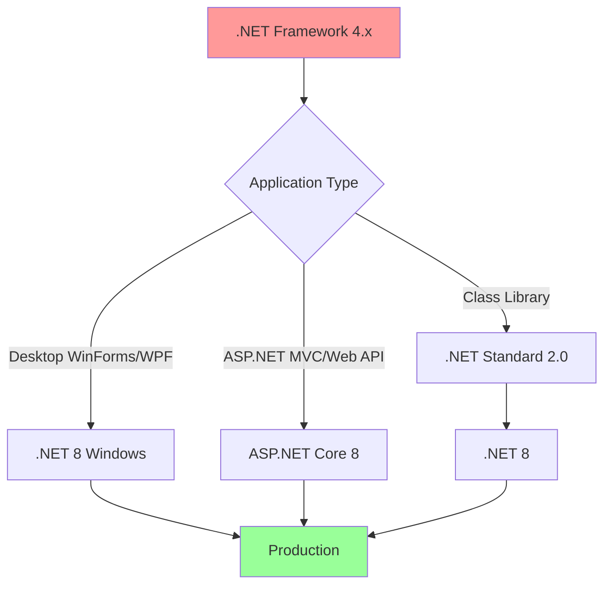

# Framework Upgrade Guide: .NET Framework to .NET 8+

## Overview

This guide provides step-by-step instructions for migrating Windows applications from .NET Framework (4.x) to modern .NET 8+. The migration path varies depending on your starting point and application type, but this guide covers the most common scenarios and challenges.

## Table of Contents

- [Understanding the Migration Path](#understanding-the-migration-path)
- [Pre-Migration Assessment](#pre-migration-assessment)
- [Migration Strategies](#migration-strategies)
- [Step-by-Step Migration](#step-by-step-migration)
- [Breaking Changes](#breaking-changes)
- [Post-Migration Optimization](#post-migration-optimization)
- [Troubleshooting](#troubleshooting)

## Understanding the Migration Path

### .NET Framework vs .NET (Core/8+)

| Aspect | .NET Framework | .NET 8+ |
|--------|----------------|---------|
| Platform | Windows-only | Cross-platform (Windows, Linux, macOS) |
| Open Source | Partial | Fully open source |
| Performance | Baseline | 2-3x faster in many scenarios |
| Deployment | Requires runtime installation | Self-contained or runtime-dependent |
| Release Cycle | Infrequent | Annual releases (odd = STS, even = LTS) |
| Support | Security fixes only | Active development |
| APIs | Larger surface area (legacy included) | Modern, streamlined API surface |

### Migration Paths



### Why Migrate?

**Benefits:**
- ✅ **Performance**: Significant runtime improvements
- ✅ **Modern Language Features**: C# 12, nullable reference types
- ✅ **Long-term Support**: .NET 8 supported until November 2026
- ✅ **Better Tooling**: Improved debugging, profiling, and diagnostics
- ✅ **Reduced Disk Footprint**: Trimming and single-file publishing
- ✅ **Active Development**: Regular updates and new features

**Considerations:**
- ⚠️ Some Windows-specific APIs may require changes
- ⚠️ Third-party dependencies must support .NET 8
- ⚠️ Testing effort required to ensure compatibility
- ⚠️ Team training on new patterns and APIs

## Pre-Migration Assessment

### Step 1: Analyze Your Project

#### Check Current Framework Version

```xml
<!-- Look in your .csproj file -->
<PropertyGroup>
    <TargetFramework>net472</TargetFramework>  <!-- .NET Framework 4.7.2 -->
</PropertyGroup>
```

#### Inventory Dependencies

```bash
# List all NuGet packages
dotnet list package

# Check for outdated packages
dotnet list package --outdated

# Find deprecated packages
dotnet list package --deprecated
```

**Create a dependency spreadsheet:**

| Package Name | Current Version | .NET 8 Compatible? | Alternative | Action Required |
|--------------|-----------------|-------------------|-------------|-----------------|
| Newtonsoft.Json | 12.0.3 | ✅ Yes | System.Text.Json | Consider migration |
| EntityFramework | 6.4.4 | ❌ No | EF Core 8 | Must migrate |
| System.Web | N/A (Framework) | ❌ No | ASP.NET Core | Rewrite required |

### Step 2: Run .NET Upgrade Assistant Analysis

```bash
# Install the tool
dotnet tool install -g upgrade-assistant

# Analyze without making changes
upgrade-assistant analyze MyApplication.sln

# Generate detailed report
upgrade-assistant analyze MyApplication.sln --output-format sarif --output-file analysis.sarif
```

**Sample Output:**
```
Target Framework: net8.0-windows
Upgradability: Ready
Readiness Level: 85%

Issues Found:
- 3 incompatible packages
- 12 API usage warnings
- 5 deprecated pattern warnings
```

### Step 3: Identify Breaking Changes

#### Use API Analyzer

```xml
<!-- Add to .csproj -->
<ItemGroup>
    <PackageReference Include="Microsoft.DotNet.UpgradeAssistant.Extensions.Default.Analyzers" 
                      Version="0.4.421302" />
</ItemGroup>
```

```bash
# Build to see warnings
dotnet build
```

#### Check Platform Compatibility

```csharp
// This API is Windows-only in .NET
[SupportedOSPlatform("windows")]
public void UseWindowsSpecificAPI()
{
    // Windows-specific code
}
```

### Step 4: Assess Project Type

| Project Type | Complexity | Recommended Approach |
|--------------|-----------|---------------------|
| Class Library (no Windows dependencies) | Low | Direct upgrade to .NET 8 |
| Class Library (with Windows APIs) | Medium | Target net8.0-windows |
| WinForms/WPF Desktop App | Medium | Use Upgrade Assistant |
| ASP.NET Web Forms | High | Rewrite to ASP.NET Core |
| ASP.NET MVC/Web API | Medium-High | Migrate to ASP.NET Core |
| WCF Service | High | Migrate to gRPC or Web API |

## Migration Strategies

### Strategy 1: In-Place Upgrade (Recommended for Simple Projects)

**Best For:**
- Class libraries
- Small applications
- Projects with modern dependencies

**Steps:**
1. Update project file to .NET 8
2. Update dependencies
3. Fix compilation errors
4. Test thoroughly

### Strategy 2: Side-by-Side Migration (Recommended for Complex Projects)

**Best For:**
- Large applications
- Multiple interdependent projects
- Business-critical systems

**Steps:**
1. Create new .NET 8 projects alongside existing ones
2. Gradually move code to new projects
3. Maintain both versions during transition
4. Deprecate old version when complete

### Strategy 3: Hybrid Approach (.NET Standard Bridge)

**Best For:**
- Shared code between Framework and .NET 8
- Gradual migration of solution

**Steps:**
1. Extract shared code to .NET Standard 2.0 library
2. Reference from both Framework and .NET 8 projects
3. Migrate applications one at a time
4. Eventually remove .NET Standard library

```
Before:
- App.Framework (net472)
- Library.Framework (net472)

During Migration:
- App.Framework (net472) ─┐
- Library.Standard (netstandard2.0) ─┤
- App.Modern (net8.0) ────┘

After:
- App.Modern (net8.0)
- Library.Modern (net8.0)
```

## Step-by-Step Migration

### Phase 1: Project File Modernization

#### Step 1: Backup Your Project

```bash
git checkout -b migration/dotnet8
git add .
git commit -m "Checkpoint before .NET 8 migration"
```

#### Step 2: Convert to SDK-Style Project

**Old .csproj Format (.NET Framework):**
```xml
<?xml version="1.0" encoding="utf-8"?>
<Project ToolsVersion="15.0" xmlns="http://schemas.microsoft.com/developer/msbuild/2003">
  <Import Project="$(MSBuildExtensionsPath)\$(MSBuildToolsVersion)\Microsoft.Common.props" />
  <PropertyGroup>
    <Configuration Condition=" '$(Configuration)' == '' ">Debug</Configuration>
    <Platform Condition=" '$(Platform)' == '' ">AnyCPU</Platform>
    <ProjectGuid>{12345678-1234-1234-1234-123456789012}</ProjectGuid>
    <OutputType>Library</OutputType>
    <TargetFrameworkVersion>v4.7.2</TargetFrameworkVersion>
  </PropertyGroup>
  <ItemGroup>
    <Reference Include="System" />
    <Reference Include="System.Core" />
    <!-- Many more references -->
  </ItemGroup>
  <ItemGroup>
    <Compile Include="Class1.cs" />
    <Compile Include="Class2.cs" />
    <!-- List every file -->
  </ItemGroup>
  <Import Project="$(MSBuildToolsPath)\Microsoft.CSharp.targets" />
</Project>
```

**New SDK-Style Project (.NET 8):**
```xml
<Project Sdk="Microsoft.NET.Sdk">
  <PropertyGroup>
    <TargetFramework>net8.0</TargetFramework>
    <Nullable>enable</Nullable>
    <ImplicitUsings>enable</ImplicitUsings>
  </PropertyGroup>
</Project>
```

**For Windows Desktop Apps:**
```xml
<Project Sdk="Microsoft.NET.Sdk">
  <PropertyGroup>
    <OutputType>WinExe</OutputType>
    <TargetFramework>net8.0-windows10.0.19041.0</TargetFramework>
    <TargetPlatformMinVersion>10.0.19041.0</TargetPlatformMinVersion>
    <UseWPF>true</UseWPF>  <!-- For WPF apps -->
    <!-- OR -->
    <UseWindowsForms>true</UseWindowsForms>  <!-- For WinForms apps -->
    <Nullable>enable</Nullable>
  </PropertyGroup>
</Project>
```

#### Step 3: Use try-convert Tool (Automated)

```bash
# Install try-convert
dotnet tool install -g try-convert

# Convert project file
try-convert -p MyProject.csproj

# Convert entire solution
try-convert -w MySolution.sln
```

### Phase 2: Dependency Updates

#### Step 1: Update NuGet Packages

```bash
# Update all packages to latest compatible versions
dotnet add package PackageName --version Latest

# Or use NuGet Package Manager in Visual Studio
```

#### Step 2: Handle Common Package Migrations

**Entity Framework:**
```bash
# Remove old EF6
dotnet remove package EntityFramework

# Add EF Core
dotnet add package Microsoft.EntityFrameworkCore
dotnet add package Microsoft.EntityFrameworkCore.SqlServer
dotnet add package Microsoft.EntityFrameworkCore.Tools
```

**JSON Serialization:**
```bash
# Option 1: Continue using Newtonsoft.Json
dotnet add package Newtonsoft.Json

# Option 2: Migrate to System.Text.Json (recommended)
# Built into .NET 8, no package needed
```

**Dependency Injection:**
```bash
# Add DI support (built-in for ASP.NET Core)
dotnet add package Microsoft.Extensions.DependencyInjection
dotnet add package Microsoft.Extensions.Logging
dotnet add package Microsoft.Extensions.Configuration
```

#### Step 3: Replace Removed APIs

| .NET Framework API | .NET 8 Alternative |
|-------------------|-------------------|
| `System.Configuration.ConfigurationManager` | `Microsoft.Extensions.Configuration` |
| `System.Web.HttpContext` | `Microsoft.AspNetCore.Http.HttpContext` |
| `System.Drawing` (GDI+) | `System.Drawing.Common` (Windows) or `ImageSharp` (cross-platform) |
| `AppDomain.CurrentDomain.SetData` | Configuration or DI |
| `System.Net.Mail.SmtpClient` | `MailKit` library |

**Example: Configuration Migration**

**.NET Framework:**
```csharp
using System.Configuration;

string connString = ConfigurationManager.ConnectionStrings["MyDb"].ConnectionString;
string setting = ConfigurationManager.AppSettings["MySetting"];
```

**.NET 8:**
```csharp
using Microsoft.Extensions.Configuration;

// In Program.cs
var configuration = new ConfigurationBuilder()
    .SetBasePath(Directory.GetCurrentDirectory())
    .AddJsonFile("appsettings.json", optional: false)
    .Build();

// In your classes (via DI)
public class MyService
{
    private readonly IConfiguration _configuration;
    
    public MyService(IConfiguration configuration)
    {
        _configuration = configuration;
    }
    
    public void DoWork()
    {
        string connString = _configuration.GetConnectionString("MyDb");
        string setting = _configuration["MySetting"];
    }
}
```

### Phase 3: Code Updates

#### Step 1: Enable Nullable Reference Types

```xml
<PropertyGroup>
    <Nullable>enable</Nullable>
</PropertyGroup>
```

**Fix null-related warnings:**
```csharp
// Before
public string GetName(User user)
{
    return user.Name;  // Warning: possible null reference
}

// After
public string GetName(User? user)
{
    return user?.Name ?? "Unknown";
}

// Or with null check
public string GetName(User? user)
{
    if (user is null)
        throw new ArgumentNullException(nameof(user));
    
    return user.Name;
}
```

#### Step 2: Update async/await Patterns

```csharp
// .NET Framework: Often used Task.Run unnecessarily
public async Task<string> GetDataAsync()
{
    return await Task.Run(() =>
    {
        // Synchronous code wrapped in Task.Run
        return File.ReadAllText("data.txt");
    });
}

// .NET 8: Use truly async APIs
public async Task<string> GetDataAsync()
{
    // Truly async I/O
    return await File.ReadAllTextAsync("data.txt");
}
```

#### Step 3: Replace Deprecated APIs

**System.Drawing (GDI+) Migration:**

```csharp
// OLD: System.Drawing (Windows-only)
using System.Drawing;
using System.Drawing.Imaging;

public void ResizeImage(string inputPath, string outputPath)
{
    using var image = Image.FromFile(inputPath);
    using var resized = new Bitmap(image, new Size(800, 600));
    resized.Save(outputPath, ImageFormat.Jpeg);
}

// NEW Option 1: System.Drawing.Common (Windows-only, add NuGet package)
// Same code as above, but requires explicit package reference

// NEW Option 2: ImageSharp (cross-platform, recommended)
using SixLabors.ImageSharp;
using SixLabors.ImageSharp.Processing;

public async Task ResizeImageAsync(string inputPath, string outputPath)
{
    using var image = await Image.LoadAsync(inputPath);
    image.Mutate(x => x.Resize(800, 600));
    await image.SaveAsync(outputPath);
}
```

**BinaryFormatter Migration (Security Risk):**

```csharp
// OLD: BinaryFormatter (removed in .NET 8 for security reasons)
using System.Runtime.Serialization.Formatters.Binary;

public void SaveData(MyData data, string path)
{
    var formatter = new BinaryFormatter();
    using var stream = File.Create(path);
    formatter.Serialize(stream, data);  // Security vulnerability!
}

// NEW: Use JSON or MessagePack
using System.Text.Json;

public async Task SaveDataAsync(MyData data, string path)
{
    var json = JsonSerializer.Serialize(data);
    await File.WriteAllTextAsync(path, json);
}

public async Task<MyData> LoadDataAsync(string path)
{
    var json = await File.ReadAllTextAsync(path);
    return JsonSerializer.Deserialize<MyData>(json)!;
}
```

### Phase 4: Compilation and Testing

#### Step 1: Fix Compilation Errors

```bash
# Build the project
dotnet build

# Common errors and fixes:
# 1. Missing using directives (enable ImplicitUsings)
# 2. Nullable warnings (add null checks)
# 3. API not found (find replacement API)
# 4. Package incompatibility (update or find alternative)
```

#### Step 2: Run Existing Tests

```bash
# Run all tests
dotnet test

# Run with detailed logging
dotnet test --logger "console;verbosity=detailed"

# Generate coverage
dotnet test /p:CollectCoverage=true
```

#### Step 3: Add Integration Tests

```csharp
using Xunit;

public class MigrationIntegrationTests
{
    [Fact]
    public async Task VerifyDatabaseConnectivity()
    {
        // Test that EF Core migration works
        var context = new MyDbContext();
        var canConnect = await context.Database.CanConnectAsync();
        Assert.True(canConnect);
    }
    
    [Fact]
    public void VerifyConfigurationLoads()
    {
        // Test that new configuration system works
        var config = BuildConfiguration();
        var connectionString = config.GetConnectionString("Default");
        Assert.NotNull(connectionString);
    }
    
    [Fact]
    public async Task VerifyFileOperations()
    {
        // Test that file I/O works correctly
        var testFile = Path.GetTempFileName();
        await File.WriteAllTextAsync(testFile, "test");
        var content = await File.ReadAllTextAsync(testFile);
        Assert.Equal("test", content);
        File.Delete(testFile);
    }
}
```

### Phase 5: WPF/WinForms Specific Migration

#### WPF Applications

**Project File Setup:**
```xml
<Project Sdk="Microsoft.NET.Sdk">
  <PropertyGroup>
    <OutputType>WinExe</OutputType>
    <TargetFramework>net8.0-windows</TargetFramework>
    <UseWPF>true</UseWPF>
    <Nullable>enable</Nullable>
  </PropertyGroup>
</Project>
```

**No Major Code Changes Required:**
- XAML files work as-is
- Code-behind requires minimal changes
- Data binding continues to work
- Commands and MVVM patterns unchanged

**Potential Issues:**
```csharp
// Issue: Window.GetWindow() might return null
// Old code:
var window = Window.GetWindow(this);
window.Close();

// New code (null-safe):
var window = Window.GetWindow(this);
if (window != null)
{
    window.Close();
}
```

#### WinForms Applications

**Project File Setup:**
```xml
<Project Sdk="Microsoft.NET.Sdk">
  <PropertyGroup>
    <OutputType>WinExe</OutputType>
    <TargetFramework>net8.0-windows</TargetFramework>
    <UseWindowsForms>true</UseWindowsForms>
    <Nullable>enable</Nullable>
  </PropertyGroup>
</Project>
```

**Enable Application Configuration:**
```csharp
// Program.cs
using System;
using System.Windows.Forms;

namespace MyWinFormsApp
{
    static class Program
    {
        [STAThread]
        static void Main()
        {
            ApplicationConfiguration.Initialize();  // New in .NET 5+
            Application.Run(new MainForm());
        }
    }
}
```

## Breaking Changes

### High-Impact Breaking Changes

#### 1. BinaryFormatter Removed

**Impact:** High - Affects serialization
**Affected Code:** Any use of `BinaryFormatter`

**Solution:**
```csharp
// Use System.Text.Json or MessagePack instead
using System.Text.Json;

// For complex objects
var options = new JsonSerializerOptions
{
    WriteIndented = true,
    PropertyNameCaseInsensitive = true
};

string json = JsonSerializer.Serialize(myObject, options);
MyType obj = JsonSerializer.Deserialize<MyType>(json, options);
```

#### 2. RemotingException and Related Types Removed

**Impact:** High - Affects distributed systems
**Affected Code:** .NET Remoting usage

**Solution:** Migrate to modern alternatives:
- gRPC (recommended for new projects)
- REST APIs (HTTP/JSON)
- WCF-CoreFX (limited compatibility layer)

#### 3. Default Culture Handling Changes

**Impact:** Medium - Affects date/number formatting
**Behavior:** `CultureInfo.CurrentCulture` is thread-specific in .NET 8

**Solution:**
```csharp
// Explicitly set culture when needed
CultureInfo.CurrentCulture = new CultureInfo("en-US");

// Or use specific culture for formatting
var formatted = value.ToString("C", new CultureInfo("en-US"));
```

#### 4. TLS/SSL Defaults

**Impact:** Medium - Affects network communication
**Behavior:** Only TLS 1.2+ supported by default

**Solution:**
```csharp
// Explicitly set if needed (rarely necessary)
ServicePointManager.SecurityProtocol = SecurityProtocolType.Tls12 | SecurityProtocolType.Tls13;
```

#### 5. Assembly Loading Changes

**Impact:** Low-Medium - Affects plugin systems
**Behavior:** AssemblyLoadContext replaces AppDomain for isolation

**Solution:**
```csharp
// Old: AppDomain
AppDomain domain = AppDomain.CreateDomain("PluginDomain");
// Unload was complex

// New: AssemblyLoadContext
var context = new AssemblyLoadContext("PluginContext", isCollectible: true);
Assembly assembly = context.LoadFromAssemblyPath(pluginPath);
// Unload is simpler
context.Unload();
```

### API Removals and Replacements

#### Configuration

| Removed API | Replacement |
|-------------|-------------|
| `ConfigurationManager.AppSettings` | `IConfiguration["Key"]` |
| `ConfigurationManager.ConnectionStrings` | `IConfiguration.GetConnectionString("Name")` |
| `app.config` / `web.config` | `appsettings.json` |

#### Serialization

| Removed API | Replacement |
|-------------|-------------|
| `BinaryFormatter` | `System.Text.Json` or `MessagePack` |
| `DataContractSerializer` (partial) | `System.Text.Json` |
| `JavaScriptSerializer` | `System.Text.Json` |

#### Networking

| Removed API | Replacement |
|-------------|-------------|
| `WebClient` | `HttpClient` |
| `HttpWebRequest` | `HttpClient` |
| `FtpWebRequest` | Third-party library |

#### Data Access

| Removed API | Replacement |
|-------------|-------------|
| `System.Data.OracleClient` | `Oracle.ManagedDataAccess` |
| `Entity Framework 6.x` | `Entity Framework Core 8` |

### Configuration Migration

**Old app.config:**
```xml
<?xml version="1.0" encoding="utf-8"?>
<configuration>
  <appSettings>
    <add key="ApiUrl" value="https://api.example.com"/>
    <add key="Timeout" value="30"/>
  </appSettings>
  <connectionStrings>
    <add name="DefaultConnection" 
         connectionString="Server=localhost;Database=MyDb;Trusted_Connection=True;"/>
  </connectionStrings>
</configuration>
```

**New appsettings.json:**
```json
{
  "AppSettings": {
    "ApiUrl": "https://api.example.com",
    "Timeout": 30
  },
  "ConnectionStrings": {
    "DefaultConnection": "Server=localhost;Database=MyDb;Trusted_Connection=True;"
  }
}
```

**Accessing Configuration:**
```csharp
// Setup in Program.cs or Startup
var configuration = new ConfigurationBuilder()
    .SetBasePath(Directory.GetCurrentDirectory())
    .AddJsonFile("appsettings.json", optional: false, reloadOnChange: true)
    .AddJsonFile($"appsettings.{environment}.json", optional: true)
    .AddEnvironmentVariables()
    .Build();

// Register in DI
services.AddSingleton<IConfiguration>(configuration);

// Use in classes
public class MyService
{
    private readonly IConfiguration _config;
    
    public MyService(IConfiguration config)
    {
        _config = config;
    }
    
    public void DoWork()
    {
        string apiUrl = _config["AppSettings:ApiUrl"];
        int timeout = _config.GetValue<int>("AppSettings:Timeout");
        string connString = _config.GetConnectionString("DefaultConnection");
    }
}
```

## Post-Migration Optimization

### Performance Tuning

#### 1. Enable ReadyToRun (R2R) Compilation

```xml
<PropertyGroup>
    <PublishReadyToRun>true</PublishReadyToRun>
</PropertyGroup>
```

**Benefits:**
- Faster startup time
- Reduced JIT compilation
- ~20-30% startup improvement

#### 2. Enable Trimming (For Self-Contained Apps)

```xml
<PropertyGroup>
    <PublishTrimmed>true</PublishTrimmed>
    <TrimMode>link</TrimMode>
</PropertyGroup>
```

**Benefits:**
- Reduced application size
- 50-70% smaller deployment
- Faster download/install

**⚠️ Warning:** Test thoroughly - trimming can break reflection-based code

#### 3. Single File Publishing

```bash
dotnet publish -c Release -r win-x64 --self-contained -p:PublishSingleFile=true
```

**Benefits:**
- Single executable file
- Easier deployment
- Improved user experience

#### 4. Native AOT (Advanced)

```xml
<PropertyGroup>
    <PublishAot>true</PublishAot>
</PropertyGroup>
```

**Benefits:**
- No .NET runtime required
- Fastest startup
- Smallest size

**Limitations:**
- Limited API support
- No dynamic code generation
- More complex to implement

### Memory and Resource Optimization

#### 1. Use Span<T> and Memory<T>

```csharp
// Old: Creates string allocations
public string ProcessData(string input)
{
    string trimmed = input.Trim();
    string upper = trimmed.ToUpper();
    return upper.Substring(0, 10);
}

// New: Zero-allocation with Span
public ReadOnlySpan<char> ProcessData(ReadOnlySpan<char> input)
{
    var trimmed = input.Trim();
    return trimmed.Slice(0, Math.Min(10, trimmed.Length));
}
```

#### 2. Use ArrayPool<T>

```csharp
// Old: Allocates new array each time
public byte[] ProcessLargeData()
{
    byte[] buffer = new byte[1024 * 1024];  // 1MB allocation
    // Use buffer
    return buffer;
}

// New: Rent from pool
public byte[] ProcessLargeData()
{
    byte[] buffer = ArrayPool<byte>.Shared.Rent(1024 * 1024);
    try
    {
        // Use buffer
        return buffer;
    }
    finally
    {
        ArrayPool<byte>.Shared.Return(buffer);
    }
}
```

#### 3. Use ValueTask<T> for Performance-Critical Paths

```csharp
// For operations that often complete synchronously
public ValueTask<int> GetCachedValueAsync(string key)
{
    if (_cache.TryGetValue(key, out int value))
    {
        return new ValueTask<int>(value);  // Synchronous path, no allocation
    }
    
    return new ValueTask<int>(FetchFromDatabaseAsync(key));  // Async path
}
```

### Deployment Optimization

#### Self-Contained vs Framework-Dependent

**Framework-Dependent (Recommended for most apps):**
```bash
dotnet publish -c Release -r win-x64
```

**Pros:**
- Smaller deployment size (~50-100MB smaller)
- Automatic runtime updates
- Shared runtime across apps

**Cons:**
- Requires .NET 8 runtime on target machine

**Self-Contained:**
```bash
dotnet publish -c Release -r win-x64 --self-contained
```

**Pros:**
- No runtime installation required
- Full control over runtime version
- Isolated from other apps

**Cons:**
- Larger deployment size
- Must deploy updates manually

#### Create Windows Installer

**Using Inno Setup (as in UniGetUI):**

```inno
[Setup]
AppName=My Application
AppVersion=1.0.0
DefaultDirName={autopf}\MyApp
OutputBaseFilename=MyApp-Setup
Compression=lzma2
SolidCompression=yes

[Files]
Source: "bin\Release\net8.0-windows\win-x64\publish\*"; DestDir: "{app}"; Flags: ignoreversion recursesubdirs

[Icons]
Name: "{autoprograms}\My Application"; Filename: "{app}\MyApp.exe"
Name: "{autodesktop}\My Application"; Filename: "{app}\MyApp.exe"
```

## Troubleshooting

### Common Issues and Solutions

#### Issue 1: NuGet Package Compatibility

**Symptom:**
```
error NU1202: Package MyPackage 1.2.3 is not compatible with net8.0
```

**Solutions:**
1. **Update package to latest version:**
   ```bash
   dotnet add package MyPackage --version Latest
   ```

2. **Check for .NET 8-compatible alternative**
   - Search NuGet.org for replacements
   - Check package's GitHub for migration guide

3. **Use multi-targeting as temporary workaround:**
   ```xml
   <PropertyGroup>
       <TargetFrameworks>net8.0;net472</TargetFrameworks>
   </PropertyGroup>
   ```

#### Issue 2: Missing Windows-Specific APIs

**Symptom:**
```
error CS0246: The type or namespace name 'RegistryKey' could not be found
```

**Solution:**
```bash
# Add Windows-specific package
dotnet add package Microsoft.Windows.Compatibility

# Or target Windows specifically
<TargetFramework>net8.0-windows</TargetFramework>
```

#### Issue 3: Reflection-based Code Breaks with Trimming

**Symptom:** Application works in Debug but fails after publishing with trimming

**Solutions:**

1. **Disable trimming (temporary):**
   ```xml
   <PublishTrimmed>false</PublishTrimmed>
   ```

2. **Preserve specific types:**
   ```xml
   <ItemGroup>
       <TrimmerRootAssembly Include="MyAssembly" />
   </ItemGroup>
   ```

3. **Use source generators instead of reflection** (recommended)

#### Issue 4: Configuration File Not Found

**Symptom:** `appsettings.json` not copied to output

**Solution:**
```xml
<ItemGroup>
    <None Update="appsettings.json">
        <CopyToOutputDirectory>PreserveNewest</CopyToOutputDirectory>
    </None>
</ItemGroup>
```

#### Issue 5: Entity Framework Connection Issues

**Symptom:** `SqlException: Cannot open database`

**Solution:**
```bash
# Ensure EF Core tools installed
dotnet tool install --global dotnet-ef

# Regenerate migrations
dotnet ef migrations add InitialCreate

# Update database
dotnet ef database update
```

### Performance Regression Investigation

If you notice performance degradation after migration:

```csharp
// Add performance diagnostics
using System.Diagnostics;

var stopwatch = Stopwatch.StartNew();
await MyOperationAsync();
stopwatch.Stop();
Console.WriteLine($"Operation took {stopwatch.ElapsedMilliseconds}ms");

// Use BenchmarkDotNet for detailed analysis
[MemoryDiagnoser]
public class PerformanceTests
{
    [Benchmark]
    public void OldImplementation() { }
    
    [Benchmark]
    public void NewImplementation() { }
}
```

### Debugging Tips

```bash
# Enable detailed build logging
dotnet build /v:diag > build.log

# Check runtime information
dotnet --info

# Verify assemblies loaded
dotnet deps check MyApp.dll
```

## Validation Checklist

### Pre-Production Validation

- [ ] **All tests passing**
  - [ ] Unit tests
  - [ ] Integration tests
  - [ ] UI tests (if applicable)

- [ ] **Performance acceptable**
  - [ ] Startup time ≤ .NET Framework version
  - [ ] Memory usage reasonable
  - [ ] No significant regressions

- [ ] **Compatibility verified**
  - [ ] Runs on Windows 10 (1809+)
  - [ ] Runs on Windows 11
  - [ ] Works with existing data files

- [ ] **Functionality complete**
  - [ ] All features working
  - [ ] No missing dependencies
  - [ ] Configuration loading correctly

- [ ] **Deployment tested**
  - [ ] Installer works
  - [ ] Self-contained deployment successful
  - [ ] Framework-dependent deployment successful
  - [ ] Uninstall works correctly

### Post-Migration Monitoring

```csharp
// Add telemetry to track issues
public class TelemetryService
{
    public void TrackException(Exception ex)
    {
        // Log framework version
        var frameworkVersion = RuntimeInformation.FrameworkDescription;
        
        // Log exception details
        Console.WriteLine($"[{frameworkVersion}] Exception: {ex.Message}");
    }
}
```

## Success Metrics

**Migration Success Criteria:**
- ✅ Application runs on .NET 8
- ✅ All features functional
- ✅ Performance equal or better
- ✅ All tests passing
- ✅ No critical bugs in first 30 days
- ✅ Team trained on new patterns

**Performance Targets:**
- Startup time: ≤ Framework version
- Memory usage: ≤ Framework version + 10%
- Response time: ≥ Framework version

## Related Resources

### Internal Documentation
- [Legacy Code Modernization Guide](./modernization-guide.md)
- [UI Migration Guide](./ui-migration.md)
- [Technology Stack](../codebase-analysis/01-overview/technology-stack.md)

### External Resources
- [.NET Upgrade Assistant](https://dotnet.microsoft.com/platform/upgrade-assistant)
- [Breaking Changes .NET 8](https://learn.microsoft.com/en-us/dotnet/core/compatibility/8.0)
- [Porting to .NET from .NET Framework](https://learn.microsoft.com/en-us/dotnet/core/porting/)
- [.NET API Browser](https://learn.microsoft.com/en-us/dotnet/api/)

## Conclusion

Migrating from .NET Framework to .NET 8 is a significant but worthwhile undertaking. By following this guide, using automated tools, and testing thoroughly, you can successfully modernize your application to take advantage of the performance, features, and long-term support that .NET 8 provides.

**Key Takeaways:**
1. **Start with assessment** - Know what you're migrating before you start
2. **Use tools** - Leverage Upgrade Assistant and try-convert
3. **Test extensively** - Both automated and manual testing are critical
4. **Migrate incrementally** - Don't try to do everything at once
5. **Monitor post-migration** - Watch for issues in production

The effort invested in migration will pay dividends in improved performance, better tooling, and access to modern language features for years to come.
