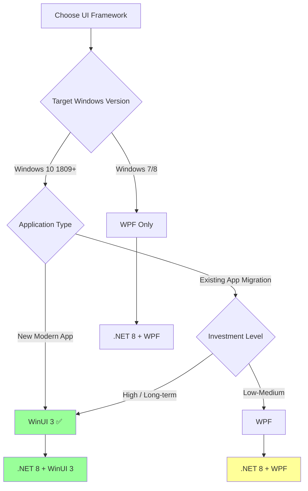

# UI Migration Guide: WinForms to WPF/WinUI

## Overview

This guide provides comprehensive instructions for migrating Windows desktop applications from WinForms to modern UI frameworks (WPF or WinUI 3). The guide covers both incremental migration strategies and complete rewrites, helping you choose the best approach for your application.

## Table of Contents

- [Framework Comparison](#framework-comparison)
- [Choosing Your Target Framework](#choosing-your-target-framework)
- [Pre-Migration Assessment](#pre-migration-assessment)
- [Migration Strategies](#migration-strategies)
- [WinForms to WPF Migration](#winforms-to-wpf-migration)
- [WinForms to WinUI 3 Migration](#winforms-to-winui-3-migration)
- [Database and Data Access Migration](#database-and-data-access-migration)
- [Common UI Patterns](#common-ui-patterns)
- [Migration Checklist](#migration-checklist)

## Framework Comparison

### Technology Overview

| Feature | WinForms | WPF | WinUI 3 |
|---------|----------|-----|---------|
| **First Released** | 2002 | 2006 | 2021 |
| **UI Technology** | GDI+ | DirectX/WPF | DirectX/Composition |
| **Markup Language** | Designer-generated C# | XAML | XAML |
| **Styling** | Limited | Extensive | Modern, Fluent Design |
| **Data Binding** | Manual | Two-way, automatic | Two-way, automatic |
| **Animation** | Basic | Advanced | Advanced + Composition API |
| **Modern Look** | ❌ Windows Classic | ⚠️ Can be modern | ✅ Fluent Design |
| **Touch Support** | Limited | Good | Excellent |
| **Performance** | Good | Good | Excellent |
| **.NET 8 Support** | ✅ Yes | ✅ Yes | ✅ Yes |
| **Cross-platform** | ❌ Windows only | ❌ Windows only | ❌ Windows only |
| **Learning Curve** | Low | Medium-High | Medium-High |

### Architecture Comparison

**WinForms:**
```
┌──────────────────┐
│   UI Layer       │  Form1.cs (Code-behind)
│   (Code-behind)  │  Form1.Designer.cs (Designer)
├──────────────────┤
│ Business Logic   │  Mixed with UI code
├──────────────────┤
│   Data Access    │  Mixed with UI code
└──────────────────┘
```

**WPF/WinUI 3:**
```
┌──────────────────────────────┐
│   View (XAML + Code-behind)  │  MainWindow.xaml
├──────────────────────────────┤
│   ViewModel                  │  MainViewModel.cs
├──────────────────────────────┤
│   Model / Business Logic     │  Services, Managers
├──────────────────────────────┤
│   Data Access                │  Repositories, DbContext
└──────────────────────────────┘
```

## Choosing Your Target Framework

### Decision Matrix



### Choose WPF When:
- ✅ Need to support Windows 7/8
- ✅ Large existing WinForms codebase
- ✅ Team familiar with XAML but not WinUI
- ✅ Lower migration risk preferred
- ✅ Mature ecosystem and tooling important

### Choose WinUI 3 When:
- ✅ **Target Windows 10 1809+ only** (Recommended for new projects)
- ✅ Want modern Fluent Design out of the box
- ✅ Need best performance and touch support
- ✅ Long-term investment (Microsoft's future direction)
- ✅ Can invest in learning new framework
- ✅ **Following UniGetUI's architecture** ✨

**Why UniGetUI Uses WinUI 3:**
- Modern Windows 11 look and feel
- Best performance for desktop apps
- Access to Windows App SDK features
- Future-proof technology choice
- Superior composition and animation APIs

## Pre-Migration Assessment

### Step 1: Inventory Your WinForms Application

#### Analyze Form Complexity

**Simple Forms (Easy to migrate):**
- Few controls (< 20)
- Simple layout (stacked, grid)
- Minimal custom drawing
- Standard controls only

**Complex Forms (Challenging):**
- Many controls (50+)
- Complex layout (nested panels, custom positioning)
- Custom drawing (GDI+ graphics)
- Custom controls
- Third-party controls

#### Create Form Inventory

```csharp
// Tool to analyze your application
public class FormAnalyzer
{
    public class FormInfo
    {
        public string FormName { get; set; }
        public int ControlCount { get; set; }
        public List<string> ControlTypes { get; set; }
        public bool HasCustomDrawing { get; set; }
        public bool HasThirdPartyControls { get; set; }
        public int ComplexityScore { get; set; }  // 1-10
    }
    
    public static List<FormInfo> AnalyzeAssembly(Assembly assembly)
    {
        var formInfos = new List<FormInfo>();
        
        foreach (var type in assembly.GetTypes())
        {
            if (type.IsSubclassOf(typeof(Form)))
            {
                var info = new FormInfo
                {
                    FormName = type.Name,
                    ControlTypes = new List<string>()
                };
                
                // Analyze form complexity
                // (Reflection-based analysis)
                
                formInfos.Add(info);
            }
        }
        
        return formInfos;
    }
}
```

### Step 2: Identify Migration Challenges

| Challenge | Impact | Mitigation |
|-----------|--------|-----------|
| Custom-drawn controls | High | Rewrite using WPF/WinUI drawing |
| Third-party controls | High | Find equivalent or rewrite |
| Complex data binding | Medium | Learn XAML binding |
| MDI applications | Medium | Redesign as tabbed interface |
| Crystal Reports | High | Migrate to modern reporting |
| ActiveX/COM controls | High | Find .NET alternatives |

### Step 3: Set Realistic Expectations

**Typical Migration Timeline:**

| Application Size | WinForms to WPF | WinForms to WinUI 3 |
|-----------------|-----------------|---------------------|
| Small (1-5 forms) | 1-2 weeks | 2-3 weeks |
| Medium (6-20 forms) | 1-2 months | 2-3 months |
| Large (20+ forms) | 3-6 months | 4-8 months |
| Very Large (100+ forms) | 6-12 months | 8-15 months |

**Effort Distribution:**
- UI Conversion: 40%
- Data Binding Reimplementation: 20%
- Testing: 25%
- Performance Optimization: 10%
- Polish and refinement: 5%

## Migration Strategies

### Strategy 1: Big Bang Rewrite (Not Recommended)

**Approach:** Stop development and rewrite entire application.

**Pros:**
- Clean slate
- No hybrid code
- Can redesign everything

**Cons:**
- ❌ High risk
- ❌ Long development gap
- ❌ No incremental value
- ❌ Potential for scope creep

**Use When:** Application is very small (< 5 forms)

### Strategy 2: Incremental Module Migration (Recommended)

**Approach:** Migrate one module/feature at a time while maintaining working application.

**Pros:**
- ✅ Lower risk
- ✅ Continuous delivery
- ✅ Team learns gradually
- ✅ Can prioritize high-value features

**Cons:**
- Mixed technology stack temporarily
- Requires interop solution

**Use When:** Medium to large applications

**Implementation:**
```csharp
// Host WPF/WinUI content in WinForms
public partial class MainForm : Form
{
    private ElementHost _elementHost;
    
    public MainForm()
    {
        InitializeComponent();
        
        // Host WPF user control in WinForms
        var wpfControl = new ModernWpfControl();
        _elementHost = new ElementHost
        {
            Dock = DockStyle.Fill,
            Child = wpfControl
        };
        
        panelContainer.Controls.Add(_elementHost);
    }
}

// Or launch new WinUI window from WinForms
private void OpenModernWindow()
{
    var modernWindow = new ModernWinUIWindow();
    modernWindow.ShowDialog();  // Or Show() for non-modal
}
```

### Strategy 3: Strangler Fig Pattern

**Approach:** Build new UI around old one, gradually replacing functionality.

**Implementation:**
```
Phase 1: New WinUI shell with WinForms windows embedded
Phase 2: Migrate high-value screens to WinUI
Phase 3: Migrate remaining screens
Phase 4: Remove WinForms completely
```

**Benefits:**
- ✅ Always have working application
- ✅ Can ship improvements incrementally
- ✅ Easy rollback if needed

### Strategy 4: Hybrid Architecture (Permanent)

**Approach:** Keep some WinForms, migrate critical parts to WPF/WinUI.

**Use When:**
- Some forms rarely change
- Third-party controls not available in WPF/WinUI
- Budget constraints

**Example Architecture:**
```
Main App (WinUI 3)
├── Dashboard (WinUI 3) ✅
├── Settings (WinUI 3) ✅
├── Data Entry (WinForms - legacy) ⚠️
└── Reports (WinForms + Crystal Reports) ⚠️
```

## WinForms to WPF Migration

### Setting Up WPF Project

```xml
<Project Sdk="Microsoft.NET.Sdk">
  <PropertyGroup>
    <OutputType>WinExe</OutputType>
    <TargetFramework>net8.0-windows</TargetFramework>
    <UseWPF>true</UseWPF>
    <Nullable>enable</Nullable>
  </PropertyGroup>
</Project>
```

### Converting Forms to WPF Windows

#### Example: Simple Form Migration

**WinForms (Form1.cs):**
```csharp
public partial class Form1 : Form
{
    private Label label1;
    private TextBox textBox1;
    private Button button1;
    
    public Form1()
    {
        InitializeComponent();
        
        label1 = new Label { Text = "Name:", Location = new Point(10, 10) };
        textBox1 = new TextBox { Location = new Point(60, 10), Width = 200 };
        button1 = new Button { Text = "Submit", Location = new Point(270, 8) };
        button1.Click += Button1_Click;
        
        Controls.Add(label1);
        Controls.Add(textBox1);
        Controls.Add(button1);
    }
    
    private void Button1_Click(object sender, EventArgs e)
    {
        MessageBox.Show($"Hello, {textBox1.Text}!");
    }
}
```

**WPF (MainWindow.xaml):**
```xml
<Window x:Class="MyApp.MainWindow"
        xmlns="http://schemas.microsoft.com/winfx/2006/xaml/presentation"
        xmlns:x="http://schemas.microsoft.com/winfx/2006/xaml"
        Title="My Application" Height="100" Width="400">
    <Grid Margin="10">
        <Grid.ColumnDefinitions>
            <ColumnDefinition Width="Auto"/>
            <ColumnDefinition Width="*"/>
            <ColumnDefinition Width="Auto"/>
        </Grid.ColumnDefinitions>
        
        <Label Content="Name:" Grid.Column="0" VerticalAlignment="Center"/>
        <TextBox x:Name="textBox1" Grid.Column="1" Margin="5,0"/>
        <Button Content="Submit" Grid.Column="2" Click="Button_Click"/>
    </Grid>
</Window>
```

**WPF (MainWindow.xaml.cs):**
```csharp
public partial class MainWindow : Window
{
    public MainWindow()
    {
        InitializeComponent();
    }
    
    private void Button_Click(object sender, RoutedEventArgs e)
    {
        MessageBox.Show($"Hello, {textBox1.Text}!");
    }
}
```

### MVVM Pattern (Recommended)

**ViewModel:**
```csharp
using CommunityToolkit.Mvvm.ComponentModel;
using CommunityToolkit.Mvvm.Input;

public partial class MainViewModel : ObservableObject
{
    [ObservableProperty]
    private string _name = string.Empty;
    
    [RelayCommand]
    private void Submit()
    {
        MessageBox.Show($"Hello, {Name}!");
    }
}
```

**View (MainWindow.xaml):**
```xml
<Window x:Class="MyApp.MainWindow"
        xmlns="http://schemas.microsoft.com/winfx/2006/xaml/presentation"
        xmlns:x="http://schemas.microsoft.com/winfx/2006/xaml"
        xmlns:local="clr-namespace:MyApp"
        Title="My Application" Height="100" Width="400">
    <Window.DataContext>
        <local:MainViewModel/>
    </Window.DataContext>
    
    <Grid Margin="10">
        <Grid.ColumnDefinitions>
            <ColumnDefinition Width="Auto"/>
            <ColumnDefinition Width="*"/>
            <ColumnDefinition Width="Auto"/>
        </Grid.ColumnDefinitions>
        
        <Label Content="Name:" Grid.Column="0" VerticalAlignment="Center"/>
        <TextBox Text="{Binding Name, UpdateSourceTrigger=PropertyChanged}" 
                 Grid.Column="1" Margin="5,0"/>
        <Button Content="Submit" Grid.Column="2" Command="{Binding SubmitCommand}"/>
    </Grid>
</Window>
```

### Control Mapping

| WinForms Control | WPF Equivalent | Notes |
|------------------|----------------|-------|
| `Form` | `Window` | Similar but uses XAML |
| `Label` | `Label` or `TextBlock` | TextBlock for read-only text |
| `TextBox` | `TextBox` | Similar functionality |
| `Button` | `Button` | Similar |
| `CheckBox` | `CheckBox` | Similar |
| `RadioButton` | `RadioButton` | Similar |
| `ComboBox` | `ComboBox` | Similar |
| `ListBox` | `ListBox` | Similar |
| `DataGridView` | `DataGrid` | More powerful in WPF |
| `PictureBox` | `Image` | Different image handling |
| `Panel` | `Grid`, `StackPanel`, `DockPanel` | More layout options |
| `GroupBox` | `GroupBox` | Similar |
| `MenuStrip` | `Menu` | Different structure |
| `ToolStrip` | `ToolBar` | Different structure |
| `StatusStrip` | `StatusBar` | Different structure |
| `TreeView` | `TreeView` | Similar but with better binding |
| `TabControl` | `TabControl` | Similar |

### Layout Conversion

**WinForms Absolute Positioning:**
```csharp
button1.Location = new Point(10, 20);
button1.Size = new Size(100, 30);
```

**WPF Layout Panels:**
```xml
<!-- StackPanel: Vertical or horizontal stacking -->
<StackPanel Orientation="Vertical">
    <Button Content="Button 1"/>
    <Button Content="Button 2"/>
</StackPanel>

<!-- Grid: Table-like layout (most common) -->
<Grid>
    <Grid.RowDefinitions>
        <RowDefinition Height="Auto"/>
        <RowDefinition Height="*"/>
    </Grid.RowDefinitions>
    <Grid.ColumnDefinitions>
        <ColumnDefinition Width="200"/>
        <ColumnDefinition Width="*"/>
    </Grid.ColumnDefinitions>
    
    <Button Grid.Row="0" Grid.Column="0" Content="Button 1"/>
    <Button Grid.Row="0" Grid.Column="1" Content="Button 2"/>
</Grid>

<!-- DockPanel: Dock to edges -->
<DockPanel>
    <Button DockPanel.Dock="Top" Content="Top"/>
    <Button DockPanel.Dock="Bottom" Content="Bottom"/>
    <Button Content="Fills remaining space"/>
</DockPanel>
```

## WinForms to WinUI 3 Migration

### Setting Up WinUI 3 Project

```xml
<Project Sdk="Microsoft.NET.Sdk">
  <PropertyGroup>
    <OutputType>WinExe</OutputType>
    <TargetFramework>net8.0-windows10.0.19041.0</TargetFramework>
    <TargetPlatformMinVersion>10.0.19041.0</TargetPlatformMinVersion>
    <Platforms>x86;x64;ARM64</Platforms>
    <RuntimeIdentifiers>win10-x86;win10-x64;win10-arm64</RuntimeIdentifiers>
    <UseWinUI>true</UseWinUI>
    <Nullable>enable</Nullable>
  </PropertyGroup>

  <ItemGroup>
    <PackageReference Include="Microsoft.WindowsAppSDK" Version="1.7.250606001" />
    <PackageReference Include="CommunityToolkit.WinUI" Version="8.2.250402" />
  </ItemGroup>
</Project>
```

### Converting Forms to WinUI 3 Windows

**WinUI 3 Application Structure:**

```csharp
// App.xaml.cs
public partial class App : Application
{
    private Window? m_window;
    
    protected override void OnLaunched(LaunchActivatedEventArgs args)
    {
        m_window = new MainWindow();
        m_window.Activate();
    }
}
```

**MainWindow.xaml:**
```xml
<Window
    x:Class="MyApp.MainWindow"
    xmlns="http://schemas.microsoft.com/winfx/2006/xaml/presentation"
    xmlns:x="http://schemas.microsoft.com/winfx/2006/xaml"
    xmlns:d="http://schemas.microsoft.com/expression/blend/2008"
    xmlns:mc="http://schemas.openxmlformats.org/markup-compatibility/2006"
    mc:Ignorable="d">

    <Grid>
        <NavigationView x:Name="NavView"
                        IsBackButtonVisible="Collapsed"
                        PaneDisplayMode="Left">
            <NavigationView.MenuItems>
                <NavigationViewItem Icon="Home" Content="Home" Tag="home"/>
                <NavigationViewItem Icon="Setting" Content="Settings" Tag="settings"/>
            </NavigationView.MenuItems>
            
            <Frame x:Name="ContentFrame"/>
        </NavigationView>
    </Grid>
</Window>
```

### WinUI 3 Specific Features

#### 1. Modern Fluent Design Controls

```xml
<!-- InfoBar for notifications -->
<InfoBar x:Name="infoBar"
         Title="Success"
         Message="Package installed successfully"
         Severity="Success"
         IsOpen="True"/>

<!-- NumberBox for numeric input -->
<NumberBox Header="Timeout (seconds)"
           Value="{x:Bind ViewModel.Timeout, Mode=TwoWay}"
           SpinButtonPlacementMode="Inline"
           Minimum="1"
           Maximum="300"/>

<!-- ProgressRing for loading -->
<ProgressRing IsActive="{x:Bind ViewModel.IsLoading, Mode=OneWay}"
              Width="50"
              Height="50"/>

<!-- TeachingTip for guidance -->
<TeachingTip x:Name="teachingTip"
             Target="{x:Bind TargetButton}"
             Title="New Feature"
             Subtitle="Click here to access new functionality"
             IsOpen="True"/>
```

#### 2. Mica Material (Windows 11)

```xml
<Window.SystemBackdrop>
    <MicaBackdrop Kind="BaseAlt"/>
</Window.SystemBackdrop>
```

#### 3. Title Bar Customization

```csharp
// In MainWindow constructor
public MainWindow()
{
    InitializeComponent();
    
    // Customize title bar
    ExtendsContentIntoTitleBar = true;
    SetTitleBar(AppTitleBar);  // Custom title bar element
    
    // Set title bar colors
    var titleBar = AppWindow.TitleBar;
    titleBar.ButtonBackgroundColor = Colors.Transparent;
    titleBar.ButtonInactiveBackgroundColor = Colors.Transparent;
}
```

### Control Mapping (WinForms to WinUI 3)

| WinForms Control | WinUI 3 Equivalent | Notes |
|------------------|-------------------|-------|
| `Form` | `Window` | More modern APIs |
| `MenuStrip` | `NavigationView` | Modern navigation pattern |
| `ToolStrip` | `CommandBar` | Fluent Design |
| `StatusStrip` | `InfoBar` or custom bar | Different approach |
| `DataGridView` | `DataGrid` (Community Toolkit) | Requires package |
| `NotifyIcon` | `H.NotifyIcon.WinUI` | Third-party package |
| `FolderBrowserDialog` | `FolderPicker` | Modern Windows API |
| `OpenFileDialog` | `FileOpenPicker` | Modern Windows API |

### UniGetUI-Inspired Architecture

Following the UniGetUI project structure:

```
MyApp/
├── App.xaml                    # Application entry point
├── MainWindow.xaml             # Main window
├── Pages/                      # Application pages
│   ├── DashboardPage.xaml
│   ├── SettingsPage.xaml
│   └── AboutPage.xaml
├── Controls/                   # Reusable controls
│   ├── PackageCard.xaml
│   └── StatusIndicator.xaml
├── ViewModels/                 # MVVM ViewModels
│   ├── DashboardViewModel.cs
│   └── SettingsViewModel.cs
├── Services/                   # Business logic
│   ├── PackageService.cs
│   └── SettingsService.cs
├── Core/                       # Core functionality
│   ├── Logging/
│   ├── Settings/
│   └── Data/
└── Assets/                     # Images, fonts, etc.
```

**Example Page with MVVM:**

```xml
<!-- DashboardPage.xaml -->
<Page
    x:Class="MyApp.Pages.DashboardPage"
    xmlns="http://schemas.microsoft.com/winfx/2006/xaml/presentation"
    xmlns:x="http://schemas.microsoft.com/winfx/2006/xaml"
    xmlns:controls="using:CommunityToolkit.WinUI.Controls">

    <Grid>
        <Grid.RowDefinitions>
            <RowDefinition Height="Auto"/>
            <RowDefinition Height="*"/>
        </Grid.RowDefinitions>
        
        <!-- Header -->
        <StackPanel Grid.Row="0" Padding="24" Spacing="8">
            <TextBlock Text="Dashboard" 
                       Style="{StaticResource TitleTextBlockStyle}"/>
            <TextBlock Text="{x:Bind ViewModel.StatusMessage, Mode=OneWay}"
                       Style="{StaticResource BodyTextBlockStyle}"/>
        </StackPanel>
        
        <!-- Content -->
        <controls:AdaptiveGridView Grid.Row="1"
                                   ItemsSource="{x:Bind ViewModel.Items, Mode=OneWay}"
                                   DesiredWidth="300"
                                   ItemHeight="200">
            <controls:AdaptiveGridView.ItemTemplate>
                <DataTemplate>
                    <!-- Item template -->
                </DataTemplate>
            </controls:AdaptiveGridView.ItemTemplate>
        </controls:AdaptiveGridView>
    </Grid>
</Page>
```

```csharp
// DashboardPage.xaml.cs
public sealed partial class DashboardPage : Page
{
    public DashboardViewModel ViewModel { get; }
    
    public DashboardPage()
    {
        ViewModel = new DashboardViewModel();
        InitializeComponent();
    }
}
```

```csharp
// DashboardViewModel.cs
using CommunityToolkit.Mvvm.ComponentModel;
using CommunityToolkit.Mvvm.Input;

public partial class DashboardViewModel : ObservableObject
{
    [ObservableProperty]
    private string _statusMessage = "Ready";
    
    [ObservableProperty]
    private ObservableCollection<ItemModel> _items = new();
    
    [RelayCommand]
    private async Task LoadDataAsync()
    {
        StatusMessage = "Loading...";
        
        try
        {
            var data = await _dataService.GetItemsAsync();
            Items = new ObservableCollection<ItemModel>(data);
            StatusMessage = $"Loaded {Items.Count} items";
        }
        catch (Exception ex)
        {
            StatusMessage = $"Error: {ex.Message}";
        }
    }
}
```

## Database and Data Access Migration

### From ADO.NET to Entity Framework Core

**Old WinForms + ADO.NET:**
```csharp
public List<Package> GetPackages()
{
    var packages = new List<Package>();
    
    using var connection = new SqlConnection(_connectionString);
    connection.Open();
    
    using var command = new SqlCommand("SELECT * FROM Packages", connection);
    using var reader = command.ExecuteReader();
    
    while (reader.Read())
    {
        packages.Add(new Package
        {
            Id = reader.GetInt32(0),
            Name = reader.GetString(1),
            Version = reader.GetString(2)
        });
    }
    
    return packages;
}
```

**Modern WinUI 3 + EF Core:**
```csharp
// DbContext
public class AppDbContext : DbContext
{
    public DbSet<Package> Packages { get; set; }
    
    protected override void OnConfiguring(DbContextOptionsBuilder optionsBuilder)
    {
        optionsBuilder.UseSqlite("Data Source=app.db");
    }
}

// Repository
public class PackageRepository
{
    private readonly AppDbContext _context;
    
    public PackageRepository(AppDbContext context)
    {
        _context = context;
    }
    
    public async Task<List<Package>> GetPackagesAsync()
    {
        return await _context.Packages.ToListAsync();
    }
    
    public async Task<Package?> GetPackageByIdAsync(int id)
    {
        return await _context.Packages.FindAsync(id);
    }
    
    public async Task AddPackageAsync(Package package)
    {
        _context.Packages.Add(package);
        await _context.SaveChangesAsync();
    }
}
```

### Data Binding in WinUI 3

**List Binding:**
```xml
<ListView ItemsSource="{x:Bind ViewModel.Packages, Mode=OneWay}"
          SelectedItem="{x:Bind ViewModel.SelectedPackage, Mode=TwoWay}">
    <ListView.ItemTemplate>
        <DataTemplate x:DataType="local:Package">
            <Grid Padding="12">
                <Grid.ColumnDefinitions>
                    <ColumnDefinition Width="*"/>
                    <ColumnDefinition Width="Auto"/>
                </Grid.ColumnDefinitions>
                
                <StackPanel Grid.Column="0">
                    <TextBlock Text="{x:Bind Name}" 
                               Style="{StaticResource BodyStrongTextBlockStyle}"/>
                    <TextBlock Text="{x:Bind Version}" 
                               Style="{StaticResource CaptionTextBlockStyle}"/>
                </StackPanel>
                
                <Button Grid.Column="1"
                        Content="Install"
                        Command="{Binding DataContext.InstallCommand, ElementName=Page}"
                        CommandParameter="{x:Bind}"/>
            </Grid>
        </DataTemplate>
    </ListView.ItemTemplate>
</ListView>
```

## Common UI Patterns

### Pattern 1: Master-Detail View

```xml
<Grid>
    <Grid.ColumnDefinitions>
        <ColumnDefinition Width="300"/>
        <ColumnDefinition Width="*"/>
    </Grid.ColumnDefinitions>
    
    <!-- Master List -->
    <ListView Grid.Column="0"
              ItemsSource="{x:Bind ViewModel.Items, Mode=OneWay}"
              SelectedItem="{x:Bind ViewModel.SelectedItem, Mode=TwoWay}">
        <!-- Item template -->
    </ListView>
    
    <!-- Detail Panel -->
    <ScrollViewer Grid.Column="1" Padding="24">
        <StackPanel Spacing="16"
                    DataContext="{x:Bind ViewModel.SelectedItem, Mode=OneWay}">
            <TextBlock Text="{Binding Name}" 
                       Style="{StaticResource TitleTextBlockStyle}"/>
            <TextBlock Text="{Binding Description}"
                       TextWrapping="Wrap"/>
            <!-- More details -->
        </StackPanel>
    </ScrollViewer>
</Grid>
```

### Pattern 2: Progress Indication

```csharp
// ViewModel
public partial class OperationViewModel : ObservableObject
{
    [ObservableProperty]
    private bool _isLoading;
    
    [ObservableProperty]
    private double _progress;
    
    [ObservableProperty]
    private string _statusMessage = string.Empty;
    
    [RelayCommand]
    private async Task PerformOperationAsync()
    {
        IsLoading = true;
        Progress = 0;
        
        try
        {
            for (int i = 0; i <= 100; i += 10)
            {
                StatusMessage = $"Processing... {i}%";
                Progress = i;
                await Task.Delay(100);
            }
            
            StatusMessage = "Complete!";
        }
        finally
        {
            IsLoading = false;
        }
    }
}
```

```xml
<!-- View -->
<StackPanel Spacing="12">
    <Button Content="Start Operation"
            Command="{x:Bind ViewModel.PerformOperationCommand}"
            IsEnabled="{x:Bind ViewModel.IsLoading, Mode=OneWay, Converter={StaticResource InvertBoolConverter}}"/>
    
    <ProgressBar Value="{x:Bind ViewModel.Progress, Mode=OneWay}"
                 Maximum="100"
                 Visibility="{x:Bind ViewModel.IsLoading, Mode=OneWay}"/>
    
    <TextBlock Text="{x:Bind ViewModel.StatusMessage, Mode=OneWay}"/>
</StackPanel>
```

### Pattern 3: Settings Page

```xml
<ScrollViewer>
    <StackPanel Spacing="4" Padding="24">
        <!-- General Settings -->
        <TextBlock Text="General" 
                   Style="{StaticResource SubtitleTextBlockStyle}"
                   Margin="0,0,0,8"/>
        
        <controls:SettingsCard Header="Auto Update"
                               Description="Automatically check for updates">
            <ToggleSwitch IsOn="{x:Bind ViewModel.AutoUpdate, Mode=TwoWay}"/>
        </controls:SettingsCard>
        
        <controls:SettingsCard Header="Theme"
                               Description="Choose app theme">
            <ComboBox SelectedIndex="{x:Bind ViewModel.ThemeIndex, Mode=TwoWay}">
                <ComboBoxItem Content="Light"/>
                <ComboBoxItem Content="Dark"/>
                <ComboBoxItem Content="System"/>
            </ComboBox>
        </controls:SettingsCard>
        
        <!-- Advanced Settings -->
        <TextBlock Text="Advanced" 
                   Style="{StaticResource SubtitleTextBlockStyle}"
                   Margin="0,24,0,8"/>
        
        <controls:SettingsExpander Header="Network Settings"
                                   Description="Configure proxy and timeout">
            <controls:SettingsExpander.Items>
                <controls:SettingsCard Header="Proxy URL">
                    <TextBox Text="{x:Bind ViewModel.ProxyUrl, Mode=TwoWay}"
                             PlaceholderText="http://proxy:8080"/>
                </controls:SettingsCard>
                
                <controls:SettingsCard Header="Timeout">
                    <NumberBox Value="{x:Bind ViewModel.Timeout, Mode=TwoWay}"
                               Minimum="10"
                               Maximum="300"
                               SpinButtonPlacementMode="Inline"/>
                </controls:SettingsCard>
            </controls:SettingsExpander.Items>
        </controls:SettingsExpander>
    </StackPanel>
</ScrollViewer>
```

## Migration Checklist

### Pre-Migration

- [ ] **Assessment Complete**
  - [ ] Form inventory created
  - [ ] Complexity scored
  - [ ] Third-party dependencies identified
  - [ ] Custom controls catalogued
  - [ ] Target framework chosen (WPF vs WinUI 3)

- [ ] **Team Preparation**
  - [ ] XAML training completed
  - [ ] MVVM pattern understood
  - [ ] Data binding concepts learned
  - [ ] Development environment set up

- [ ] **Architecture Planning**
  - [ ] Migration strategy selected
  - [ ] MVVM structure designed
  - [ ] Dependency injection planned
  - [ ] Data access strategy defined

### During Migration

- [ ] **Project Setup**
  - [ ] New WPF/WinUI project created
  - [ ] NuGet packages added
  - [ ] Project structure organized
  - [ ] Shared code extracted

- [ ] **UI Conversion**
  - [ ] Forms converted to Windows/Pages
  - [ ] Layouts converted to XAML panels
  - [ ] Controls mapped to modern equivalents
  - [ ] Styles and themes applied

- [ ] **MVVM Implementation**
  - [ ] ViewModels created
  - [ ] Data binding implemented
  - [ ] Commands created
  - [ ] Navigation implemented

- [ ] **Data Access**
  - [ ] Repository pattern implemented
  - [ ] Entity Framework configured
  - [ ] Migrations created
  - [ ] Data seeding implemented

- [ ] **Testing**
  - [ ] Unit tests for ViewModels
  - [ ] Integration tests for data access
  - [ ] UI tests for critical workflows
  - [ ] Performance testing

### Post-Migration

- [ ] **Validation**
  - [ ] All features working
  - [ ] Performance acceptable
  - [ ] No memory leaks
  - [ ] Accessibility verified

- [ ] **Polish**
  - [ ] Animations added
  - [ ] Transitions smooth
  - [ ] Icons and images optimized
  - [ ] Error messages user-friendly

- [ ] **Documentation**
  - [ ] Architecture documented
  - [ ] Code commented
  - [ ] User guide updated
  - [ ] Migration notes captured

- [ ] **Deployment**
  - [ ] Installer created
  - [ ] Auto-update configured
  - [ ] Rollback plan tested
  - [ ] Production deployment successful

## Common Pitfalls and Solutions

### Pitfall 1: Over-using Code-Behind

**Problem:** Putting too much logic in code-behind (XAML.cs files)

**Solution:**
```csharp
// ❌ Bad: Logic in code-behind
private void Button_Click(object sender, RoutedEventArgs e)
{
    var result = PerformComplexCalculation();
    textBox.Text = result.ToString();
    UpdateDatabase(result);
}

// ✅ Good: Logic in ViewModel
public partial class MyViewModel : ObservableObject
{
    [RelayCommand]
    private async Task ProcessDataAsync()
    {
        var result = _calculationService.PerformCalculation();
        Result = result.ToString();
        await _repository.UpdateAsync(result);
    }
}
```

### Pitfall 2: Not Understanding Data Binding Modes

**Problem:** Using wrong binding mode causing performance issues or stale data

**Solution:**
```xml
<!-- OneTime: Set once, never updates (best for static data) -->
<TextBlock Text="{Binding StaticValue, Mode=OneTime}"/>

<!-- OneWay: Updates UI when source changes (default for most) -->
<TextBlock Text="{Binding CurrentStatus, Mode=OneWay}"/>

<!-- TwoWay: UI updates source and vice versa (for input controls) -->
<TextBox Text="{Binding UserInput, Mode=TwoWay, UpdateSourceTrigger=PropertyChanged}"/>

<!-- OneWayToSource: UI updates source only (rare) -->
<Slider Value="{Binding Volume, Mode=OneWayToSource}"/>
```

### Pitfall 3: Blocking UI Thread

**Problem:** Performing long operations synchronously

**Solution:**
```csharp
// ❌ Bad: Blocks UI
[RelayCommand]
private void LoadData()
{
    var data = _service.GetData();  // Synchronous, blocks UI
    Items = new ObservableCollection<Item>(data);
}

// ✅ Good: Async operation
[RelayCommand]
private async Task LoadDataAsync()
{
    IsLoading = true;
    try
    {
        var data = await _service.GetDataAsync();  // Non-blocking
        Items = new ObservableCollection<Item>(data);
    }
    finally
    {
        IsLoading = false;
    }
}
```

### Pitfall 4: Memory Leaks from Event Handlers

**Problem:** Not unsubscribing from events

**Solution:**
```csharp
// ❌ Bad: Memory leak
public MyViewModel()
{
    SomeService.DataChanged += OnDataChanged;  // Never unsubscribed
}

// ✅ Good: Proper cleanup
public MyViewModel(ISomeService service)
{
    _service = service;
    _service.DataChanged += OnDataChanged;
}

public void Dispose()
{
    _service.DataChanged -= OnDataChanged;
}

// ✅ Better: Use WeakEventManager
WeakEventManager<ISomeService, EventArgs>.AddHandler(
    _service, nameof(_service.DataChanged), OnDataChanged);
```

## Performance Considerations

### UI Virtualization

```xml
<!-- Automatically virtualizes items for large lists -->
<ListView ItemsSource="{x:Bind ViewModel.LargeList, Mode=OneWay}"
          VirtualizingStackPanel.IsVirtualizing="True"
          VirtualizingStackPanel.VirtualizationMode="Recycling">
    <!-- ItemTemplate -->
</ListView>
```

### Lazy Loading

```csharp
public partial class MainViewModel : ObservableObject
{
    [ObservableProperty]
    private ObservableCollection<ItemViewModel> _items = new();
    
    public async Task LoadItemsIncrementallyAsync()
    {
        const int pageSize = 50;
        int page = 0;
        
        while (true)
        {
            var items = await _repository.GetItemsAsync(page, pageSize);
            if (!items.Any()) break;
            
            foreach (var item in items)
            {
                Items.Add(new ItemViewModel(item));
            }
            
            page++;
        }
    }
}
```

## Related Resources

### Internal Documentation
- [Legacy Code Modernization Guide](./modernization-guide.md)
- [Framework Upgrade Guide](./framework-upgrade.md)
- [Architecture Overview](../codebase-analysis/01-overview/architecture.md)
- [Technology Stack](../codebase-analysis/01-overview/technology-stack.md)

### External Resources
- [WPF Documentation](https://learn.microsoft.com/en-us/dotnet/desktop/wpf/)
- [WinUI 3 Documentation](https://learn.microsoft.com/en-us/windows/apps/winui/)
- [Windows App SDK](https://learn.microsoft.com/en-us/windows/apps/windows-app-sdk/)
- [CommunityToolkit.WinUI](https://learn.microsoft.com/en-us/dotnet/communitytoolkit/windows/)
- [MVVM Toolkit](https://learn.microsoft.com/en-us/dotnet/communitytoolkit/mvvm/)

## Conclusion

Migrating from WinForms to modern XAML-based frameworks (WPF or WinUI 3) is a significant undertaking, but it unlocks substantial benefits in terms of maintainability, performance, and user experience. By following this guide, using incremental migration strategies, and leveraging MVVM patterns, you can successfully modernize your desktop applications.

**Key Takeaways:**
1. **Choose the right target**: WinUI 3 for new projects (like UniGetUI), WPF for broader compatibility
2. **Migrate incrementally**: Don't try to rewrite everything at once
3. **Embrace MVVM**: Proper separation of concerns pays dividends
4. **Learn XAML**: It's powerful once you understand data binding and layouts
5. **Test thoroughly**: UI migrations are prone to subtle bugs

The investment in migration will result in a more modern, maintainable, and performant application that can evolve with the Windows platform for years to come.
